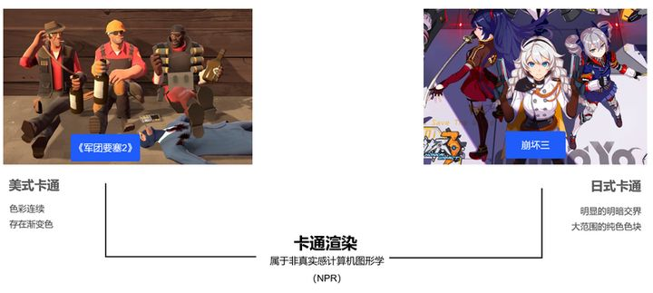
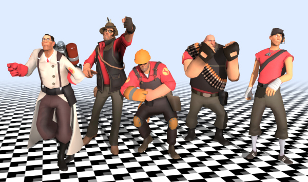
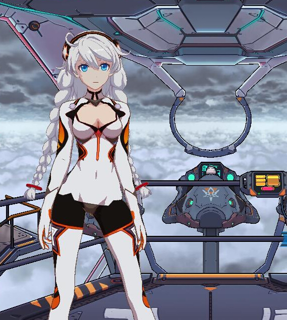
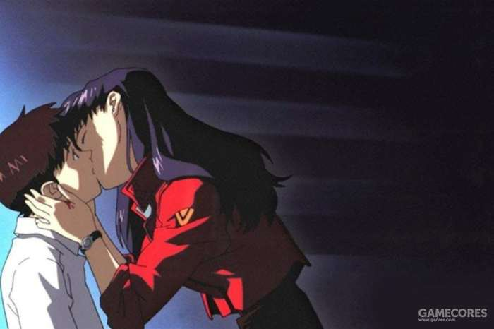
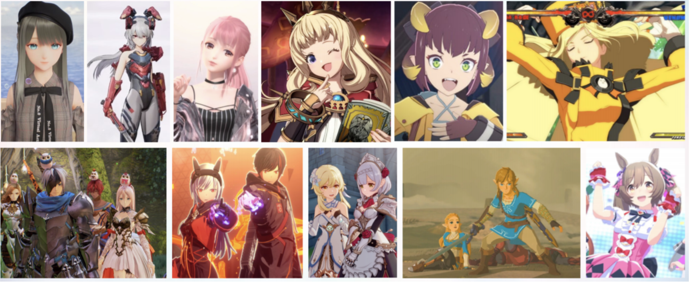
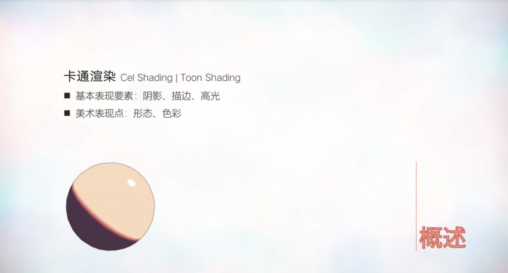
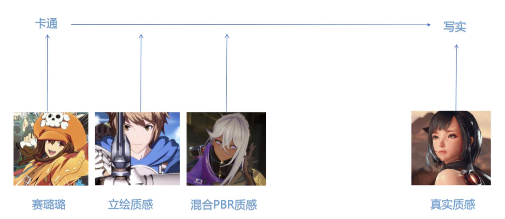
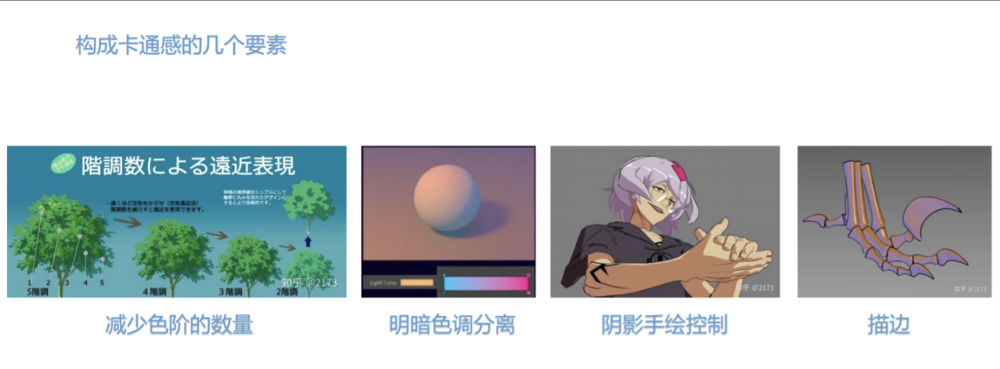
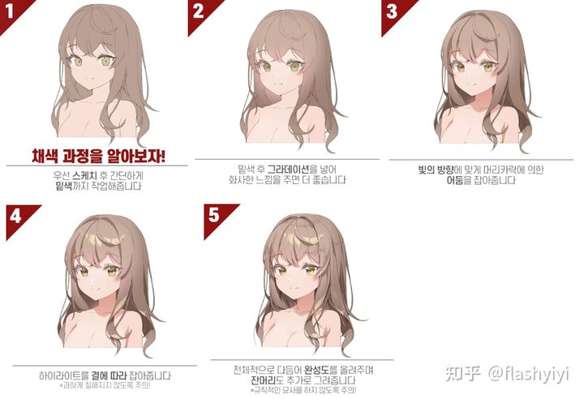

# Toon Shading Collection 

## CH01 - Overview of stylelized Art

Toon-shading is a type of stylelized rendering (or non-photorealistic rendering (NPR)), which favours artistic expression by emulating hand drawn art. It's counterpart is PBR (physically based rendering) which attempts to simulate (or approximate) Light in the real world.

Lets begin by categorizing different styles:

  

------

 **Western cartoons：**

Example: "Team Fortress 2"

Shading:

- The light and shadow shapes prefer soft edges and gradients.
- Highlights and Shadows are often exaggerated.
- The style is heavily dependent on artist authored colors.
TN: Soft edge = gradient. Hard edge = clear cutoff between shapes of color.

Modelling:

- The characters proportions are highly exaggerated.
TN: The western tradition grew cartoon in part out of (political) carricature and generally favours extreme expressions over conventionally attractive characters. Or in other words, maximize expression not maximize appeal.

 

------

**Anime (Easter cartoon):**

Example: "Honkai Impact 3rd"

Shading:

- Favours large shapes of solid color (celshading)
- Little to no gradiations between tones. All edges are hard.

Modeling:

- Proportions are more realistic than western Styles. 

  

  

------

### Discussing the Implementation for stylelized rendering

  

> As CGI technology develops, computer animation techniques are increasingly being applied to games and 3D animations. However, there are still many awkward inconsistencies in the visual presentation. This is due to the technical focus of (graphics) engineers, who often lack the knowledge and experience to understand what artists actually want to express. Instead, they focus on the technical implementation of the effects. As a result, while game visuals contain all the necessary elements, they fail to achieve the desired emotional impact.
>
> To achive good results, graphics engineers need a solid understanding of Art in Manga and Anime. However, knowledge in Anime is more immediately useful than Manga. With this in mind, we can look at different examples to understand how they create their appeal and then use computer graphics technologies to recreate them. This is in contrast to simply implementing surface level features while failing to capture the essence.
>
> Wheter it's Mangaka, a masterful artist or animation company, generally they all have strong styles which Fans immediately recognize, unlike the cookie-cutter cartoon rendering commonly present in recent games. at current date, there is a lot of room for improvement with many underdeveloped visual effects for anime style rendering.
>> TN: I am using Manga/mangaka and Anime over the more general terms of Comic and Animation as the text discusses the eastern comic tradition.
>
> If you are working in the animation or games industry as an artist, consider how you express emotion through animation. How can 3D rendering produce the lines of the mouth? How to use lighting to create a strong Atmosphere? Does a retro color scheme with celshading still look appealing? Have you considered this approach during production?
> 
> 
>
> While there are only a few important techniques to know, it's crucial to use them well in order to recreate the original art and capture the appropriate atmosphere.
>
> As photorealistic rendering technology develops and becomes more established, non-photorealistic rendering (NPR) also gains more attention. One of the most important styles is celshading. This style requires a comprehensive understanding of traditional cel animation as well as 3D technology. Pure technical expertise cannot produce a high quality cel shading effect.
>
> To achieve the highest quality possible it's not only important to master traditional art techniques, but also have experience with concept art, in-between drawings (or at least understanding the underlying principles) and a sense for composition and layout, but also able to utilize 3D rendering techniques to recreate the style faithfully while streamlining the workflow. Maintaining visual consistency using computer graphics is challenging.
>
> In chinese and international forums, some core fans are averse to photorealistic artstyles and don't want a japanese pixar. This sentiment stems from the fact, that achieving cel-shaded effects with 3D technology remains challenging.
>
> An example where the artdirection collapsed can be seen in the 3D adaptation of "Berserk".
>
> Compare this to "Land of the Lustrous" which managed to capture the handdrawn appeal of traditional cel animation much more faithfully. 
>
> I think there is still a lot of room for improvement for cel shading in games. For example: 
>
> I would create a more retro style rendering for a hypothetical "Saint Seiya" game.
>
> Interestingly, this retro style has gradually become a popular subculture trend. For example, Vaporwave videos often play clips from Sailor Moon or Neon Genesis Evangelion combined with Lofi-Hiphop music, creating a strong cyberpunk feel. Classic works of art remain timeless for hundreds of years; after all, anime itself has only existed for several decades.
>
> One netizen commented: "CGI technology isn't necessarily good or bad; it's how the production company uses it that determines whether it's good or bad." What's your opinion?

  

------

### Discussing Trends in Art-Styles

  

> Productions for Animation work with a different methodology from Games. Animation often works with specific camera angles and manually adjusts the images to maximize the appeal and fix errors, where Games favour consistency accross different environments and viewing angles.
>
> Handdrawn characters are often not consistent 3D objects. In order to recreate the appeal this inherent "brokenness" needs to be intentionally reintroduced. In the meantime, PBR remains one of the major trends. 
>
> Since Arc System Works shared it's toon rendering approach for Guilty Gear on GDC 2015, toon shading has developed very rapidly. There are productions attempting to recreate cel-shaded animation such as Guilty Gear or Uma Musume, stylelized PBR productions like Infinity Nikki or 鹿鸣(TN: Lumi? seems to be a CN only thing). There are also productions leaning more towards PBR like Granblue Fantasy, Blue Protocol and other explorations like Tales of Arise.
>
> 
> (TL-BR 鹿鸣, GFL2: Excillium, Infinity Nikki, Granblue Fantasy Versus, ?, Guilty Gear Xrd, Tales of Arise, Scarlet Nexus, Genshin Impact, TLoZ: Breath of the wild/tears of the kingdom, uma musume.)
> 
> The ability to create distinct styles with 3D rendering is becoming stronger. For Toonshading, unlike PBR, there are no standards to compare to in order to judge it's quality. Toonshading heavily relies on modeling and texturing, as such artdirection is particularly important.
>
> Additionally, toonshading combines the artists aesthetic preferences with an abstraction of the real world. Different artists have approaches to their art, resulting in a large variety in rendering styles. Even so, they still share some common elements. Let us take a closer look at what efforts gamedevelopers took to create high quality anime style visuals. 
>
> 
>
> Lets first list the basic concepts. There are two common names for toonshading. Celshading as an abbrevation of Celulloid Shading and Toon from Cartoon Shading. The most basic type of Toonshading only needs outlines, hightlights and flat shapes for light and shadow. 
>
> However, as mentioned before, strictly following this approach isn't necessarily required to create a stylelized/anime feel as styles in handdrawn art have also diversified. It's important to apply the underlying principles to create the desired appeal.
>
>  
>
> When the artists are creating their work, they place their reference images on a scale from stylelized to realistic, to determine how much they lean towards one or the other.
>
> Although there are many tricks in toon rendering, they are used to restore the unique effects of the original illustration. 
>
> 
>
> There are four elements universal to all variations of anime style art, regardless if they lean towards realistic or stylelized.
>
> 
>
> First is to reduce the number of unique colors. The fewer colors there are, the more carton-y the appeal.
>
> Secondly the separation of light and dark tones. Usually warm lights are paired with cold darks. By creating a strong contrast between these a more stylelized look can be achieved while also creating a stronger sense of light and dark.
>
> Thirdly, controlling shadows. In Manga, the neck of a character is often cast in shadow, even if it should be lit by placement of the lightsource. This is done to achieve an attractive aesthetic, even if it is at odds with the actual 3d form. To recreate this, we need manual control over shadows.
>
> Lastly, lineart is important for the appeal of anime style rendering. 

There are several directions that cartoon rendering can continue to advance in the future (personal opinion of a Goose Factory boss): TN: I really do not know how to properly translate "某鹅厂大佬个人观点" so have the literal meaning.
>
> For one, lean into cel shaded anime style. Ignore the 3D structure and exaggerate the mesh deformations in order to recreate the 2D appeal.
>
> Secondly, combinations of toon-shading and PBR in order to better define different materials are also worth exploring. Here approaches vary with no unified solutions dominating yet. However, because of this lack of uniformity this approach has the greatest potential in the future.
>
> Lastly, applying post production effects from anime to game rendering pipelines. This approach would be something of a cross industry collaboration, by applying knowledge and experience from one field to another. 

  

------

### Choosing a Style

Cited from here：

> 
>
> "Cel-shading is dead" is not true because anything is wrong with the style in itself, but rather because rendering techniques aiming at pure Cel-Shading have reached a plateau, where subsequent investments will yield ever decreasing improvements to it's quality and expressiveness, while becoming more difficult to achieve.
>
> With deep-pocketed companies like MiHoYo present on the market, competing in graphics means not only a large degree of polish, but also significant visual improvements. The space to the ceiling might not be enough to create a significant gap and this assumes the competition remains stagnant.
>
> So for all of MiHoYo's competitors, pure Cel-Shading is functionally dead. Strictly speaking, even MiHoYo's own work isn't pure cel-shading anymore. By extension, companies clinging to pure cel-shading are moving into a dead end.
>
>  
>
>   #### **How do we move forward？**
>
> NPR is a big field with more solutions than cel-shading. 
>
> However, for commercial projects, the style cannot be chosen purely on personal preference, but needs to appeal to a wider appeal. You need to consider the following:
>
> - The style must be proven as viable on the market. There need to be multiple successful works using this style active on the market. In addition, the usage of this style must be on the rise. A style in decline, fallen out of favour, or eliminated by market forces is an absolute no-go. 
>
> - Even for a competetive style, you need to consider compatablity with the game must be considered. If you're making a free-camera/view 3D game, the style must look good from all angles, which breaks a large number of 2D styles. Further, some styles are restricted to characterart and to expensive for large worlds using diverse landscapes with many NPCs, but can only be used for diorama puzzles or dress-up games. To meet these requirements, besides drawing inspiration from existing games, the most suitable adjacent medium are **film and television**. It's hard to evaluate for many illustration styles if they could meet the adorementioned requirements.
>
>    
>
> Generally speaking, the existing styles can be split into two camps: PBR based on Disneys technlogy and 3D rendering which attempts to recreate 2D illustration. 
> 
> (There is also pure realism, which provides it's own value, but is beyond the scope of this discussion. The problem of realism is the increasing internal complexity without yielding (significantly) better output.) TN: [Meaning of “卷”](https://chinese.stackexchange.com/questions/52695/what-does-%E5%8D%B7-mean-in-%E5%BD%93%E4%BD%A0%E5%88%9A%E5%BC%80%E5%A7%8B%E6%83%B3%E5%8D%B7%E7%9A%84%E6%97%B6%E5%80%99) 
>
> Disney's style is not suited well for adult content due to it's constant use and association with family friendly content. Even so it's rendering technologies can be applied to adult content, "Overwatch" being a good example for this. Even with there only being a small number of successful production there is no real issue meeting the criteria of viablity. 
>
> The problem lies in the fact that most works in this style are aimed at an Amerian and European audience, while rarely used in Asia. There are few references adopting this style to suit asian preferences because of this. "Final Fantasy" originally belonged to this movement, but but it's clear they became befuddled and moved into a stylelistic dead-end.
> 
> In my Opinion, China's own explorations have largely failed. In summary: If any NPR-production would be better of with realistic rendering, it should just be realistic. Many domestic productions are better suited to pure realism emulating tv-dramas. Half-Realism/Half-Stylelized is ultimately an intermittent stop-gap.
>
> Asians could of course accept European and American themes like "Monkey King Nezha" (某大圣哪吒) without being a disadvantage for a global release. The issue of acclimatization and the lack of adult oriented media for reference remains.
>
>    
>
> The other direction can basically be described as 3D (japanese) Anime. 
>
> 2D animation is not bound to a single style. Even ignoring American and European animations, very simple styles often appear in games. The problem is however, that these niche styles are difficult to evaluate for mass-appeal. More importantly, they often lack film and television references.
>
> Anime has undergone a long period of itteration on the market. The quality of older and current styles differs significantly, making it difficult to dismiss the results of this as uncopmetetive. More importantly, it's primary mediums, Manga and Animation are excellent references for games with a wealth of references available.
>
> In conclusion, even outside the target audience, Anime has unique advantages. With that said, what room for discussion is there when it comes to the target audience? 
> >(总之，即使是针对非受众，日式卡通风格也都有它独有的优势。因此，对于受众，那还有什么可讨论的余地
TN: I am really not sure about this one.)
>
>  
>
> #### **The Importance of "Borrowing"**
>
> My emphasis on "Borrowing" may make some people uncomfortable, they may feel that:
>
> Doing something you have never done before is difficult, but shouldn't that skill develop naturally?
>
> Some even complainshouted "Plagiarism" is immoral!
>
> On that I have to say, there may be more "immoral" things in the gaming world than you think. 
>
>  
>
> What are the advantages of "physically based rendering" which became popular recently?
>
> *Productioncapacity*. PBR materials can be created to the same quality standard and quantity while requiring less time and ressources. Inversely, with the same time and cost investment a higher quality and quantity of models and materials can be created.
>
> But why is it both faster and cheaper?
>
> Because PBR allows to directly use real life references without human intervention to create materials. 
>
> Assasssins Creed restores historical buildings and authentic terrain features. Do you think the cost has increased?
>
> The overall cost may even went down.
>
> But what if we're attempting to create a model completely from scratch, without any reference material from life, but with the same quality of existing products? The cost will go down significantly.
>
>    
>
> The reason PBR can lower production cost and increase capacity is the **copying of reality**.
>
> "Copying" is unavoidable. Without it you'd have to reinvent everything from scratch, every time. This is not feasible in practice as it'd require infinite manhours. Whereas the cost of a game is effectively fixed and productiontimelines hardly negotiable. As such, copying becomes a necessary requirement as the alternatives are not workable.
>
> To achieve a high level of polish at a fixed cost there are two options:
>
> 1. Find a few savants who're happy to work on a shoestring budget and pull the weight of an entire team each. 
>2. Copy.
> 
>    
>
> NPR fundamentally cannot copy Reality the same way PBR can, virtue of being stylelized. The best alternative is to find systematic workflows mimicing those in PBR pipelines. The more you can copy in terms of approach without reinventing things, the higher the quality of the result investing the same time and effort.
>
> This does not take into account the talent market.
>
> Again, this is not to elevate japanese Anime above other approaches. It may even put of parts of your target audience, which prefers semirealistic styles that are outside your own preference. And you have to orient yourself around your audiences preference at the end of the day.
>
> But what If you really want to aim for a genuinely "new" style? How do you prove that it has a chance for success? Even if you make the right call, the exploration cost and delays in production will likely yield a worse result overall. If the quality suffers or the project can’t be completed at all, what good is it that the direction was right in the first place?
>
> Anime has another important advantage, which is a large body of works in TV and Cinema for reference, which are the easiest to translate into games. The reason PBR can greatly reduce cost is it's ability to easily reuse processes from the movie and TV industries.
>
> Here, Disney-Style 3D animation can be compared to japanese Animation.
>
> Other works, which have not yet been adapted to TV or Movie need to first complete this exploration process. In addition to this, games need to adapt the rendering techniques to run them in realtime. None of these tasks are easy to accomplish or may even be impossible.
>
>    
>
> #### **Celshading never dies**
>
> 所以我上面说那么多是为了证实选择“日式卡通”这个方向的合理性吗？
> Did I say all of the above with the sole intend of proving that "anime" is the right stylistic choice?
>
> No. If you decided to create a product in this area, this is not even worth being discussed. 
>
> What I mean is, following the reasoning above, while taking into account the abundance of references and ease to adapt it into games, 
> 
> **that you're stuck with celshading.**
>
> Animation itself is celshaded after all. If you don't aim for celshading, you're probably better of aiming for PBR, as it has an abundance of references to draw from.
>
>    
>
> You may ask, why bother with movie references at all? Why not use games directly? Aren't there plenty of games with styles which do not have a matching counterpart in film? 
>
> Think about it for a moment. Aren't a lot of those games fixed in perspective with a character far removed from the camera?
>
> Did they have a free moving camera or cinematic cutscenes?
>
> Did they use human characters? Different demographics? Different genders?
>
> Outdoor settings? Daytime scenes? Everyday environments?
>
> Does your project require any of these tings?
>
>    
>
> There are of course games which managed to pull this off. However, their artstyles were already strong from the outset to make an animated feature with them. They did, with their own ability, complete both the cinematization and gamification of their style, which deserves huge respect.
>
> But do you intent on copying that style? (Will it even suit your projects needs?)
>
> If not, can you achieve the same success on your own?
>
>   
>
> #### **A choice for the Witcher**
>
> But Celshading isn't an option either.
>
> We have to pick between two bad options. 
>
> Pick the Celshading route and you're in immediate competition with MiHoYo and the endless fantasy towers which will appear in the future. If your work is strong enough to compete with them, this will not be a problem. 
>
> Worst case you just fall back on hyper realism. Plenty of companies did that. A game isn't made from artstyle alone after all. If your art is similar, compete in different areas of the game. You need a strong product in order to have a competetive advantage, carried by many different aspects of the game. A competetive advantage you usually do not have.
> 
>  
>
> The other option is to explore new styles, given that the weakness of celshading is the homogenization of the different styles. As long as you keep the deviations reaonable you might be able to be just different enough while staying within the alotted budget.
>
> Instead of establishing a completely new style, you may start from a point close to celshading and make incremental improvements, similar to how the japanese anime industry is evolving it's technology in recent years. 
>
> This is in my opinion the best option in terms of "risk balance".
>
>    
>
> However, the adjustments made may only take you from 4 to 5.
>
> 
>
> There are a lot more changes which could be made, but each of them comes with it's own pricetag and risk attached.
>
> Many of the contemprary anime techniques can be adopted into games. However, everyone is already doing this, which still means to compete within the celshading aesthetic. 
>
> If it's competition, so be it.
>
> Whether celshading ultimately survives or not is another topic, but you'll not get around imitating "theatrical animation", the same as everyone else.
