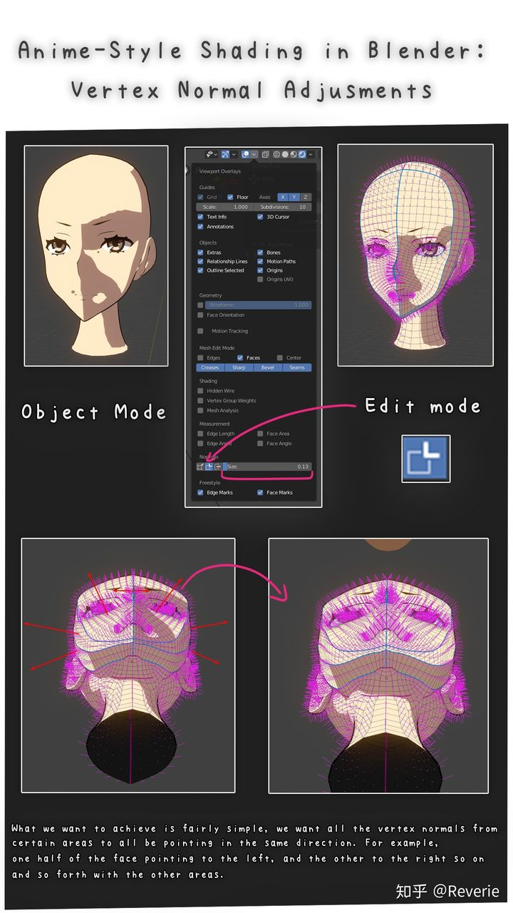
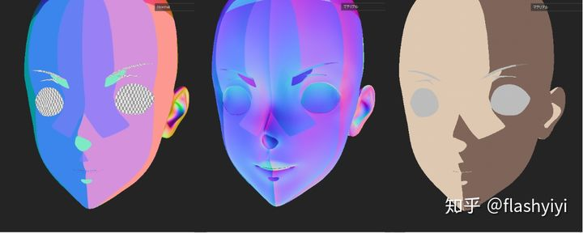
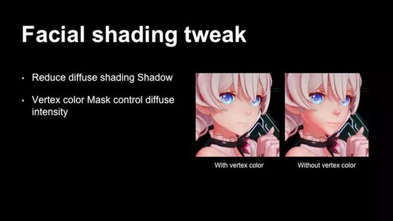
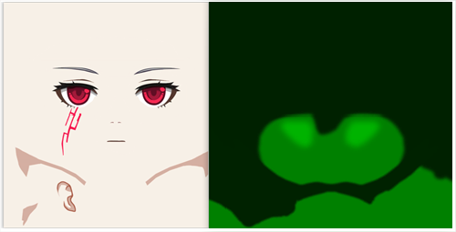
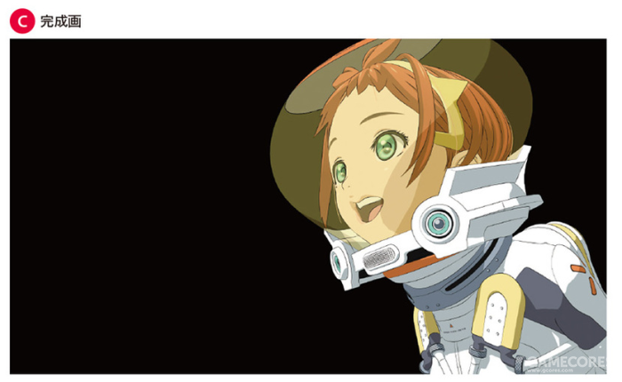
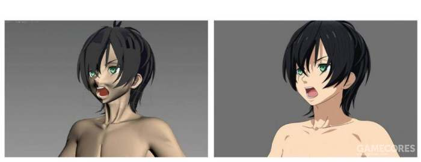
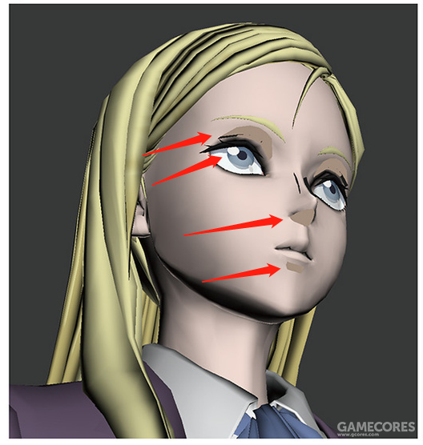

# Toon Shading Collection 

## CH03a - Direct Diffuse on Face 面部漫反射（主光）

二次元角色的面部是对真实人脸的高度抽象，其漫反射阴影的表达也是高度概括性的。明暗界线对于法线非常敏感，很容易产生不平整的界线，影响模型的美观，这对面部明暗处理带来了严峻的挑战。

常见二次元脸的光影，通常存在一些特殊区域，比如眼睛下面会形成一个三角区。要实现这些效果，而我们同时又希望尽量精简面数，那就需要做相应的专门调整。

一个坏消息是，可能目前为止还没有一种完美的解决方案。过场动画可以靠精确设置光源来回避问题，但实际游戏的高自由性总会暴露一些丑的角度。

*↑眼下三角*

 大致有两种思路来修正面部：法线和阈值。

 

------

### 修正面部法线

一是通过复制粘贴让某个区域内法线对齐一致，来实现像lowpoly一样的粗略阴影；二是使用简化的代理模型（包括但不限于球体）做法线传递，可以得到平滑的明暗变化。

Unity有免费插件Normal Painter等工具做手动修正，Maya自带法线传递的功能，3ds Max可以通过插件Noors Normal Thief实现法线传递的功能。在SP里还有Normal Convert Shader可以绘制法线图。

*↑注意眼下的三角区等位置的布线*

 

**优点：** 

- XYZ各个方向的光照角度都有考虑到。
- 模型确定的话处理较快，还算适合量产。
- 阴影精度和贴图无关。

**缺点：** 

- 某些角度还是会有瑕疵，要想发现并修正瑕疵、且不引入其它角度的新瑕疵，需要的工作量很大，而且可能找不到所有角度光照都不错的结果。
- 对前期模型布线要求很高。
- 环形布线必然产生三角结构，对表情适配可能有影响。
- 难以处理复杂体块。

  

**注意：** 

- 经过修改后的模型不能直接使用法线贴图，所以如果必须使用法线贴图，建议把修改过的法线储存到顶点色或UV上，这样不会影响其他的效果。
- 模型布线要精细，区域布线需要有循环边保护、侧面分区等，本质是根据角色阴影走向来布线，这样也比较好控制阴影方向。

 

*↑火影忍者究极风暴，将人物的面部向外膨胀，再用膨胀后的面部法线传递回原模型*

*↑罪恶装备，手动调整法线*

*↑推特作者Yoolies的脸部法线调整教程*

 

- #### 变体1——法线贴图

还可以直接在法线贴图上改出平整的法线。

**优点：** 不用再纠结模型点线排布。

**缺点：** 过于静态。

**注意：** 这张图并非常见的切线空间法线，而是物体空间法线图，这样才能有高通用性，表情口型的顶点变更都不会影响光照分布。当然也可以把它转回切线空间版本，但没必要。如果某些情况要求光照随表情改版，也可以增加另一张脸部法线图做插值。

*↑在SP中用Normal Convert Shader绘制法线图*

 

- #### 变体2——法线动态偏移

据说嗜血代码的面部法线方案是，模型原始法线不需要修改，另有一个通道控制面部法线动态偏移强度，偏移方向是视线负方向，于是从各个方向查看模型时，法线都能趋向于平面，比直接调整法线的侧面效果还要顺滑一些。

 

 

------

### mask控制暗部强度

通过一张面部的mask贴图来控制阴影的变化，使得阴影只在有限的区域（比如鼻子附近）中出现。当然，也可以使用顶点色来代替mask贴图的作用。

还有种简化版，是先在ramp条计算上就把整体明暗分界点后移，整张脸处于亮部的区间更大，再压暗鼻子和下巴等细节，甚至可能永久压暗。战双是这个做法，甚至连鼻子下的阴影也不留，只卡了一段勾线表现鼻子。

**优点：** 没法线修正麻烦。

**缺点：** 有些角度可能还要磨合。

**注意：** 基于HalfLambert值来进行的调整，而HalfLambert本身就是NdotL，法线如果本身就很平滑的话调整起来会方便很多。

*↑米哈游：直接利用一个顶点色通道，控制脸部的上色层的强弱，减弱面部明暗对比，通过压低漫反射表现来达到想要的卡通效果。*

*↑七大罪也用了顶点色通道调整脸部阴影*

*↑崩坏3面部阴影判定贴图*

 

 

------

### 水平方向阈值mask

原神使用的角色面部处理方法。

美术先绘制出光线按纵轴旋转各角度的理想光影mask图，模型本身的 halfLambert 值不参与mask的制作流程。然后使用SDF距离场算法，融合各角度mask，最后生成一张过渡mask。要求只考虑水平方向的过渡，在计算 halfLambert 时 lightDir 和 normalDir 都只计算 xz 分量。

 

**优点：** 

- 比起法线调整要直观得多，制作简单高效，可以脚本生成。
- 通用性高，只要其他角色面部布线和UV位置保持一致，在不同脸上的效果基本不变。
- 不需要再费力对齐法线，模型法线只产生一半的影响或完全不影响（根据算法），即便模型法线发生调整也没什么问题。
- 可以把光照一直保持倾斜的角度的话，效果不错，也没有违和感。

**缺点：** 并非所有细节可以完美手绘控制，只能照顾光照的左右旋转分量。

 

**大佬分享的工具：** [如何快速生成混合卡通光照图](https://zhuanlan.zhihu.com/p/356185096)

*↑米哈游：绘制了光照角度在1°、10°、30°、60°、90°、120°、150°、180° 的图像*

 

 

------

### 衔接问题

经过调整的面部区域，要怎样和周围皮肤上的漫反射明暗分界线自然地连接，也是一个要考虑的问题。取巧的方式就是大家头顶都有头发盖着，并且脖子下巴都压暗，那基本不用担心。但如果要出光头角色，就要慎重了……不过话说回来，古往今来卡渲游戏有出现过吴克角色吗？

 

 

------

### 弃疗方案：动态光照

将光照方向跟场景光照方向解绑，完全跟随角色朝向和视角。光照有限视角方向，随着角色朝向偏移，但不超过30°夹角，角色转向较大时，再将光照插值变化为更好的角度。

这个办法常用于选人界面。一般玩家不会发现或并不在意。

而在世界场景中，可能要考虑将场景光源也跟着角色光源方向变化，也有的做法是永远从相机视角方向给角色打光、场景保持自己的静态光照方向。

多人同屏时，整个场景的角色可能需要共用光照方向，避免视觉矛盾。

如果不是为了面部光影的处理，谁会这么自讨苦吃地复杂化光照方案呢……

 

#### 变体1——压低光源角度法

一般天光其实都是顶光（为了生成较少的建筑阴影），直接打人脸上都会完蛋。蓝色协议是直接在人物身上将天光方向拉平了50%，也就是仰角最多45度。

但这个方法只是解决了光照的高低角度问题，左右角度并不在它的考虑范畴。

 

#### 变体2——补光法

也有观点认为：光源的方向垂直于视线方向就会把明暗部之间的强烈对比呈现出来，因此为了削弱对比就专门为脸部补一个光，光源是从观察者这边射出去的，或者加点自发光也行。

不过这也只是稍微缓解了默认的面部阴影形状给人带来的不适感，并没有从本质上解决问题。

 

 

------

### 强行建模法

介绍一种动画公司常用的技法。

有的日本CGI动画公司使用的是另外的方式来实现想要的体积感和光影表现，就是通过反直觉的建模强行把3D模型进行扭曲，或者阴影颜色直接通过覆盖模型的方式进行制作。

其实只要最终渲染的画面效果是对的那其实无论什么方法都可以。

当然，考虑到面数、相机和光源的多角度变化，游戏中一般不会这么做，而是用上文和上章提到的办法替代。

