# Toon Shading Collection 

## CH04 - Direct Specular 高光（主光）


传统高光是使用H半程向量和法线来进行模拟的。与梯度漫反射阴影相同，我们依然使用smoothstep函数对原始高光值做一个离散化的处理，获得了边界明显的风格化高光。

<br>


<br>

也可以以GGX高光为基础，对高光计算结果或粗糙度值进行梯度化计算。

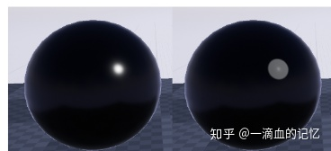

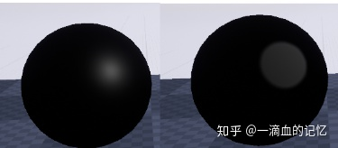

```glsl
half StylizedSpecular(half specularTerm, half specSmoothness)
{
	return smoothstep(specSmoothness * 0.5, 0.5 + specSmoothness * 0.5, specularTerm);
}

Half r = Roughness * 0.85 + (1e-4h);
specularTerm = StylizedSpecular(specularTerm, specSmooth) * (1 / r);
```

<br>

<br>

------

### 硬边高光抗锯齿


为避免硬边高光的锯齿，可以用fiwdth函数补充抗锯齿处理。

```glsl
fixed spec = dot(worldNormal, worldHalfDir);
fixed w = fwidth(spec) * 2.0;
fixed3 specular = smoothstep(-w, w, spec + _SpecularScale - 1)) * step(0.0001, _SpecularScale);
```

<br>

<br>

------

### 柔化（软边）高光

传统的卡通高光通常都处理成硬边（如罪恶装备式的传统赛璐璐动画风），然而这几年业界开始流行为二次元角色渲染融入更丰富的材质效果，卡通高光也接受羽化高光了。

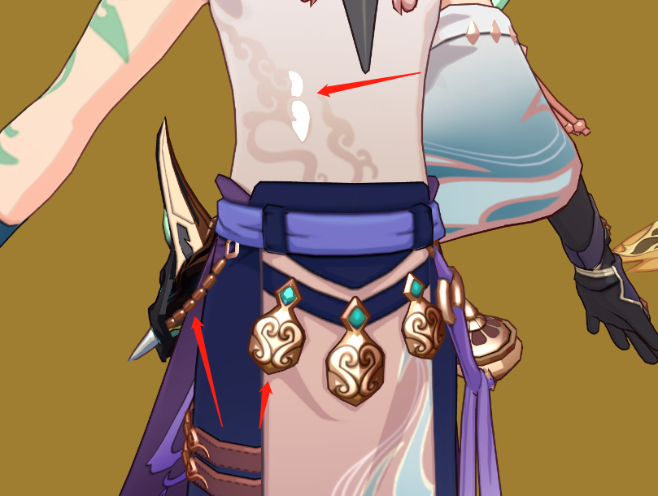

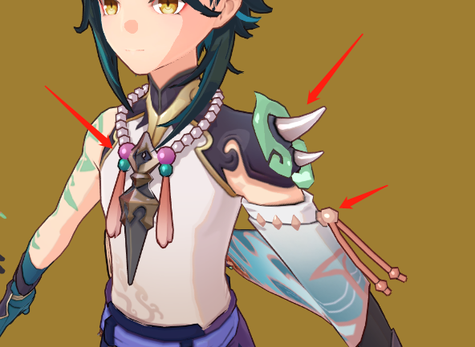

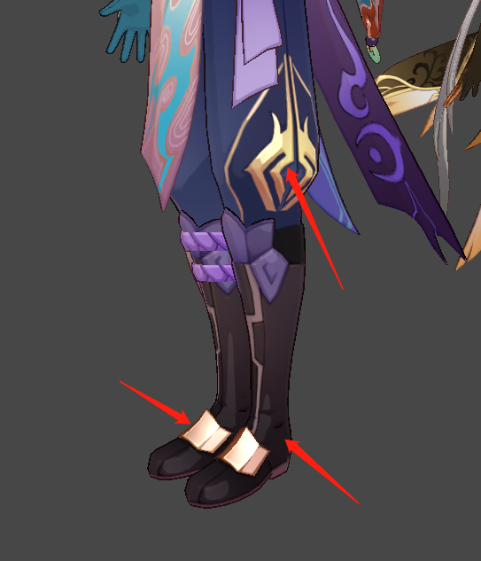

*↑个人还原的原神效果，金属材质的高光是软边，区别于玉石漆皮等材质的硬边高光*

<br>

仅米哈游一家就是这一趋势的典型例子，崩坏3中普遍采用硬边高光（不咋玩崩3，说错不负责），到原神中专门对金属部分做了软边高光处理，使金属材质有种“做旧”“粗糙”“厚重”的感觉，视觉信息更加丰富，也更加贴合中古奇幻类的世界观。

做软边高光，只需要给smoothstep函数填一个较大的柔化区间即可，或者直接保留原始高光计算的结果不附加任何离散化计算。

 <br>

**性能优化**：Gouraud 高光，在顶点中计算。


动态观察原神的金属球体，发现高光呈多边形变化，应该是使用了Gouraud 高光，即在Vertex Shader中计算高光作为优化。对于卡通渲染来说，这种牺牲精度提高性能的做法造成的多边形高光，似乎也能视为一种独特画风。

<br>

<br>

------

### 风格化高光

有时候，我们需要对高光形态进行定制。

<br>

#### Ramp映射与叠加


*↑崩坏3角色官方MMD对高光也做了多层ramp*

<br>

也可以像漫反射一样对高光进行一次ramp映射乃至多层高低频ramp叠加处理。

```glsl
float3 H = normalize(V + L);
float NoH = max(0, dot(N, H));
half specRamp = tex2D(_SpecularRamp, float2(NoH, _SpecularShininess)).r; //_SpecularShininess控制高光的锐利程度
float3 specular = _SpecularColor * specRamp * _SpecularIntensity;
```

<br>

#### 纯参数化计算变形

形状自由，充分发挥算法想象力，但实际应用场景不多。

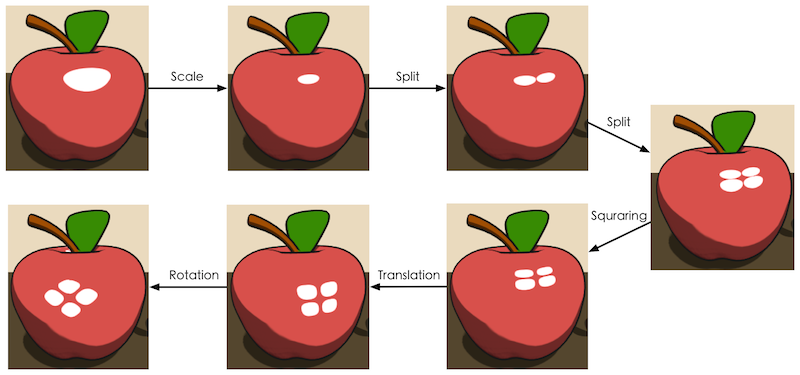

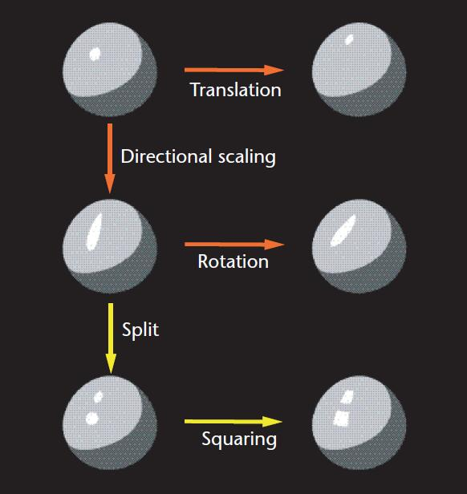

<br>

#### MatCap采样

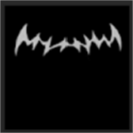

也可以使用MatCap采样高光，但这要接受假定视角不变的前提。

<br>

#### 各向异性高光

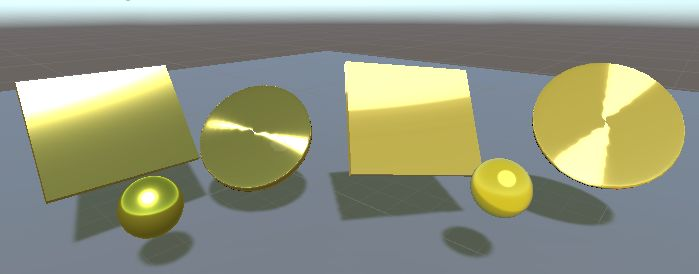

以写实渲染的各向异性高光为基础，再进行卡通化调整，通常用在头发或者特殊金属上。

<br>

<br>

------

### 特殊高光材质案例

#### 清漆材质

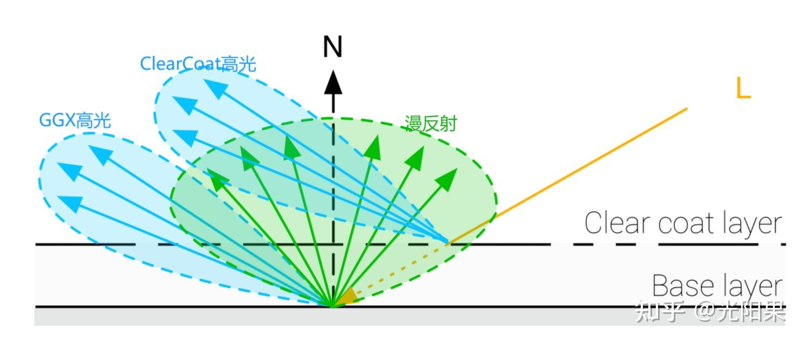

*↑清漆材质光照原理*


*↑清漆材质能量守恒公式*

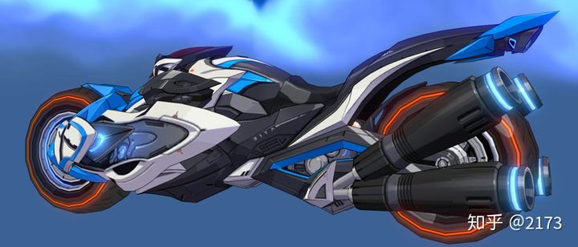

*↑摩托车金属排气管的车漆效果*

<br>

二分色还可以表现一些表面有半透明层的多层材质，比如瓷器表面的半透明釉质，漆面上的半透明涂层，可以用于表现光滑的皮革、金属等。

这个效果相当于有2层高光，直接增加一层独立的高光计算就行，然后看情况要不要补个能量守恒计算。也有说要将高光公式中的法线点乘半角向量换成法线点乘视线方向的，但这应该只是为了一直看到高光或伪反射。

<br>

#### 丝绸材质

各向异性高光一般使用切线替代法线，但丝绸适合使用副法线，最好能叠三个高光层，每一层分别设置不同的颜色，以便最终材质看起来色彩层次较为丰富。

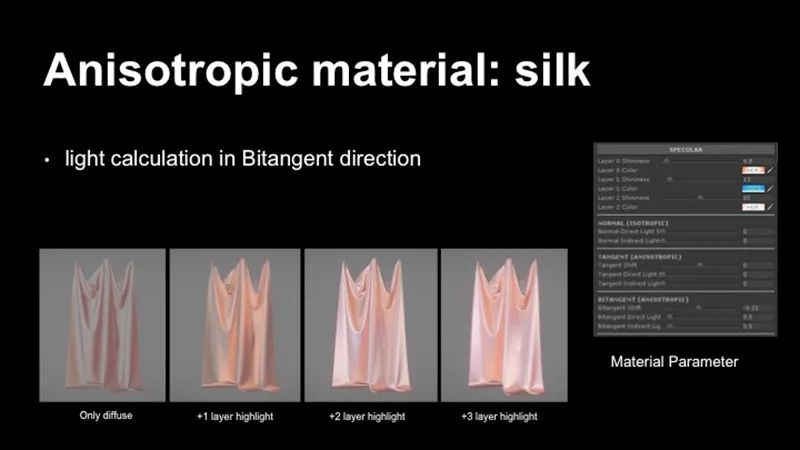

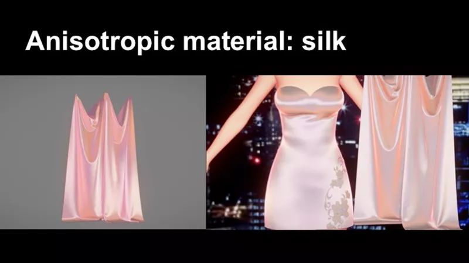

<br>

#### 头发高光

角色头发是高光变形的主要应用场景。主流做法有基于写实渲染梯度化的各向异性高光、利用遮罩贴图控制形状等。头发高光将放到下面单独章节讲解。

<br>

<br>

------


