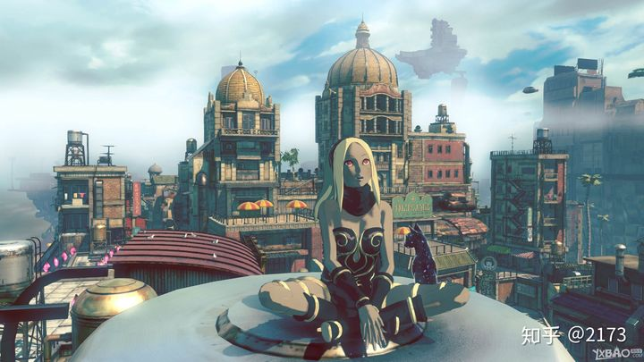
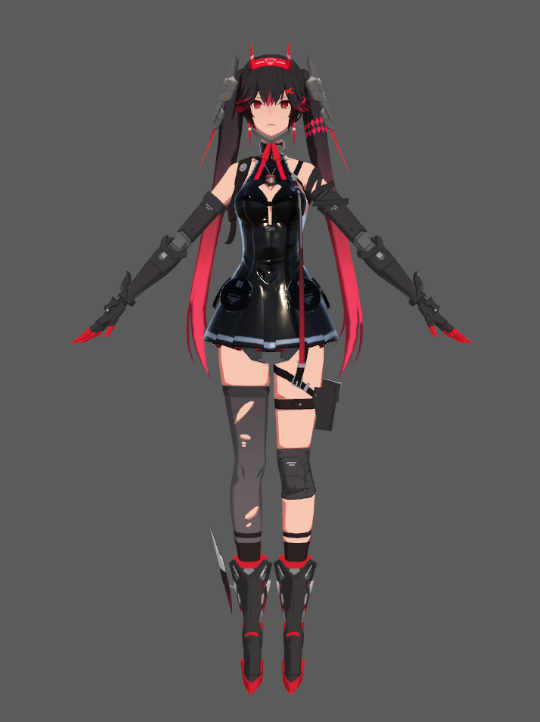
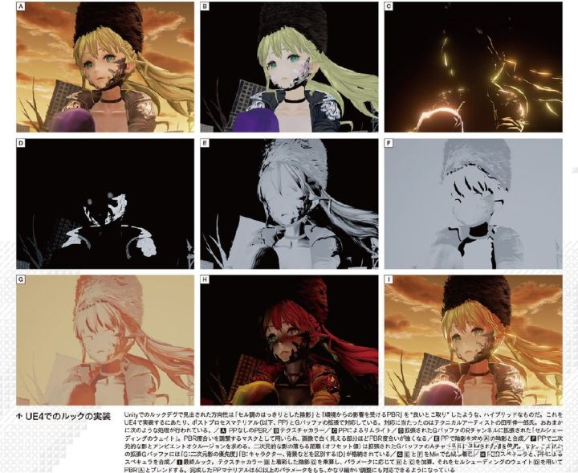
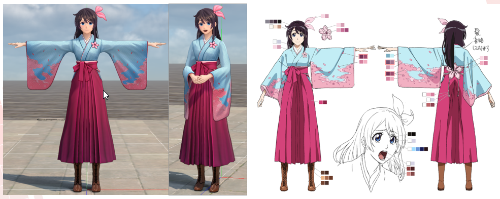
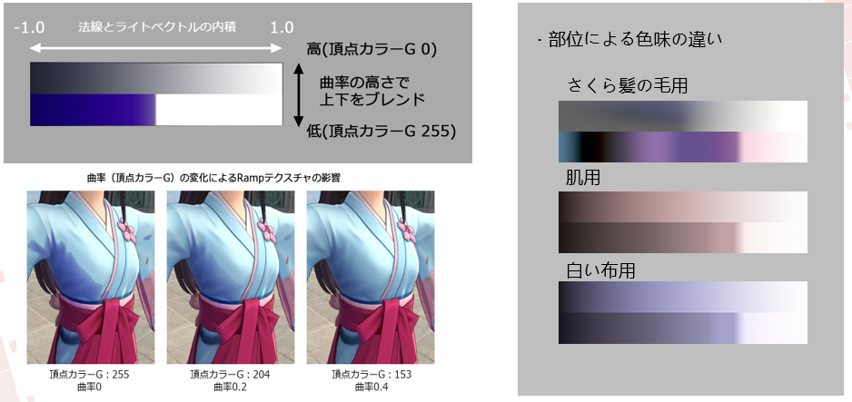

# Toon Shading Collection 

## CH07 - PBR Integration PBR结合

一种观点：卡通渲染可以完全靠trick，看起来对就是对，不物理正确也无所谓。

一种趋势：卡通渲染要走更加正确的路线，光照模型PBR化。

  

传统的赛璐璐渲染缺点在于无法表现出材质的质感，只能表现平涂的感觉：一方面减少了色阶，营造出卡通的风格；另一方面也因为色阶的减少，难以表达多样的材质。

于是业界卡通渲染又向不那么“卡通”的视觉效果迈进了一步：基于pbr的光照模型，外加一些ramp、笔触贴图之类的风格化处理（Ramp大法好），具体制作起来也和普通的次时代流程差别不大。至于实际使用到项目中，可以考虑一下相关的取舍。例如IBL是否使用，选择哪种光照模型等等。

 

 

------

### PBR算法卡通化魔改

#### 降色阶化卡通风

一种方式是直接以PBR光照算法为底，再通过减少色阶来增加卡通感。典型案例是《重力眩晕》。

然而这种减少色阶的做法还是削弱了材质的表达，比如金属并不太有金属感。另外，这种渲染的结果看起来还是有点粗糙、饱和度不高，可能更加适合画面比较厚重的美漫风，又或者进行更精细的算法调整也能实现我们想要的日漫风。

 

#### 偏写实手办风

*↑闪耀暖暖，写实渲染+造型二次元？但是叠纸家的恋与深空就怪怪的。*

最接近写实的手办风PBR，可能稍微调整下光照算法细节（守望先锋和迪士尼都对BRDF漫反射项做了变形，暗部提升饱和度之类的？），配合建模造型的风格化，就很卡通了。

 

 

------

### PBR与传统卡通材质并存

如果要体现卡通感，又要保留PBR丰富的材质表达力，为了鱼与熊掌兼得，一些游戏选择了让两种算法并存。

这个办法要同时计算两套光照模型，性能压力比直接魔改PBR还高一点。

下面是相关的融合思路。

 

#### 按区域切变

*↑个人试验的中间版本战双女主，小皮裙完全按Unity Standard Shader版PBR计算，直接使用按默认天空盒生成的反射探针就有点油，跟其它区域合不起来。*

 

首先肯定是给一张mask划分出想要PBR材质表现的区域，比如金属、皮革等对质感要求高的部分，而粗布、皮肤则保留二分卡通算法。

一刀切地想，PBR区就完全用PBR算法，非PBR区就完全用传统卡通算法，完全独立、互不干涉，然而不做调整的PBR区域稍显突兀，总觉得比非PBR区域显得油腻（可能因为阴影比较浓重、反光色相不受控等）。

 

#### 按比例混合PBR

可以考虑让PBR和卡通渲染有一定比例混合，而非直接切变。这可以让PBR部分带上一点卡通感，其实也是PBR油腻问题的解决办法之一。

这个混合还能顺便叠出两层高光的清漆效果。

战双的PBR区域权重一般没有给满1，不是完全切变。

 

#### PBR算法微调

*↑个人逆向战双源码结论：一层边缘光强行叠加在PBR皮革上，非PBR的ramp暗部也叠在了PBR区域上。另外反射贴图换成跟天空盒无关的之后，裙子颜色终于不油腻突兀了。*

为了削弱PBR部分的写实感，还可以稍微对算法作调整：

一是PBR相关参数开放了自定义修改，比如反射Cubemap可以自选、高光强度可以手动调整等。

二是可以继续往上叠加非PBR的细节效果，比如边缘光等。

修改后的PBR跟场景的联系要削弱很多，尤其是反射贴图的解绑，场景的反射探针对角色来说可能就无意义了，换成图案偏简单的反射贴图更有卡通感，甚至可以用MatCap，当然也可以继续往上叠反射探针。

 

 

------

### PBR融合案例

> 噬血代码的渲染流程，使用的是延迟渲染，除了GBuffer外还单独扩展一张专门存放数据用的贴图。
>
> （翻译软件+大佬理解，可能存在误解）
>
> A：未经后处理的PBR表现
>
> B：BaseMap
>
> C：后处理Bloom图
>
> D：GBuffer扩展图的R通道：表示PBR程度的遮罩，越白则PBR程度越强
>
> E：后处理中计算的光影图，在A图中就可以看到已经算进去了
>
> F：后处理中计算的投影和AO，顺便一提GBuffer扩展图的A通道：投影的落下距离（偏移值），此外G通道是投影的优先级，B通道是用于区分角色、背景等的ID
>
> G：E与F的最小值合成的阴影图
>
> H：PBR高光和后处理高光的合成
>
> I：最终效果，B图中的BaseMap和G中的阴影做乘算，根据参数与H图和C图相加，再根据D图的权重来与A图的PBR进行混合。
>
> 可以从D图看到皮肤光影处没有任何PBR权重，就是纯卡渲，并且颜色有渐变的过渡；投影是硬投影；眼睛处有些许pbr权重。
>
> 而服装和装备是卡渲和PBR的权重混合，噬血代码和异界锁链PBR都是使用三个通道来控制：金属度、AO和粗糙度/光滑度。间接光部分没有说明，但提到在地图中布有许多probe，猜应该是lightProbe和reflectProbe。
>
> 这种算是比较复杂了，其实要表现出PBR感觉，最显著的就是PBR高光：直接高光和间接高光。直接高光选择常见的GGX，间接高光用采样reflectprobe来表现，其实Unity的默认材质那一套就很好。至于间接漫反射光可以看情况选择采样lightprobe，不过漫反射相对而言不明显，根据实际情况决定要不要。

 

……其实我觉得这种看起来还是画面脏脏的……

 

 

------

### PBR魔改失败案例？

新樱花大战在初期开发的时候使用的是双色调的Toon渲染风格，没有使用PBR，后面根据用户诉求，将渲染的方向转向了具有Toon风格的PBR。

总之我就有被丑到，咋说呢，还是油腻吧，有种写实又不写实卡通又不卡通的两不沾四不像的尴尬，可能主要因为建模拖后腿影响整体观感。有人会觉得这部看着养眼吗？有的话找我打一架谢谢。

*↑新樱花大战魔改漫反射，按曲率直接混合软硬ramp*

 

 

------

### 更进一步？

有人认为：PBR和NPR分区渲染的办法比较low，感觉是做NPR到头了舍不得PBR表现，强捏在一起即违和又违反了PBR思想；PBR降阶或和NPR调制的办法太浪费，感觉像做好蛋糕后只吃蛋糕皮，剩下的全扔了。

那卡通渲染接下来该怎么发展呢？这个问题留待以后解答。

 

 

------

### 回归传统？

抄送大佬观点：

> 卡通渲染是个完全不一样的东西，如果还用PBR的思路考虑问题基本是死路一条，尤其是那些只知背书而不理解PBR为何那样做的理由的人，而这类人是绝大多数。所以你们多半会看到很多奇奇怪怪的游戏诞生。
>
> 基本上，卡渲，就是在画一幅动态的画。原画能力是第一位的。技术要做的，是让原画结果在3D世界中自然呈现。可以认为，一切“物理”都是无意义的，尤其是和颜色相关的物理。
>
> 但实际操作的时候，又不可避免需要使用PBR的手段减少成本……我只能说，一定要搞清楚哪个是第一性的。
>
> 卡渲的第一性，永远都是原画脑中所想的画面。即使原画想要的东西我们永远都做不出来，但那并不妨碍朝那个方向前进。事实上，也可以把PBR的渲染部分当作是向NPR结果的一种低端拟合。目标暧昧不清，且使用PBR的“规则”做事，做出来的东西永远都只是四不像，两边都不讨好。
>
> 而这是目前很难避免的现况。

