# Toon Shading Collection 

## CH07 - PBR Integration PBR结合

一种观点：卡通渲染可以完全靠trick，看起来对就是对，不物理正确也无所谓。

一种趋势：卡通渲染要走更加正确的路线，光照模型PBR化。

  

传统的赛璐璐渲染缺点在于无法表现出材质的质感，只能表现平涂的感觉：一方面减少了色阶，营造出卡通的风格；另一方面也因为色阶的减少，难以表达多样的材质。

于是业界卡通渲染又向不那么“卡通”的视觉效果迈进了一步：基于pbr的光照模型，外加一些ramp、笔触贴图之类的风格化处理（Ramp大法好），具体制作起来也和普通的次时代流程差别不大。至于实际使用到项目中，可以考虑一下相关的取舍。例如IBL是否使用，选择哪种光照模型等等。

 

 

------

### PBR算法卡通化魔改

#### 降色阶化卡通风

一种方式是直接以PBR光照算法为底，再通过减少色阶来增加卡通感。典型案例是《重力眩晕》。

然而这种减少色阶的做法还是削弱了材质的表达，比如金属并不太有金属感。另外，这种渲染的结果看起来还是有点粗糙、饱和度不高，可能更加适合画面比较厚重的美漫风，又或者进行更精细的算法调整也能实现我们想要的日漫风。

 

#### 偏写实手办风

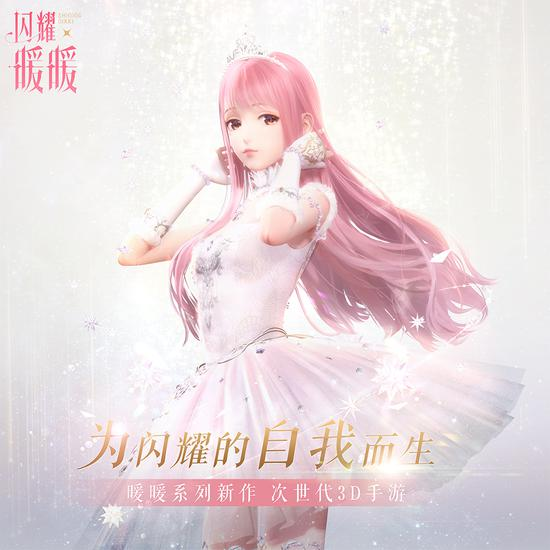

*↑闪耀暖暖，写实渲染+造型二次元？但是叠纸家的恋与深空就怪怪的。*

最接近写实的手办风PBR，可能稍微调整下光照算法细节（守望先锋和迪士尼都对BRDF漫反射项做了变形，暗部提升饱和度之类的？），配合建模造型的风格化，就很卡通了。

 

 

------

### PBR与传统卡通材质并存

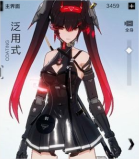

如果要体现卡通感，又要保留PBR丰富的材质表达力，为了鱼与熊掌兼得，一些游戏选择了让两种算法并存。

这个办法要同时计算两套光照模型，性能压力比直接魔改PBR还高一点。

下面是相关的融合思路。

 

#### 按区域切变

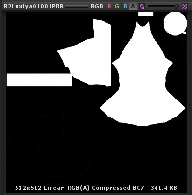

*↑个人试验的中间版本战双女主，小皮裙完全按Unity Standard Shader版PBR计算，直接使用按默认天空盒生成的反射探针就有点油，跟其它区域合不起来。*

 

首先肯定是给一张mask划分出想要PBR材质表现的区域，比如金属、皮革等对质感要求高的部分，而粗布、皮肤则保留二分卡通算法。

一刀切地想，PBR区就完全用PBR算法，非PBR区就完全用传统卡通算法，完全独立、互不干涉，然而不做调整的PBR区域稍显突兀，总觉得比非PBR区域显得油腻（可能因为阴影比较浓重、反光色相不受控等）。

 

#### 按比例混合PBR

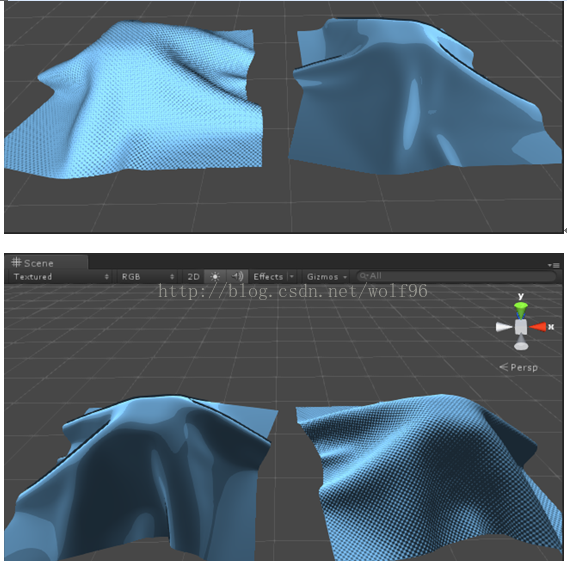

可以考虑让PBR和卡通渲染有一定比例混合，而非直接切变。这可以让PBR部分带上一点卡通感，其实也是PBR油腻问题的解决办法之一。

这个混合还能顺便叠出两层高光的清漆效果。

战双的PBR区域权重一般没有给满1，不是完全切变。

 

#### PBR算法微调

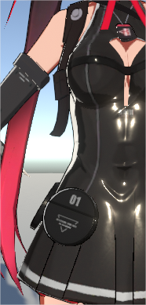

*↑个人逆向战双源码结论：一层边缘光强行叠加在PBR皮革上，非PBR的ramp暗部也叠在了PBR区域上。另外反射贴图换成跟天空盒无关的之后，裙子颜色终于不油腻突兀了。*

为了削弱PBR部分的写实感，还可以稍微对算法作调整：

一是PBR相关参数开放了自定义修改，比如反射Cubemap可以自选、高光强度可以手动调整等。

二是可以继续往上叠加非PBR的细节效果，比如边缘光等。

修改后的PBR跟场景的联系要削弱很多，尤其是反射贴图的解绑，场景的反射探针对角色来说可能就无意义了，换成图案偏简单的反射贴图更有卡通感，甚至可以用MatCap，当然也可以继续往上叠反射探针。

 

 

------

### PBR融合案例

> 噬血代码的渲染流程，使用的是延迟渲染，除了GBuffer外还单独扩展一张专门存放数据用的贴图。
>
> （翻译软件+大佬理解，可能存在误解）
>
> A：未经后处理的PBR表现
>
> B：BaseMap
>
> C：后处理Bloom图
>
> D：GBuffer扩展图的R通道：表示PBR程度的遮罩，越白则PBR程度越强
>
> E：后处理中计算的光影图，在A图中就可以看到已经算进去了
>
> F：后处理中计算的投影和AO，顺便一提GBuffer扩展图的A通道：投影的落下距离（偏移值），此外G通道是投影的优先级，B通道是用于区分角色、背景等的ID
>
> G：E与F的最小值合成的阴影图
>
> H：PBR高光和后处理高光的合成
>
> I：最终效果，B图中的BaseMap和G中的阴影做乘算，根据参数与H图和C图相加，再根据D图的权重来与A图的PBR进行混合。
>
> 可以从D图看到皮肤光影处没有任何PBR权重，就是纯卡渲，并且颜色有渐变的过渡；投影是硬投影；眼睛处有些许pbr权重。
>
> 而服装和装备是卡渲和PBR的权重混合，噬血代码和异界锁链PBR都是使用三个通道来控制：金属度、AO和粗糙度/光滑度。间接光部分没有说明，但提到在地图中布有许多probe，猜应该是lightProbe和reflectProbe。
>
> 这种算是比较复杂了，其实要表现出PBR感觉，最显著的就是PBR高光：直接高光和间接高光。直接高光选择常见的GGX，间接高光用采样reflectprobe来表现，其实Unity的默认材质那一套就很好。至于间接漫反射光可以看情况选择采样lightprobe，不过漫反射相对而言不明显，根据实际情况决定要不要。

 

……其实我觉得这种看起来还是画面脏脏的……

 

 

------

### PBR魔改失败案例？

新樱花大战在初期开发的时候使用的是双色调的Toon渲染风格，没有使用PBR，后面根据用户诉求，将渲染的方向转向了具有Toon风格的PBR。

总之我就有被丑到，咋说呢，还是油腻吧，有种写实又不写实卡通又不卡通的两不沾四不像的尴尬，可能主要因为建模拖后腿影响整体观感。有人会觉得这部看着养眼吗？有的话找我打一架谢谢。

*↑新樱花大战魔改漫反射，按曲率直接混合软硬ramp*

 

 

------

### PBR魔改思路参考

大佬思路搬运，探讨范围包括PBR和多光源等：

 

> 单光源：Result = lerp(暗部颜色，亮部颜色，二值化系数) * LightColor / PI + 额外高光部分
>
> 其中二值化系数=smoothstep(MidPoint - Blur,MidPoint + Blur,Dot(L,N))，由两个参数来决定光照过渡的软硬。
>
> 如果是采样Ramp图，则将二值化系数替换成Ramp的采样结果。
>
>  
>
> 需要除PI是个经验结论，如果不除亮部会显得过亮。这是因为正常物体能够产生全额亮度的部分只是少量面积，而二值化光照整个正面都是最大亮度，观感上就会显得过亮。
>
> 额外高光部分指的是边缘光，GGX高光和部分强制指定的高光，一般会乘LightColor来确定基本亮度。这部分面积小，对整体亮度影响不大，在和非高光部分对比的时候感觉合理就行了。只要单层叠加是合理的，多层叠加的结果也是合理的。
>
>  
>
> 多光源的情况下，直接将所有光照结果相加。
>
> 其中环境光和烘培光会处理成一个和主要光源相同方向的单独光源，获取光照探针的R0（具体做法是在获取光照探针数据的时候将传入的法线设为(0,0,0)），然后乘PI * PI，作为上面公式的LightColor，使用天光方向或者一个指定的方向作为L，然后完整进行一次计算（包括高光等等）
>
> 实际环境下，光照一般只有两种：一种是白天的室外，物体受到的光照是天光和环境光各占一半，一种是室内和夜晚，物体基本只受环境光影响。
>
> 但是在这两种环境下，卡通渲染的结果应当是相似的，所以物体必须在环境光为主的环境下也具有正常强度的明暗变化，因此只能将环境光处理成一个普通直线光。
>
> 乘两次PI也是经验结论。最终可以让物体在大部分实际环境下都具有合理的亮度，不会过亮或者过暗。
>
>  
>
> 但是显然，因为上面的公式也会让光源照亮物体的背面（仅仅是乘以暗部颜色，但暗部颜色并不会很暗），这种做法在多个高亮度的动态光照下依然还是会产生过曝的现象，比如人物前后各放置一个点光源。因此需要在光源上添加参数，让这些额外光源计算卡通光照时忽略暗部，压低整体亮度。
>
> 但通常情况，动态光照并不会有很多，大多是临时出现的特效光，因此即使不处理也没什么。
>
> 但不管是UE还是Unity给光源添加参数都不算太困难。而只要光源上有参数，就容易处理不同环境下材质的兼容问题。许多参数，比如二值化的模糊程度都可以放在光源上，用于区别不同功能的光，主光源可以边缘清晰，辅助点光源就可以是模糊的。
>
> 加上光源参数还是很有意义的，但只是处理不同环境下的基本亮度问题，参数一般不需要调整。
>
>  
>
> 注意上面的计算都是针对物理光照的辐射度的，如果你的游戏是LDR的，这样做并不一定正确。
>
> 所有HDR的卡通渲染游戏都会遇到这个问题：ToneMaping以后饱和度变低了。更糟糕的是纹理的对比度也降低了，导致图片丢失了大量细节，甚至连嘴都看不到了。
>
> 通常只能在贴图上反向增加饱和度和对比度，但非常不直观，而且精度损失严重。饱和度可以后处理加回去，对比度可没辙。
>
> 我用了个自己的骚方法：拟合ACES公式的逆运算。
>
> color * (2.51 * color + 0.03)) / (color * (2.43 * color + 0.59) + 0.14
>
> 这是ACES的一个简化公式，只保证了基本亮度。我用Excel拟合了它的逆运算，结果如下：
>
> 3.4475 * color * color * color - 2.7866 * color * color + 1.2281 * color - 0.0056
>
> 不准确但是差不多了。然后用它来处理传入的固有色贴图，通过和原本的贴图颜色lerp选择一个合适的混合比例，就可以在最终显示上还原出和原贴图几乎一样的结果。
>
>  
>
> 它的缺点是同样参数在暗处会显得对比度有些过高，想做的完美还需要根据光照强度来调整lerp的比例（注意是光照强度而不是最终辐射度，因为我们要保证是的纹理内容的对比度，乘过纹理后就没法得知这个原始的对比度了）
>
> 如果可以回避偏色问题，那么绘制贴图的时候就可以直接采用原画的结果。和PBR不同，卡通渲染是个极度依赖原画能力的课题，你没有固定的材质库可用，也没有什么预定参数，决定结果美观的就是贴图的质量，出现偏色是致命的。
>
> 而且暗部对比过高的现象也证明了，仅仅靠改贴图颜色无法解决这个问题。
>
> 而且在ACES下好看的材质纹理，对比度需要非常高，也非常难看，一般美术很难直接画或者选出符合要求的颜色，大家都是在用色板的经验数值取色，实际操作根本不可能做到符合ACES的偏色要求。
>
> 所以这可能是本文最有价值的东西。
>
>  
>
> 当然，更聪明的做法是根本不用ACES，甚至不用ToneMaping。一个固定亮度，而且没有室内外切换的卡通渲染游戏其实根本不需要ToneMaping，一切都可以原样画出来，毕竟物理光照规则对它来讲并没有意义。
>
> 严格来讲，甚至不需要线性空间。在卡通渲染下，实际上伽马空间的光照结果更加美观。否则PS也不会用伽马作为图层的混合方式了。
>
> 但是如果你还打算用PBR来节约画师的工作量，还希望借用PBR的那些“好东西”，就需要保留ToneMaping和正确的物理光照模型。现在的修正偏色方案，就是个折中的方法。

 

 

------

### PBR结合目标与实践思路解说

基于PBR的卡通表现，基于物理的光照，PBR是对现实的还原，而NPR则是非真实感渲染。虽然它们名称上是对立的，不过为了效果的提升，我们可以各取相关的特征缝合起来表现效果。使用PBR的优势在于PBR是艺术导向的，它能让美术同学用直观的参数，标准化的工作流，快速的实现大量材质的真实感渲染，把NPR的特征迁移到PPR中，并且保留这种易用性就是我们的目标。

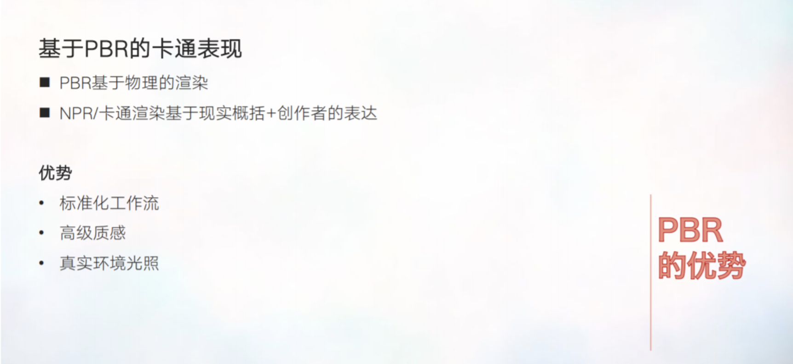

但实际操作中由于卡通渲染的特征涉及非物理属性的方面太多，这种易用性是比较难以保持的，需要根据项目对不同的特征的参数进行取舍。不过PBR所带来的环境光照和PBR的质感是比较容易保留的。

左图是Unlit的材质，右图是基于PBR魔改的NPR，混合PBR的NPR就可有一部分卡通效果，同时也具有PBR的质感了。

PBR中存在的间接光照计算可以比较方便的适配不同环境下的光照表现。不管是夜晚、白天、森林或者是在其他的一些环境下，在不同的环境中都可以有对应的光照反馈，这对角色与环境的适配是十分有利的。

以下用Shader Graph做了一个典型的PBR材质。

众所周知，PBR是由直接光照与间接光照组成，这里的黄色和橙色区域就是直接光的镜面反射与漫反射，绿色区域是间接光的镜面反射与漫反射，蓝色区域就是数据初始化的计算。比如NdotL 、NDotV这些。

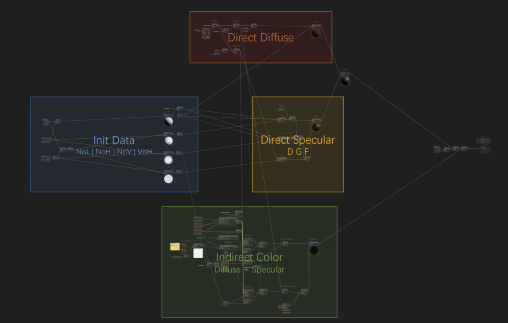

这是这个典型的PBR是在不同的粗糙度与金属度下的表现。

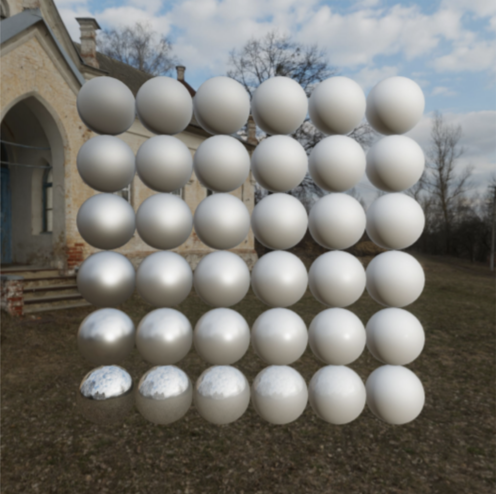

将PBR与卡通表现混合在一起的思路并不复杂，简单的来说将之前讲述的特征插入到PBR的计算流程中就可以了。但是怎么混合两者的特征，在什么节点去插入计算，这是一个见仁见智的事情，对于不同的风格，不同的管线流程都会有不同的结论。

将对应的卡通特征插入到PBR流程中，大概长这个样子，稍微有点凶残。当然了这个shader只是为了讲解做的测试，项目制作中不会这样用ShaderGraph直接做PBR。

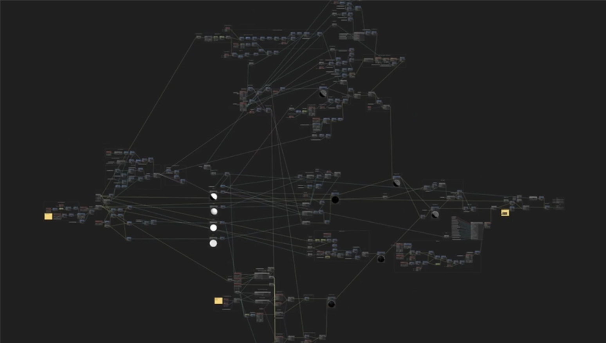

首先是魔改NPR特征后PBR整体计算流程并没有改变，依旧是直接光与间接光的镜面反射和漫反射叠加。下面就简单来讲述一下需要修改的部分。

首先是蓝色区域中数据初始化阶段的处理，最主要的是对法线N进行的操作，NDotL和相关的应用计算都可以在这里进行重新映射和合并，比如二值化阴影，面部阴影、头发投影、影贴图之类的阴影相关的操作，然后把它们合入到NDotL的结果之中。同时NDotV的控制也可以改变一部分菲尼尔的效果。

之后来看黄色区域的DFG项，这里效果比较明显的更改项就是法线分布函数D项，比如对GGX高光的范围进行重新映射，或者更改计算各项异性高光，并且加入遮罩偏移之类的操作，然后是橙色区域的diffuse计算，这个地方进行的操作，基本上可以当做emission自发光来添加。

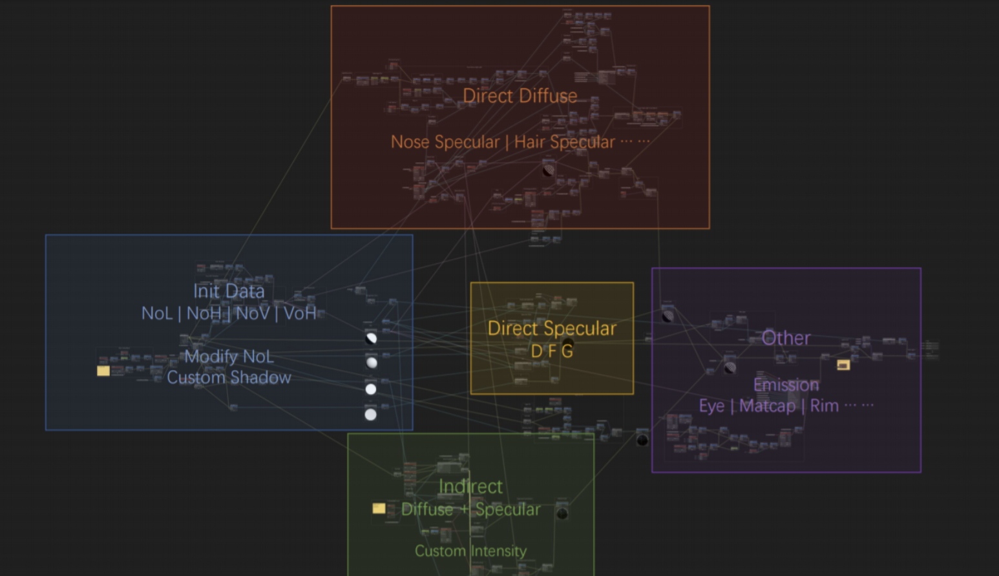

对于卡通渲染来说，一些色彩混合操作需要在这里加入，比如头发、高光，如果要使用颜色叠加的方式加入到计算结果中，就像柔光、线性光这些操作就需要在这里加入了，虽然不那么物理，但是可以保证效果。

之后就是绿色区域的间接光部分了，间接光的加入会显著提高模型的质感与立体感，但是对于卡通渲染来说，立体感的提升并不一定是好事，所以最直接的修改方式就是按照不同部分减少间接光的权重，比如对皮肤、面部这些需要平面表现的部分去减少间接光的比例。   其他还有蓝色协议使用了整体向上的法线，计算统一颜色的间接光也是一种方式。

最后就是紫色区域了，这里的计算是直接当作自发光来添加的，比如说眼睛的高光，Matcap反射，边缘光之类的。经过对PBR整体架构的模改，我们就可以得到混合了PBR的卡通表现。这里它长这个样子，这是 PBR魔改后在不同粗糙度和金属度下的表现（下图中右图）。

和默认的PBR的对比，因为自定义了阴影颜色和一些自发光的原因，它整体会更加明亮一点，卡通渲染插入到PBR中，并不会完全能量守恒。

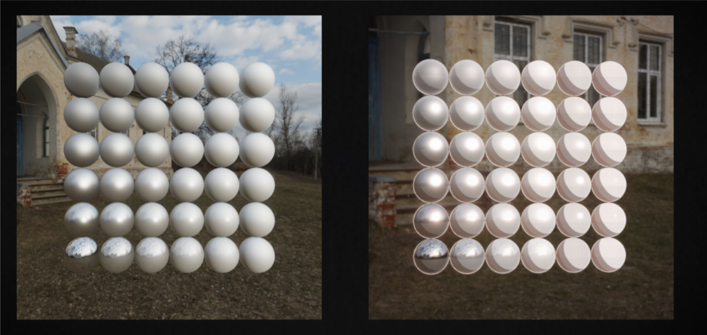

不过对于卡通渲染来说，很多不守恒的表现是可以接受的。所以虽然并不完全能量守恒，但是也适合于卡通渲染的表现。

这样我们就有了混合PBR的NPR表现，之后就要为不同区域去定制对应特征的Shading Model了，比如头发、眼睛、皮肤这些。

卡通渲染也会有很多不物理的表现，比如一直存在的高光、恒暗的阴影。高饱和度的纯净的色彩是卡通渲染的特征，但是因为有不同设备之间HDR与LDR的转换，其中会使用到ToneMapping，这就会导致可能渲染的色彩问题。 这些问题还是需要各种各样的trick来解决。

 

 

------

### 更进一步？

有人认为：PBR和NPR分区渲染的办法比较low，感觉是做NPR到头了舍不得PBR表现，强捏在一起即违和又违反了PBR思想；PBR降阶或和NPR调制的办法太浪费，感觉像做好蛋糕后只吃蛋糕皮，剩下的全扔了。

那卡通渲染接下来该怎么发展呢？这个问题留待以后解答。

 

 

------

### 回归传统？

抄送大佬观点：

> 卡通渲染是个完全不一样的东西，如果还用PBR的思路考虑问题基本是死路一条，尤其是那些只知背书而不理解PBR为何那样做的理由的人，而这类人是绝大多数。所以你们多半会看到很多奇奇怪怪的游戏诞生。
>
> 基本上，卡渲，就是在画一幅动态的画。原画能力是第一位的。技术要做的，是让原画结果在3D世界中自然呈现。可以认为，一切“物理”都是无意义的，尤其是和颜色相关的物理。
>
> 但实际操作的时候，又不可避免需要使用PBR的手段减少成本……我只能说，一定要搞清楚哪个是第一性的。
>
> 卡渲的第一性，永远都是原画脑中所想的画面。即使原画想要的东西我们永远都做不出来，但那并不妨碍朝那个方向前进。事实上，也可以把PBR的渲染部分当作是向NPR结果的一种低端拟合。目标暧昧不清，且使用PBR的“规则”做事，做出来的东西永远都只是四不像，两边都不讨好。
>
> 而这是目前很难避免的现况。

