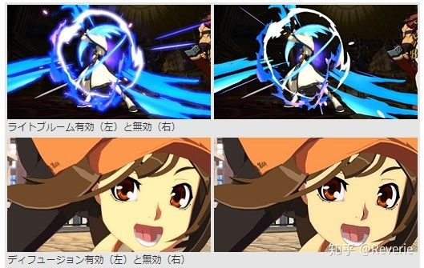
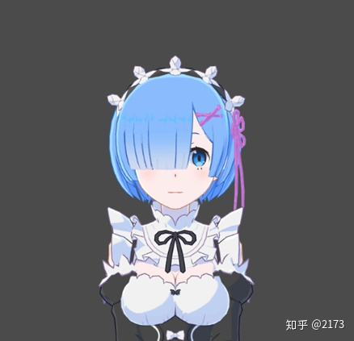
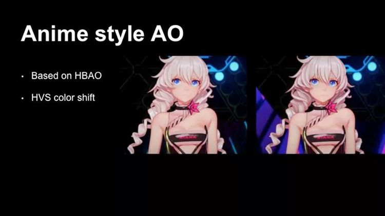

# Toon Shading Collection 

## CH08 - Post Processing 后处理

这里仅讨论对角色影响较大的后处理效果，与场景强相关的后处理放到以后的卡通渲染场景篇专文探讨。

 

 

------

### Bloom

*↑罪恶装备：左图开了Bloom，右图没开*

Bloom是卡通渲染中比较常见的后处理，基本算是必备，但放手机上带宽消耗比较大。

一般通过让边缘光部分的颜色溢出到周围区域，能提高画面的通透感，并且让角色更好的跟周围场景融合。

卡通渲染对Bloom后处理有一些特别的要求：常见的Bloom后处理根据颜色或亮度来决定曝光程度，但卡通渲染的Bloom需要能够自己控制曝光区域，与这个区域的颜色和亮度无关。

以上图举例，角色的衣服是白色的，颜色上属于亮度最高的。但是这里我们希望衣服上不要有过多曝光，曝光能集中在角色边缘光的位置。

在这里我们将颜色写入Alpha通道，利用Alpha值来控制曝光度，这需要大家自行对Bloom进行一定的修改。

用Alpha通道控制Bloom的曝光，在渲染半透明物体的时候会遇到问题，因为半透明混合也需要用到Alpha，这点可以通过使用额外的Pass单独写入Alpha来解决。

假设bloom的曝光主要集中在光照方向，边缘光的部分。于是将边缘光乘以漫反射公式获得比较符合光照方向的边缘光范围，然后将它的值赋给Alpha通道。

*↑左：通过Alpha通道控制的曝光范围；右：曝光的溢色效果*

*↑左：未开启Bloom；右：开启Bloom*

 

 

------

### AO

*↑通过对比图可以看出，在应用了AO之后，右图比左图层次感更强*

对于角色上的动态AO实现，米哈游使用修改过的HBAO，用于指定AO区域中颜色的饱和度和色调调整，使加入AO后的图像颜色看起来不会变脏。

其实我觉得不加AO也挺好看啊，加了AO反而感觉纵深感太强了，画面还是有点脏。

 

 

------

 

 

------

 

------

 

------

 

------

 

------

