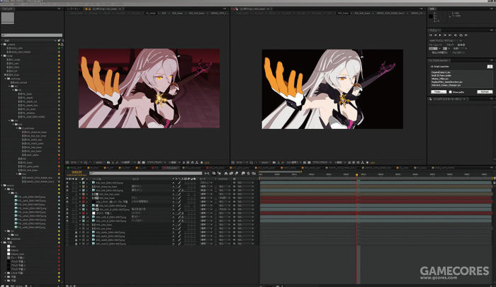
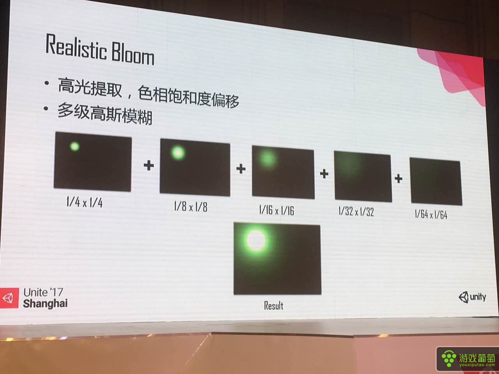

# Toon Shading Collection 

## CH08 - Post Processing 后处理

这里仅讨论对角色影响较大的后处理效果，与场景强相关的后处理放到以后的卡通渲染场景篇专文探讨。

 

 

------

### 卡通渲染后处理的意义

#### 仿动画画面论

后处理也就是传统动画中的后期特效。后处理特效不建议增加太多，用多了会破坏画面的色彩构成，非常花哨。

传统动画有一些后期调色的工作是在After Effects中合成的，同样在3D引擎中也可以通过shading的形式使用这种调色方法。

3D渲染图象后处理的方法实际上就是和视频后期软件差不多的功效，但是要求是要实时渲染，只要性能优化的足够好就可以了。

*↑《崩坏3》宣传片中的后期调色与合成*

 

#### “低频信息”论

虽然Flare，Bloom，Volume Light从物理角度是不同的光学现象，但它们都是画面的低频信息提供方，可以近似处理。

风格化渲染实际上非常需要这类低频信息增强画面的柔和感，以及缓解纯色块的单调感。除了Bloom，Flare和体积光同样也是实现这一点的很好用的工具。

同理，其它后处理也与低频信息有或多或少的联系。

 

 

------

### Bloom

*↑罪恶装备：左图开了Bloom，右图没开*

Bloom是卡通渲染中比较常见的后处理，基本算是必备，但放手机上带宽消耗比较大。

 

#### 卡通Bloom区域

卡通Bloom和写实渲染里普通的HDR有区别。

Bloom从物理角度应该是一种高亮度产生的视觉现象。普通的HDR是根据原像素rgb通道的最高值作为阈值来决定混合的模糊图的强度的，也就是越亮的部分发光程度越高。

但动画里，Bloom的系数和亮度关系并不是很大，使用PBR的方式来处理Bloom，很容易导致泛光部分发白。我们需要的其实是一个带颜色的光晕。

因为NPR体系下的颜色经过了各种特殊指定，并不和实际现实亮度直接对应，很容易出现纯白区域不希望Bloom，而高饱和低亮度区域反而希望Bloom的情况。

其次，Bloom同时也是一种画面上的低频信息，为了营造一种柔和的画面“氛围”，我们也希望增加这种低频信息的比例。而强行拉高整体Bloom强度又会导致高亮度区域过曝。

因此，常见的Bloom后处理根据颜色或亮度来决定曝光程度，而卡通渲染的Bloom需要能够自己控制曝光区域，与这个区域的颜色和亮度无关。

所以我们需要一个自定义的Bloom缩放系数。因为从崩三开始的游戏都实装了这个特性，是否要实现它一般并不会有疑问。

根据画风，一般也会参考颜色的亮度值，这样Bloom系数就只需要一个修正用的值而非贴图。

 

分别处理物体的面光和背光Bloom，可以让亮部单独产生Bloom的效果。

从“物理正确”角度，其实也是需要这样做的。因为Bloom的强弱其实代表了受光的强弱，但是卡通渲染的光照强度并不会完全通过颜色表达出来。为了保持画面的饱和度，亮部的实际亮度并不会太高，而暗部的亮度常常也不能过暗。

因此，将Bloom和颜色剥离开来，反而更加“物理正确”。

卡通渲染还特别喜欢让头发和皮肤具有更高的Bloom强度，使得它们看上去更加具有光泽。

另外通过让边缘光部分的颜色溢出到周围区域，能提高画面的通透感，并且让角色更好的跟周围场景融合。

而为了保持发光物体的饱和度，实际颜色值不能过高，从而也需要用高Bloom值来补齐原本想要的泛光。

 

Bloom效果不宜使用过猛，比较多的辉光效果一般在动画中会被用于表现温馨的情感氛围。

 

#### 卡通Bloom操作示例

以上图举例，角色的衣服是白色的，颜色上属于亮度最高的。但是这里我们希望衣服上不要有过多曝光，曝光能集中在角色边缘光的位置。

所以我们需要向屏幕缓冲写入一个专门Bloom系数来控制Bloom强度，在这里我们将bloom强度值写入Alpha通道，利用Alpha值来控制曝光度，就可以让任何颜色的物体泛光了。

假设bloom的曝光主要集中在光照方向，边缘光的部分。于是将边缘光乘以漫反射公式获得比较符合光照方向的边缘光范围，然后将它的值赋给Alpha通道。

*↑左：通过Alpha通道控制的曝光范围；右：曝光的溢色效果*

*↑左：未开启Bloom；右：开启Bloom*

 

Bloom使用高光提取，还可以偏移色相饱和度，这样对卡通渲染来说，色彩看起来就会更加丰富，而且从一定程度上，避免了应用Bloom后，画面会降低饱和度的现象。

 

#### 性能优化方向探讨

用Alpha通道控制Bloom的曝光，在渲染半透明物体的时候会遇到问题，因为半透明混合也需要用到Alpha，这点可以通过使用额外的Pass单独写入Alpha、原pass专门些RGB通道来解决。

还有额外带宽的问题。写Alpha通道的情况，Alpha Blend需要额外PASS，但Additive不需要。如果你的游戏特效使用Additive较多，额外PASS就少，就越适合写Alpha的方案。而且即使是Alpha Blend，如果不在乎Bloom系数的准确性，AlphaBlend物体大多也能堆叠到接近不透明，Bloom系数也允许常态使用最高值1——那特效不用第二个PASS修正也是可以的。

不修正，缺陷就是特效容易因为Bloom而过爆。但战双的过爆现象很少见，是不是修正的比较普遍就不知道了。

还可以让Bloom系数影响程度降低，普通特效需要的Bloom就是Bloom系数的最高值。如果需要较大的Bloom强度，则通过在HDR范围调整颜色本身的亮度来控制（这样Bloom就会更加接近PBR）。虽然束手束脚，应该也可以勉强达到我们的要求，但这个实现也不太稳定。

如果特效是单独渲染到RT进行降采样优化的，可能对这个方法影响更小些。

还有办法是额外开RT传入bloom值，如果是为此单开新RT，只用到一个通道会浪费，但如果本来的RT就有多余通道，比如法线RT，那就正好白给。

 

#### 整体方案安排探讨

具体实现的时候，最佳方案其实是准备一个单独的Half通道以储存一个HDR范围的亮度值，并在frag中将原始颜色的亮度值计算出并存入。只有这样，才能保证Alpha Blend, Additive，以及各种特殊混合模式下的Bloom值的正确性。

通常，我们并不愿意花费一个16bit的通道来实现这个效果，只愿意使用一个8bit的通道，所以只会储存一个Bloom的缩放值。这样在透明混合的时候就会出现各种麻烦。

  

目前比较倾向的方案是：

放弃透明物体的Bloom值自定义功能，透明物体阶段并不写入Bloom值，这样也节约了带宽。

而为了最终计算Bloom结果正确，必须将透明物体和不透明物体分别渲染，然后在Bloom阶段重新组合。（为什么必须这样解释起来很麻烦，信我就行了）

这个分离透明物体渲染的功能UE本来就提供了，只需要修改Bloom部分的RT组合，实现还是很简单的。而且通过配置r.SeparateTranslucencyScreenPercentage还可以获得半透物体降分辨率功能，还可以根据帧率自动进行，基本上不会不开，分离渲染导致的性能代价也就无所谓了。

事实上，这就是原神的方案，所以估计也没啥人会反对。

（原神的透明物体分辨率过低的问题确实严重。我觉得可以将部分需要精度的透明材质转为Mask材质来解决问题，Mask通过TAA抖动模拟单层半透的效果还是不错的）

  

严格来讲，最理想的方案其实是执行2次Bloom，一次无视物理亮度给画面整体做一次模糊叠加，第二次根据亮度做正常Bloom模拟实际的辉光物理现象。但因为Bloom的性能成本较高，当然希望一次做完。

配置Bloom参数的时候要考虑倒这一点。两个Bloom的功能其实是不同的。

 

#### 思路转变方向探讨

是否可以把实际亮度和颜色在光照体系下就直接拆分开，把亮度当作RGB之外的第4个颜色分量，然后用“亮度”值直接算Bloom，这样处理Additive物体时也更加方便（否则要直接屏蔽了Additive物体的Bloom值写入）。

但这样改的东西满多的，所有涉及光照的部分都要改，而且这需要让Bloom值是个HDR的值……

真要认真做，可能那才是最完美的方案。

 

#### 视觉升级方向探讨

动画和游戏的Bloom还有一个重要的区别是：模糊图和原图的混合模式并不只有线性减淡(Additive)。

如果像动画后期一样使用不同的混合模式，则有希望做出更接近动画的结果（比如有是通过叠加混合实现的加深效果）。

这个还需要尝试和探索，目前的方案终究只是PBR的一个修正，还有很大修正空间。

 

 

------

### 抗锯齿

使用后处理效果可以避免的一个非常重要的问题就是3D模型的锯齿感。使用抗锯齿（各种 Anti-Aliasing技术）后处理可以大幅度减小锯齿感，更像手绘动画效果。

上面bloom效果在3D游戏中一般配合抗锯齿一起进行。

 

 

------

### AO

*↑通过对比图可以看出，在应用了AO之后，右图比左图层次感更强*

对于角色上的动态AO实现，米哈游使用修改过的HBAO，用于指定AO区域中颜色的饱和度和色调调整，使加入AO后的图像颜色看起来不会变脏。

其实我觉得不加AO也挺好看啊，加了AO反而感觉纵深感太强了，画面还是有点脏。

 

 

------

 

 

------

 

------

 

------

 

------

