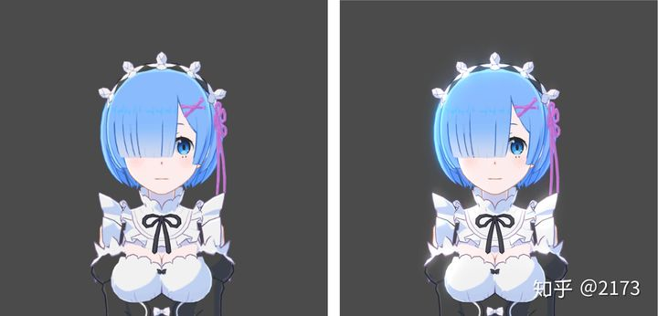

# Toon Shading Collection 

## CH08 - Post Processing 后处理

这里仅讨论对角色影响较大的后处理效果，与场景强相关的后处理放到以后的卡通渲染场景篇专文探讨。

 

 

------

### Bloom

*↑罪恶装备：左图开了Bloom，右图没开*

Bloom是卡通渲染中比较常见的后处理，基本算是必备，但放手机上带宽消耗比较大。

一般通过让边缘光部分的颜色溢出到周围区域，能提高画面的通透感，并且让角色更好的跟周围场景融合。

卡通Bloom和写实渲染里普通的HDR有区别。

普通的HDR是根据原像素rgb通道的最高值作为阈值来决定混合的模糊图的强度的，也就是越亮的部分发光程度越高，但动画里，Bloom的系数和亮度关系并不是很大，使用PBR的方式来处理Bloom，很容易导致泛光部分发白。我们需要的其实是一个带颜色的光晕。

因此，常见的Bloom后处理根据颜色或亮度来决定曝光程度，而卡通渲染的Bloom需要能够自己控制曝光区域，与这个区域的颜色和亮度无关。

根据画风，一般也会参考颜色的亮度值，这样Bloom系数就只需要一个修正用的值而非贴图。

以上图举例，角色的衣服是白色的，颜色上属于亮度最高的。但是这里我们希望衣服上不要有过多曝光，曝光能集中在角色边缘光的位置。

所以我们需要向屏幕缓冲写入一个专门Bloom系数来控制Bloom强度，在这里我们将bloom强度值写入Alpha通道，利用Alpha值来控制曝光度，就可以让任何颜色的物体泛光了。

假设bloom的曝光主要集中在光照方向，边缘光的部分。于是将边缘光乘以漫反射公式获得比较符合光照方向的边缘光范围，然后将它的值赋给Alpha通道。

*↑左：通过Alpha通道控制的曝光范围；右：曝光的溢色效果*

*↑左：未开启Bloom；右：开启Bloom*

 

Bloom使用高光提取，还可以偏移色相饱和度，这样对卡通渲染来说，色彩看起来就会更加丰富，而且从一定程度上，避免了应用Bloom后，画面会降低饱和度的现象。

 

#### 性能优化方向探讨

用Alpha通道控制Bloom的曝光，在渲染半透明物体的时候会遇到问题，因为半透明混合也需要用到Alpha，这点可以通过使用额外的Pass单独写入Alpha、原pass专门些RGB通道来解决。

还有额外带宽的问题。写Alpha通道的情况，Alpha Blend需要额外PASS，但Additive不需要。如果你的游戏特效使用Additive较多，额外PASS就少，就越适合写Alpha的方案。而且即使是Alpha Blend，如果不在乎Bloom系数的准确性，AlphaBlend物体大多也能堆叠到接近不透明，Bloom系数也允许常态使用最高值1——那特效不用第二个PASS修正也是可以的。

不修正，缺陷就是特效容易因为Bloom而过爆。但战双的过爆现象很少见，是不是修正的比较普遍就不知道了。

还可以让Bloom系数影响程度降低，普通特效需要的Bloom就是Bloom系数的最高值。如果需要较大的Bloom强度，则通过在HDR范围调整颜色本身的亮度来控制（这样Bloom就会更加接近PBR）。虽然束手束脚，应该也可以勉强达到我们的要求，但这个实现也不太稳定。

如果特效是单独渲染到RT进行降采样优化的，可能对这个方法影响更小些。

还有办法是额外开RT传入bloom值，如果是为此单开新RT，只用到一个通道会浪费，但如果本来的RT就有多余通道，比如法线RT，那就正好白给。

 

#### 视觉升级方向探讨

动画和游戏的Bloom还有一个重要的区别是：模糊图和原图的混合模式并不只有线性减淡(Additive)。

如果像动画后期一样使用不同的混合模式，则有希望做出更接近动画的结果（比如有是通过叠加混合实现的加深效果）。

这个还需要尝试和探索，目前的方案终究只是PBR的一个修正，还有很大修正空间。

 

 

------

### AO

*↑通过对比图可以看出，在应用了AO之后，右图比左图层次感更强*

对于角色上的动态AO实现，米哈游使用修改过的HBAO，用于指定AO区域中颜色的饱和度和色调调整，使加入AO后的图像颜色看起来不会变脏。

其实我觉得不加AO也挺好看啊，加了AO反而感觉纵深感太强了，画面还是有点脏。

 

 

------

 

 

------

 

------

 

------

 

------

 

------

