# Toon Shading Collection 

## CH09a - Eye 眼睛

<br>

眼睛是心灵的窗户，能表达的东西很多，二次元眼睛风格非常多元化，可能是决定观众印象的第一要素。虽然眼睛区域屏占比很少，不过在一些特写镜头下，眼睛的表现也是十分重要的。

根据需求不同，可以考虑多种实现方案。

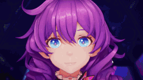

*↑眼睛的细节以及其它部位效果示例*

卡通的眼睛表达是比较随心所欲的，不过大体上依旧遵循真实的眼睛特征，比如说它也同样有折射和焦散的体现。

<br>

------

### 眼睛内部细节

梳理一下卡通角色眼睛的制作，解析一下为什么以及怎么做。

<br>

#### 眼球基本结构

先从眼球的结构说起，卡通眼睛重点强调的区域是下图中的瞳孔和虹膜部分，还有主要为巩膜的眼白区域。另外还要注意一下前房，瞳孔和虹膜区域有深度的一个主要原因就是存在前房这个空腔，这个空腔中充满了房水，可以当作一个透镜，这是瞳孔与虹膜区域有深度的主要原因，也是经常会在制作中去还原的表现点。

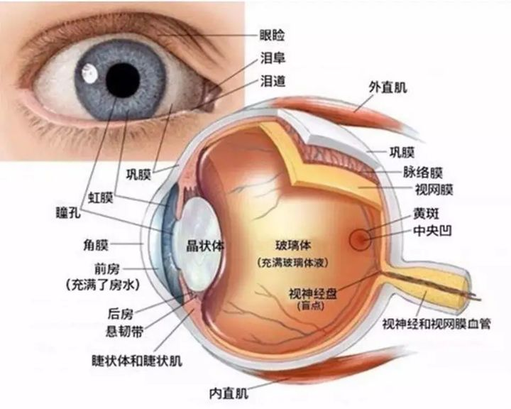

<br>

#### 折射与焦散

眼睛区域需要表达的特征有很多，这里主要挑两个对卡通渲染比较重要的特征来讲，从Next-Generation Character Rendering中拿了几张图方便说明。

首先是折射，由于前房区域的存在，眼睛主体的瞳孔和虹膜部分在视觉上是向内凹陷的，下图是是否开启折射的区别，注意瞳孔的位置。


*↑折射对比*

另外前房区域也可以看做一个透镜，会聚焦光线，在虹膜部分形成焦散的亮斑，下图同样是是否开启折射的区别。


*↑焦散对比*

<br>

#### 现实与动画

这张图片中清楚的表现了瞳孔、虹膜与前房的关系，大部分动画中也会去还原这些特征。

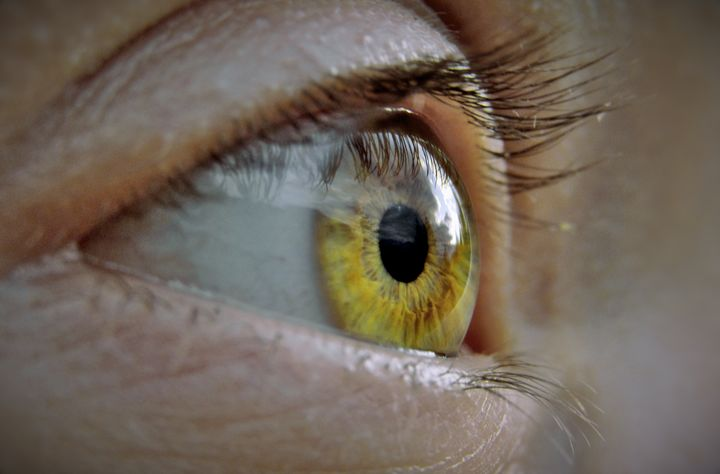

在动画中折射的表现，主要体现在角色侧面瞳孔区域会向后略有偏移，而焦散更多的体现在眼睛上除高光外的亮斑。除了折射与焦散，眼眶上部的阴影与高光点也是常见特征。

当然例外情况也有很多，不过整体而言这些特征是通用的。

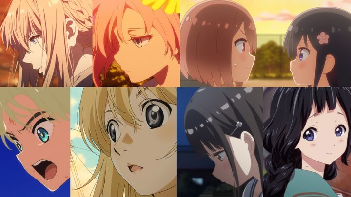

<br>

<br>

------

### 眼睛建模结构

说完眼睛的特征，就可以解释一个常见的疑问，3D模型的眼睛的瞳孔与虹膜区域是凸出来还是凹进去？

只能说两种方式都是常见的制作方法，各有对应的使用场景。

<br>

#### 凹进去

先说凹进去的，瞳孔与虹膜区域凹进去的眼睛是卡通眼睛最常见的方式，使用这种方式就自然的将瞳孔与虹膜的位置结构表达清楚，不需要在shader中做额外的操作，不足的地方就是眼球表面的高光反射没有办法精确的表达，不过对于细节量低的卡通角色的眼睛加两个高光点模型就可以满足需求了，这一点问题也不算什么缺点。


普通卡通模型处理眼部的做法通常就是把眼白留空，瞳孔凹陷下去，这样在侧面的时候也不会鼓出来显得比较自然。然而如果要做眼部近距离特写，这种做法看上去就不能令人信服。

<br>

#### 凸出来

凸出来的眼睛目前在卡通渲染中使用的较少，不过这种方式配合视差既可以很好的表现眼睛结构，也可以在眼睛表面制作动态的反光，适合高细节量角色的制作，缺点就是更高的开销以及需要一个好的视差算法。

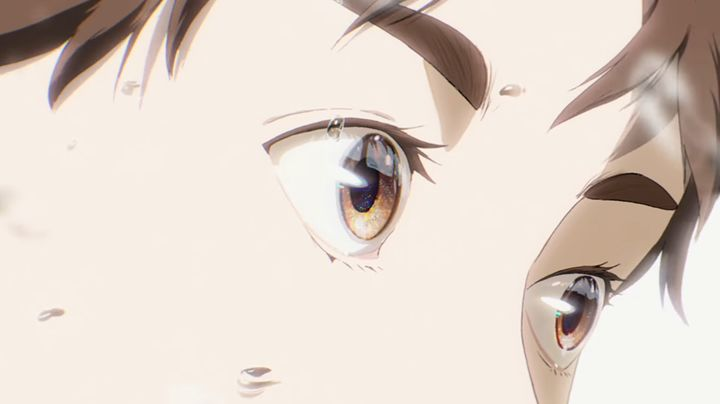

<br>

#### 复合结构

复合结构更多是写实角色中使用的方式，直接做两层，还原真实的眼睛结构，缺点就是更麻烦了，并且多一层半透明。


在卡通渲染中也有实际的使用，比如新樱花大战与SunnySideUp UnityChan，眼睛分两层建模：外层是向外凸的半透明层，用来绘制高光和反射，表示人眼的角膜；内层微微内凹，表示人眼的虹膜与中心的瞳孔。

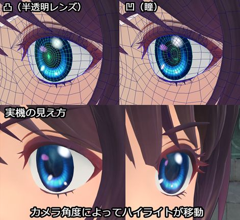


<br>

<br>

------

### 眼睛渲染制作

<br>

#### 极简方案

模型结构凹进去的眼睛渲染很简单，直接贴贴图足够了。最简单省事。

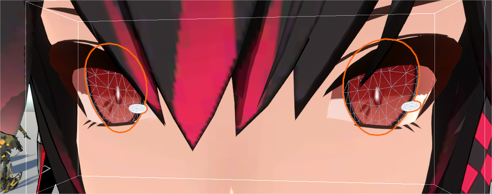

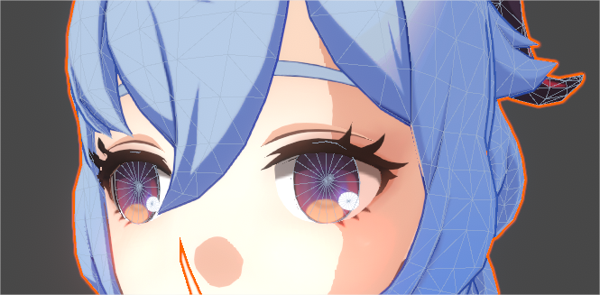<br>

<br>

#### 眼瞳折射

模型结构凸出来的单层眼睛，就需要考虑折射。

主要有视差和物理折射这两种方式，这两种方式都是对UV偏移然后进行采样，视差是一种经验模型，主要根据相机的位置去偏移UV，而基于物理的折射，则是计算了折射光线的向量，使用折射光线偏离UV。

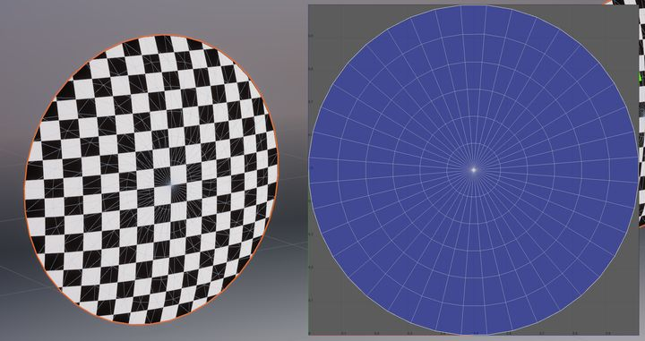

*↑下述演示的模型与对应UV*

为了模拟瞳孔与虹膜区域的深度通常会使用视差或基于物理折射的方式，这里直接使用Next-Generation Character Rendering中的两种方式。

使用真实折射算法，眼球本身还是按照球面来做，然后根据视线角度算出折射系数去偏移查找贴图对应点 。

基于物理的方法，在VR模式下会看起来更有质感，看起来比较类似于像玻璃珠的感觉。

对于卡通渲染的眼睛来说，两种方式从效果上来说差别并不大。物理折射在瞳孔偏移上要更符合直觉一点，不过很难察觉出来。

<br>

- ##### Parallax

先说视差，眼球可以看作一个理想模型，所以PPT中也只用最基础的视差模型。代码如下：

<br>

`float2 viewL = mul(viewW, (float3x2) worldInverse);`

`float2 offset = height * viewL;`

`offset.y = -offset.y;`

`texcoord -= parallaxScale * offset;`

<br>

上述代码计算了一个本地空间view的xy，然后用UV减去这个值进行偏移，texcoord就是用于采样贴图的UV。另外由于在本地空间中计算UV偏移，如果是不同轴向的模型，由于坐标轴向的区别，会使效果错误，如下图（注意轴向），所以一般会在切线空间中计算这个过程。

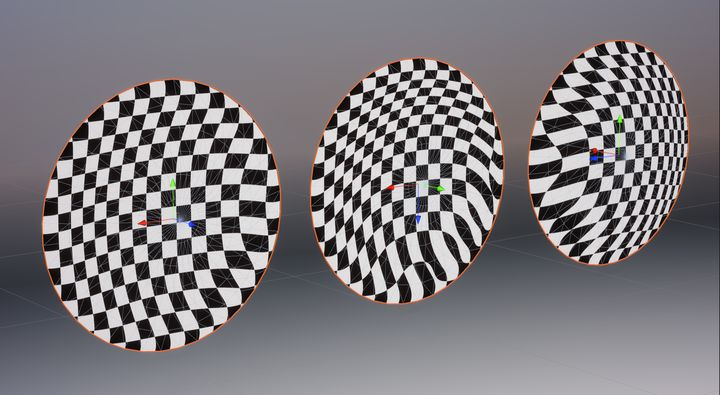

*↑轴向不同导致效果错误*

之后再加上眼睛的Mask就是一个简单而又完整的视差方案了，附上ShaderGraph中的还原（这里的height与parallaxScale是重复计算了，不需要两个参数）：

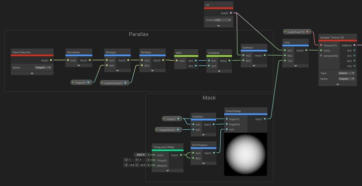

<br>

18年miHoYo的分享中，实际上也是这一思路，只不过贴出的内容较少，不知道后续计算有没有加入什么优化。

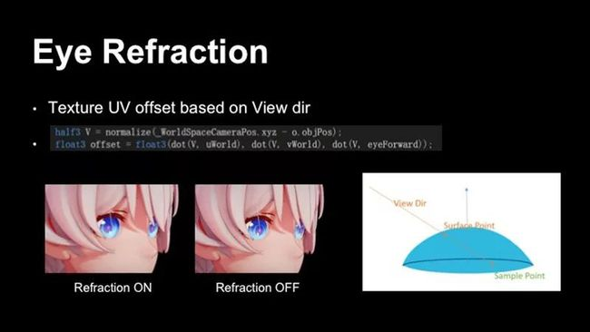

*↑可以看到如果没有折射效果，眼部侧面看上去较为奇怪*

<br>

- ##### Physically based refraction

基于物理的折射，核心在于折射光线的计算，refracted向量就对应了UV的Offset。首先上代码：

<br>

`// 角膜区域突起的模型`

`// Alternatively, use a displacement map`

`// height = max(-positionL.z – eyeIrisDepth, 0.0);` 

<br>

`// 球形模型`

`// Plot[Max[1.0 - 18.4 * r * r, 0.0], {r, 0, 0.3}]`

`height = anteriorChamberDepth * saturate( 1.0 - 18.4 * radius * radius );` 

<br>

`// refractedW`

`float w = n * dot( normalW, viewW );`

`float k = sqrt( 1.0 + ( w - n ) * ( w + n ) );`

`float3 refractedW = ( w - k ) * normalW - n * viewW;`

<br>

`float cosAlpha = dot(frontNormalW, -refractedW);`

`float dist = height / cosAlpha;`

`float3 offsetW = dist * refractedW;`

`float2 offsetL = mul(offsetW, (float3x2) worldInverse);`

`texcoord += float2(mask, -mask) * offsetL;`

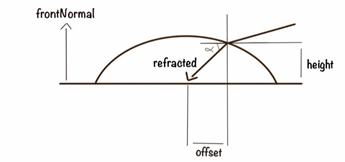

<br>

简略理一下上述代码的过程：

- 代码中首先计算了height，即前房的高度，PPT中height有两种计算方式，分别对应两种眼睛的模型结构，对应的结构写在注释中了。

- 然后计算了refracted，这个是rtr中快速拟合的计算方法，n是空气与介质折射率的比值，关于refracted的推论可以参考：[YivanLee：虚幻4渲染编程(人物篇)【第三卷：Human     Eye Rendering】](https://zhuanlan.zhihu.com/p/151786832)

- 最后一段，先通过frontNormalW与refractedW的点积计算出α角的cos值（上图中的α应该是标识错误，α是-refractedW与frontNormalW的夹角）。然后已知height，通过比值可以计算出refractedW的模长dist。offsetW即为完整的refractedW向量。最后转换到本地空间，乘上眼睛的Mask，加到原本的UV上。

- 之后就是使用偏转后的UV去采样贴图了。

与视差相同，这里也是在本地与世界空间中进行的计算，同样会有轴向问题，主要是normalW、viewW和frontNormalW参与的计算，normal与view可以转换到切线空间计算，而frontNormalW代表的是模型向前的朝向，这个必须要指定，不过图方便的话，把frontNormalW改成切线空间法线也不是不可以。

<br>

#### 焦散效果

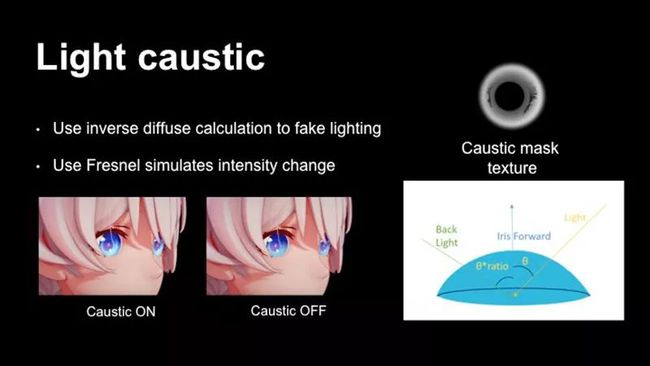

*↑通过对比图我们可以看到，没有焦散的眼睛就显得缺乏质感*

<br>

焦散的表现反倒简单了，直接画在眼睛贴图上都可以，考虑到卡通表达的自由性，焦散是否存在与焦散的形状都可以没有限制，只要好看就行。

miHoYo的分享可以简单的理解为直接贴张Mask上去，然后用光照方向和菲涅尔去影响强度变化：

<br>

加入了光线折射后的焦散效果，使得眼睛的材质得到进一步增强。

对于非写实风格渲染，物理正确并不是要考虑的因素，考虑到卡通渲染的特殊情况，我们希望的效果是焦散出现在入射光另一侧，并且入射角度越平行看起来越明显。

实现方法通过入射光和眼球前的夹角，算出入射光的强度，辅助菲涅尔公式，最后得到最终效果。具体是使用inverse diffuse来模拟，再辅助fresnel公式做亮度变化，最后乘上eye caustic纹理得到最终效果。

<br>

下面再看看卡通离散化的焦散效果，还做了双层暗色：


<br>

- ##### 高光流转

高光其实没什么好说的，简单的高光用两个模型圆点，或者做一张高光贴图就可以了，抖动就用noise扰动一下，这里写点好玩的比如高光的回旋变化。

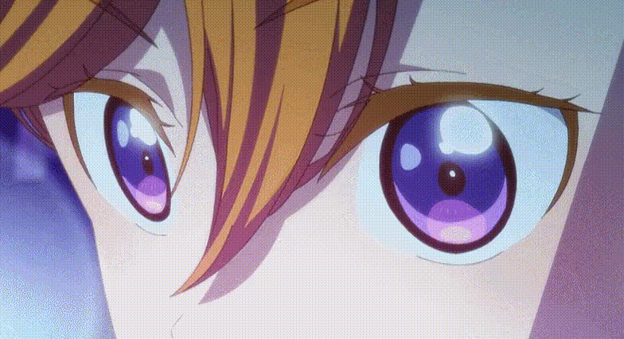

动画中可以经常看到的演出效果，眼部的回转流光。在shader还原的话，可以旋转UV意思一下，也可以用Flipbook搞定。下图中绘制了16帧的高光变化过程，在shader中结合Flipbook播放就可以了，不过这种效果一般是大特写表现情绪的时候出现的效果，出场几率不高。

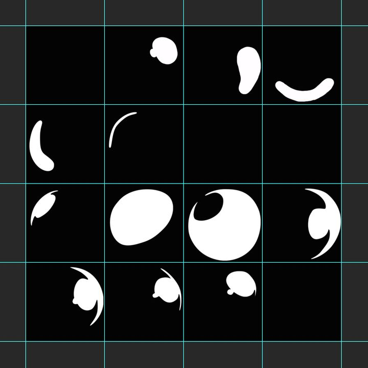

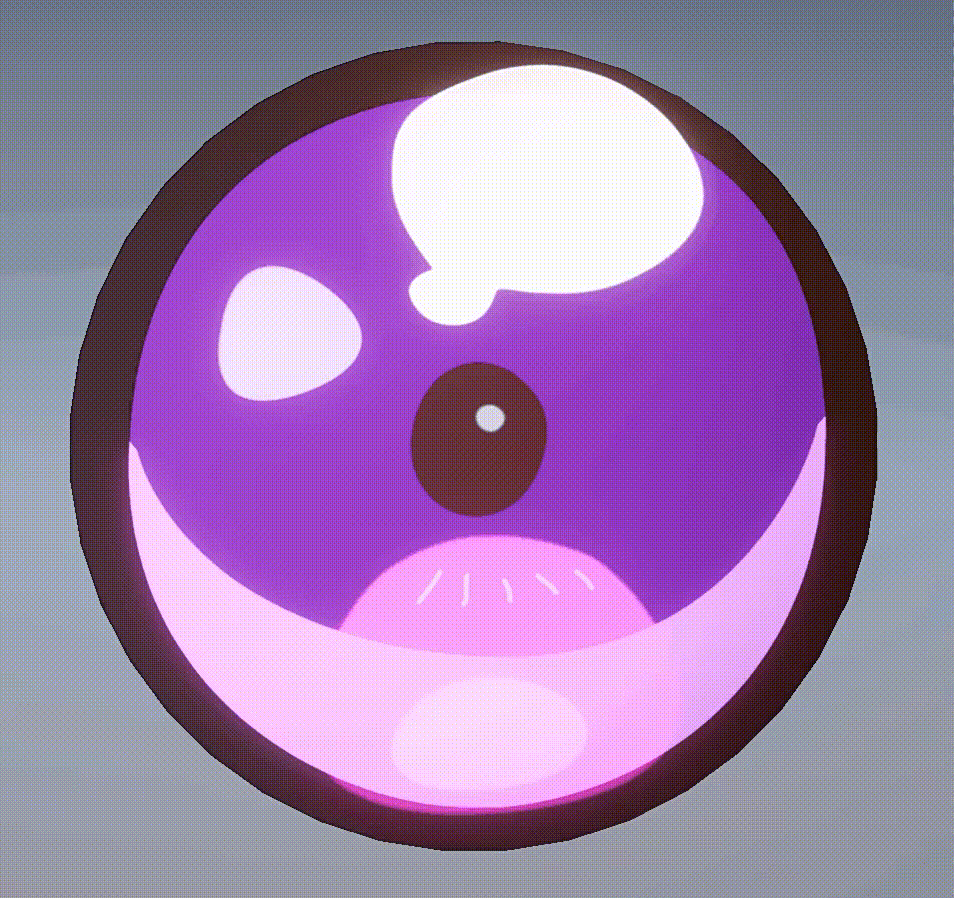

*↑Flipbook测试效果*

<br>

- ##### 环境反射

眼睛的环境反射除了高光，还可以使用Matcap丰富层次，当然做真实的环境反射更加直接，不过Matcap的可定制性更强一些。

Matcap的细节这里不过多阐述，主要方法就是使用视角空间下的法线作为UV采样贴图，并且一般要进行相机的偏移校正。

这里借用UTS中做相机修正的方法，代码如下，ViewNormalAsMatCapUV即为采样贴图的UV。

 <br>

`float3 NormalBlend_MatcapUV_Detail = viewNormal.rgb * float3(-1,-1,1);`

`float3 NormalBlend_MatcapUV_Base = (mul( UNITY_MATRIX_V, float4(viewDirection,0)).rgb*float3(-1,-1,1)) + float3(0,0,1);`

`float3 noSknewViewNormal = NormalBlend_MatcapUV_Base*dot(NormalBlend_MatcapUV_Base, NormalBlend_MatcapUV_Detail)/NormalBlend_MatcapUV_Base.b - NormalBlend_MatcapUV_Detail;`        

`float2 ViewNormalAsMatCapUV = noSknewViewNormal.rg * 0.5 + 0.5;`

 <br>

另外由于眼睛比较平的原因，matcap的变化量可能过大，可以生成一个球形法线去替换原本眼睛的法线，或者与原本的法线做插值，会让matcap的效果更固定一些。

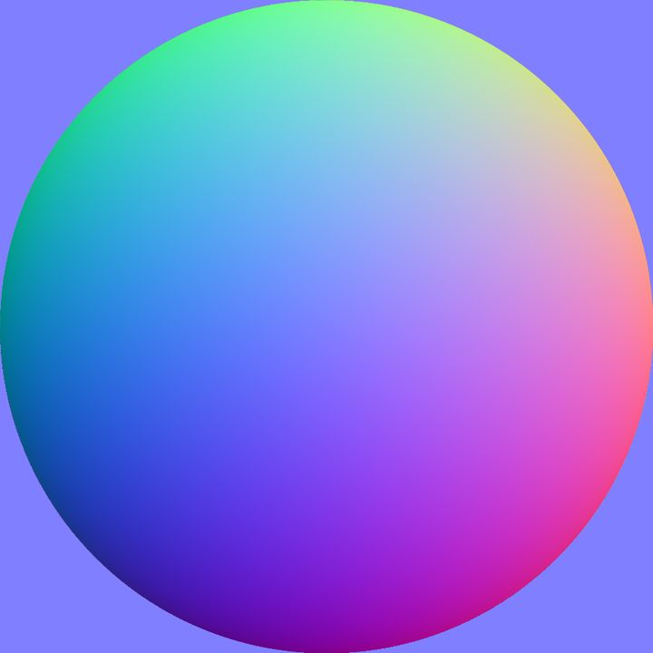

*↑球形法线*

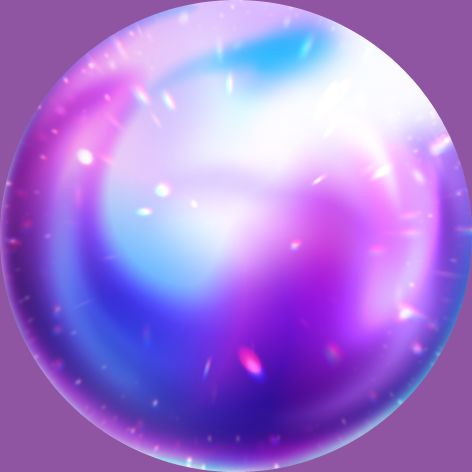

*↑使用的Matcap*


*↑加入Matcap的眼睛效果*

<br>

再拿新樱花大战举个例子:

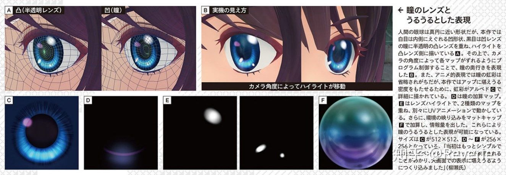

*↑新樱花大战方案——C：Albedo Map，基本贴图，表现出人眼的虹膜效果；D：对基本贴图的加算图；E：高光图，也是通过加法计算，会通过UV动画进行移动；F：环境反射图*

<br>

虽然很多动画风格的渲染中会省略掉瞳孔中的虹彩部分，但本作为了提高角色靠近时的效果，进行了详细的绘制，同时为了体现环境的变化与matcap的贴图进行叠加。

高光贴图有两张，分别使用不同的UV动画进行控制，用于表现眼睛的湿润感。虽然是很细微的操作，但是对于表现角色的感情非常的有用。

<br>

- ##### 眼白区域

眼白区域是一个容易被忽略的地方，很多卡通模型制作的时候都会把眼白区域内凹进去，这个有几个方面的原因：

- 防止侧面视角下眼睛区域的形态奇怪；
- 防止眼睛区域的表情被眼白干扰；
- 为了表现眼白上的阴影区域（存疑），在离线渲染中高质量的阴影可以在凹陷的眼白中自然形成；

而在引擎中由于阴影精度的限制，阴影很难在这么小的区域内有很好的表现，再加上很多时候会去屏蔽掉面部的自投影，另外去做自定义的阴影贴图，凹进去的眼白实际上不利于眼白区域阴影的表现。建议做在引擎中表现效果的卡通模型时，不要做非常夸张的内凹眼白，做平一点同样不会有上述一和二的问题，也更利于手绘阴影贴图的表现。

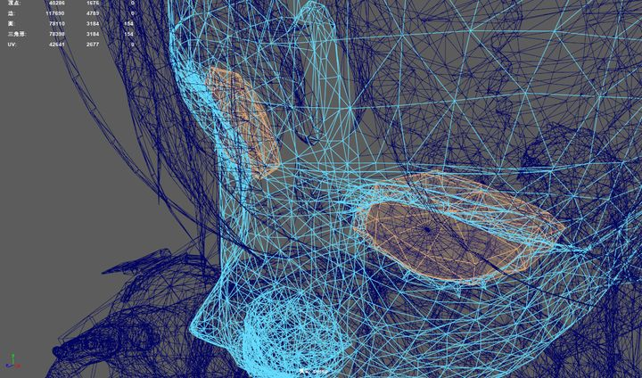

*↑内凹眼白区域*

<br>

<br>

------

### 眼睛的遮挡关系表现


当眼睛眉毛被头发遮挡时，在日式卡通渲染中通常的做法是将被头发遮挡的眉眼显示出来。

如果你的二次元渲染方案决定要这样画眼睛或眉毛，可以从下面几种方案中选择。

记得要考虑眉眼，还有面部和头发的排序问题。

<br>

#### 模板测试法

使用StencilMask结尾的shader来绘制眉毛，并将“StencilNo”写入Stencil Buffer。然后使用StencilOut结尾的shader来绘制头发刘海等，在绘制之前，先进行模板测试，只有不等于指定“StencilNo”的片元才会被保留并绘制。如此一来，头发刘海等本应遮住眉毛部分的片元会被舍弃而最终遮盖头发。

**缺点：** 多用一张模板贴图，在手机上对带宽不友好。

```glsl
// StencilMask部分：
Stencil 
{
    	Ref[_StencilNo]
        Comp Always
        Pass Replace
        Fail Replace
}

// StencilOut部分：
Stencil 
{
    	Ref[_StencilNo]
        Comp NotEqual
        Pass Keep
        Fail Keep
}

```

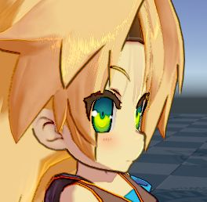

*↑具体效果可见UTS2中的人物表现*

<br>

#### 深度测试法

利用深度测试，使用RenderQueue按头发→脸→内眉毛→外眉毛的顺序绘制，眉毛绘制两遍，第一遍用ZTest LEqual绘制没被头发挡住的眉毛，第二遍用ZTest GEqual绘制盖在头发上的眉毛。

**优点：** 眉眼的计算量并不多，这种做法会更省一点。


<br>

#### 分Buffer绘制


新樱花大战在单独的Buffer中进行眉毛的绘制，并在后处理时进行合并，让眉毛和眼睛产生一种透视感。在渲染时如果由于摄像角度导致前发会挡住眼睛，就会进行这个计算。

<br>

#### 深度偏移法

在顶点上记录一个clip上z的偏移就行。但这样无法处理眼球的问题，而且在头发剧烈运动时依然可能穿帮。

<br>

#### 刘海半透明化

另一种民间意见：可以把刘海拆分开做成半透明，这样眉毛眼睛就能直接透出来了，半透明发尾也好看。

<br>

#### 为啥不弃疗法

以上不是很好操作，就最好别有眼睛显示在头发上这样的需求。眉毛好办。

<br>

<br>

------

### 

