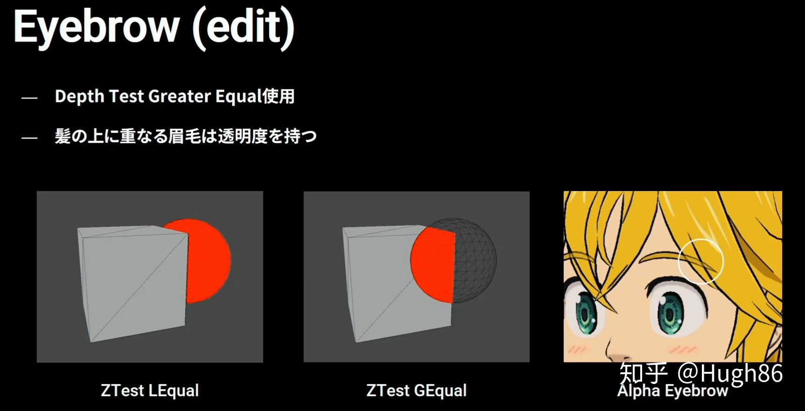

# Toon Shading Collection 

## CH09a - Eye 眼睛

<br>

眼睛是心灵的窗户，能表达的东西很多，二次元眼睛风格非常多元化，可能是决定观众印象的第一要素。根据需求不同，可以考虑多种实现方案。

<br>

------

### 眼睛的遮挡关系表现


当眼睛眉毛被头发遮挡时，在日式卡通渲染中通常的做法是将被头发遮挡的眉眼显示出来。

如果你的二次元渲染方案决定要这样画眼睛或眉毛，可以从下面几种方案中选择。

<br>

#### 模板测试法

使用StencilMask结尾的shader来绘制眉毛，并将“StencilNo”写入Stencil Buffer。然后使用StencilOut结尾的shader来绘制头发刘海等，在绘制之前，先进行模板测试，只有不等于指定“StencilNo”的片元才会被保留并绘制。如此一来，头发刘海等本应遮住眉毛部分的片元会被舍弃而最终遮盖头发。

**缺点：** 多用一张模板贴图，在手机上对带宽不友好。

```glsl
// StencilMask部分：
Stencil 
{
    	Ref[_StencilNo]
        Comp Always
        Pass Replace
        Fail Replace
}

// StencilOut部分：
Stencil 
{
    	Ref[_StencilNo]
        Comp NotEqual
        Pass Keep
        Fail Keep
}

```


*↑具体效果可见UTS2中的人物表现*

<br>

#### 深度测试法

利用深度测试，使用RenderQueue按头发→脸→内眉毛→外眉毛的顺序绘制，眉毛绘制两遍，第一遍用ZTest LEqual绘制没被头发挡住的眉毛，第二遍用ZTest GEqual绘制盖在头发上的眉毛。

**优点：** 眉眼的计算量并不多，这种做法会更省一点。



<br>

#### 分Buffer绘制


新樱花大战在单独的Buffer中进行眉毛的绘制，并在后处理时进行合并，让眉毛和眼睛产生一种透视感。在渲染时如果由于摄像角度导致前发会挡住眼睛时，会进行这个计算。

<br>

#### 深度偏移法

在顶点上记录一个clip上z的偏移就行。但这样无法处理眼球的问题，而且在头发剧烈运动时依然可能穿帮。

<br><br>

#### 刘海半透明化

另一种民间意见：可以把刘海拆分开做成半透明，这样眉毛眼睛就能直接透出来了，半透明发尾也好看。

<br><br>

#### 为啥不弃疗法

以上不是很好操作，就最好别有眼睛显示在头发上这样的需求。眉毛好办。

<br>

<br>

------

### 眼睛内部细节

做眼睛最简单省事的就是贴图，最多一层底色加高光足够了，但这放在高品质游戏里难免有点敷衍。


*↑眼睛的细节以及其它部位效果示例*

<br>

#### 眼瞳折射


*↑可以看到如果没有折射效果，眼部侧面看上去较为奇怪*

<br>

普通卡通模型处理眼部的做法通常是把眼白留空，瞳孔凹陷下去，这样在侧面的时候也不会鼓出来显得比较自然，然而如果要做眼部近距离特写，这种做法看上去就不能令人信服。

使用真实折射算法，眼球本身还是按照球面来做，然后根据视线角度算出折射系数去偏移查找贴图对应点 。

基于物理的方法，在VR模式下会看起来更有质感，看起来比较类似于像玻璃珠的感觉。

<br>

#### 焦散效果


*↑通过对比图我们可以看到，没有焦散的眼睛就显得缺乏质感*

<br>

加入了光线折射后的焦散效果，使得眼睛的材质得到进一步增强。

对于非写实风格渲染，物理正确并不是要考虑的因素，考虑到卡通渲染的特殊情况，我们希望的效果是焦散出现在入射光另一侧，并且入射角度越平行看起来越明显。

实现方法通过入射光和眼球前的夹角，算出入射光的强度，辅助菲涅尔公式，最后得到最终效果。具体是使用inverse diffuse来模拟，再辅助fresnel公式做亮度变化，最后乘上eye caustic纹理得到最终效果。

<br>

#### 高光反射分层

稍微简化的方案，拿新樱花大战举个例子，眼睛分两层建模：外层是向外凸的半透明层，用来绘制高光和反射，表示人眼的角膜；内层微微内凹，表示人眼的虹膜与中心的瞳孔。


*↑新樱花大战方案——C：Albedo Map，基本贴图，表现出人眼的虹膜效果；D：对基本贴图的加算图；E：高光图，也是通过加法计算，会通过UV动画进行移动；F：环境反射图*

<br>

虽然很多动画风格的渲染中会省略掉瞳孔中的虹彩部分，但本作为了提高角色靠近时的效果，进行了详细的绘制，同时为了体现环境的变化与matcap的贴图进行叠加。

高光贴图有两张，分别使用不同的UV动画进行控制，用于表现眼睛的湿润感。虽然是很细微的操作，但是对于表现角色的感情非常的有用。

<br>

#### 极简方案

很多极简方案是，高光都直接做成固定模型，就一个白点。不说了看图。


<br>

<br>

------


