# Toon Shading Collection 

## CH10 - More Materials 更多材质效果

 

现在的卡通渲染游戏想要刺激玩家眼球，除了之前几章探讨过的，可能还要融入越来越丰富的材质效果，所以这里列一下可以考虑的材质。大部分源于偏写实的项目，也不知道是不是应该、或者能不能改良成更卡通的感觉。

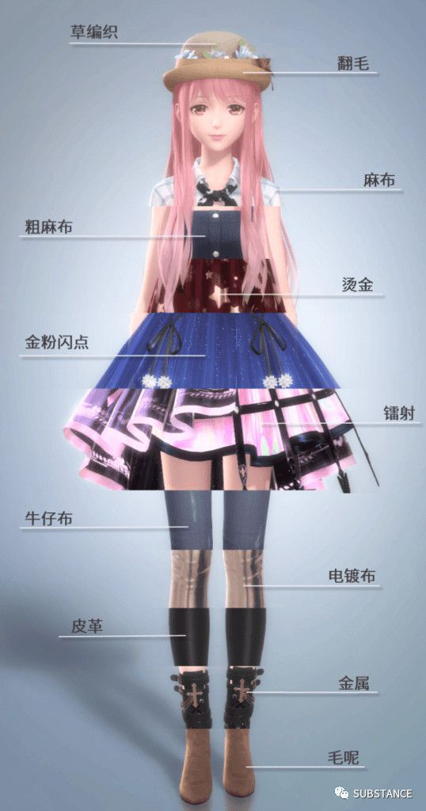

 

------

### 半透明

#### 传统方案

传统方案是用Alpha混合或Dither抖动，低性能平台尤其适合抖动，不过美术同事一般不太能接受。

 

#### 高品质折射

角色材质中还包括其它特殊的材质，例如：水晶和纱巾等半透明材质，直接使用Alpha混合不能表现出应有的质感，为了更真实细腻的高品质，就需要实现折射和模糊效果，这二个效果都依赖于Unity的Command buffer。

实现折射效果时，Command buffer在渲染折射前获取已经渲染好的Backbuffer作为背景，用于折射采样, Rgb通道设置不同折射系数，分别采样三次来模拟色散效果。

对于模糊效果，则是用Command buffer将Backbuffer降采样并做模糊，生成4张尺寸依次减半模糊度递增的RenderTexture，然后根据相机距离和FOV以及材质固有的模糊参数，确定模糊程度，选择对应的RenderTexture来完成模糊效果。

还可以对这二者的实现做一定的优化，不对直接对Backbuffer使用全屏模糊，把物体本身作为Proxy mesh，只处理需要画的部分。

 

 

------

### 闪点材质

类似于闪光片的闪烁效果，作为第二层材质来处理。

首先用specular map表示区域，然后用normal map增加反射不规则性，反射的光源主要是主光源和环境IBL贴图，此外使用光图查找表做五彩的闪烁效果，主要方法也是根据入射角度决定色彩偏移来查找光谱图，使用不同光谱图也会有不同的色彩表现。

 

 

------

### 动态赛博风材质

角色衣服上的动态条带，随着音乐的节奏变化而变化。

把跳动的音符调在分为两组，分别对应音频文件中的中频和低频信号，然后对音频做频谱分析，每帧得到的中频和低频强度根据强度去伸缩对应层的音符UV，得到动态的效果。

 

 

------

### 编织纹理布料

为了达到超细节品质，要对面料做深入研究。最为重要的环节便是编织，不同的织法出现的纹理都是不一样的，纹理结合材质可以做出无数种变化，让玩家能够充分享受到细节带来的满足感。

为了得到非常精准的Normal 法线凹凸效果，传统做法是使用最为直接的制作方式，通过3D建模来模拟真实的编织方式。下图是闪耀暖暖开发组早期制作的几组编织模型。

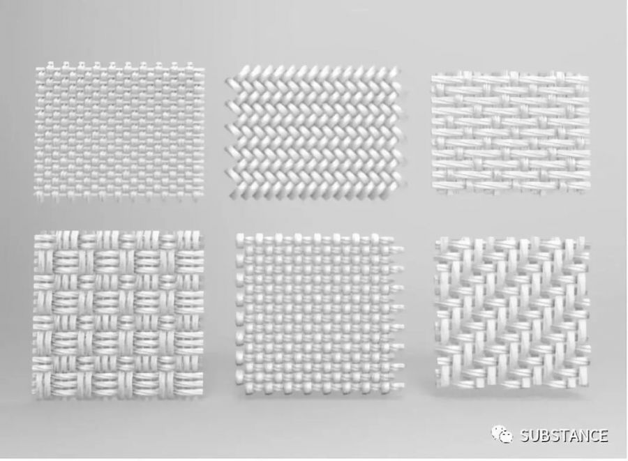

3D建模纹理的制作流程有利有弊，虽然它的品质很高，但其制作成本也比较高。最高的部分其实是修改成本，我制作了非常多的纹理，当数量达到一个库的级别后，如果在这个基础上再做修改，成本是不可预想的，而且模型纹理的整理和规范很难做得科学些。

虽然担心的问题并没有发生，但是为了追求更完美的效果和更高效且科学的工作流程，决定尝试使用 Substance Designer 制作纹理贴图。为了让团队能够熟练使用 Substance Designer要投入很大的成本，但这一切还是很值得的，所以才有了闪暖第一部宣传片中超高品质的材质效果，但这并不是最终品质，目前还在不断的突破自己。

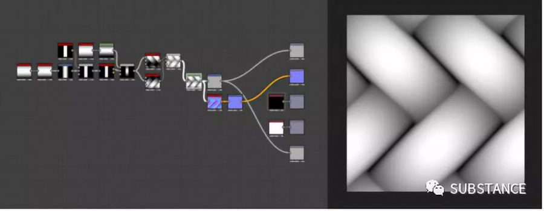

在制作过程中需要通过布料模型验证效果，该模型需要有不同的纹理方向，纵深程度，以此确认纹理中各个距离的效果。

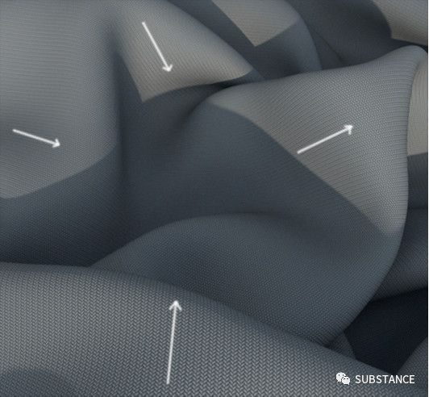

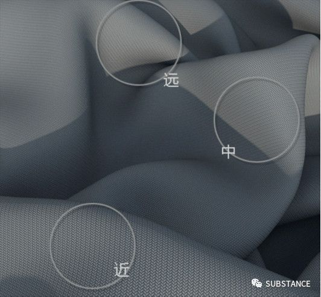

在这个过程中还需要通过调整Roughness和Metallic两个值以确认不同质感下的纹理效果。

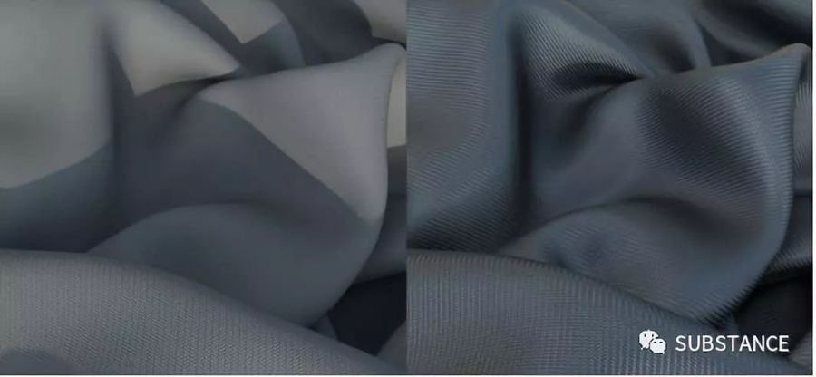

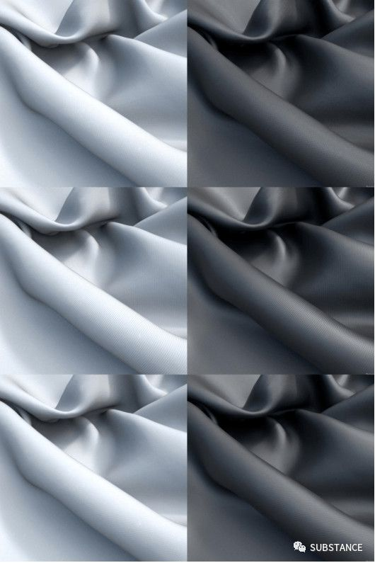

为了丰富变化，制作过程中会增加一些随机效果。Base layer + Random wear 随机磨损 + Random thrum 随机线头。

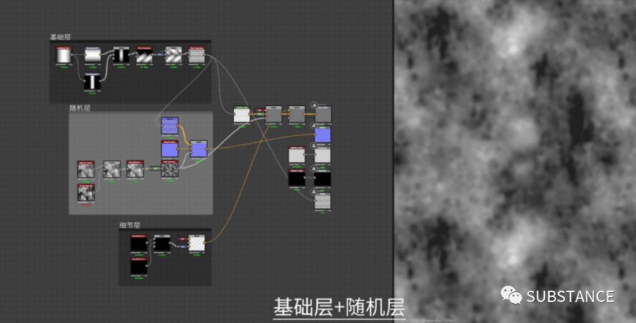

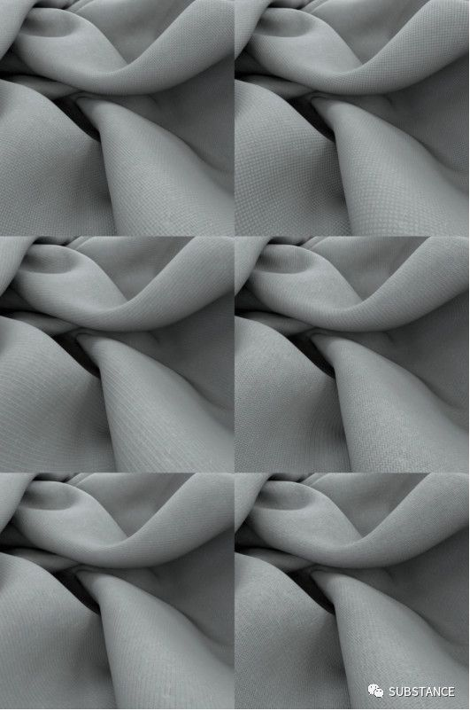

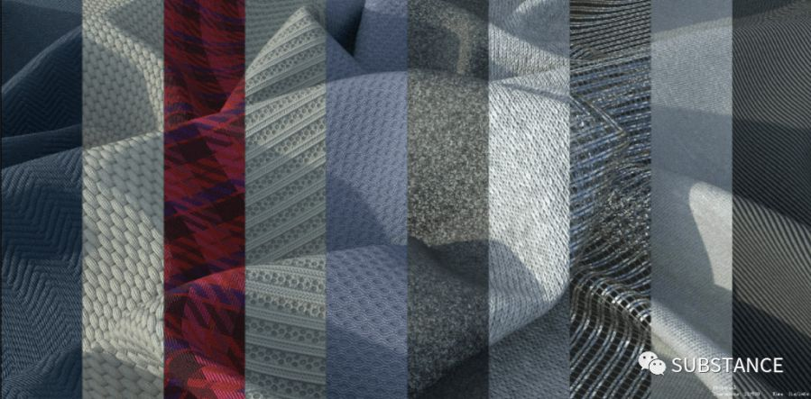

下面是区分麻纱与细纱的部分，主要改变固有色纹理层，这样可以做出更精确的材质效果。但最重要的还是需要了解如何拆分材质，懂得拆分才会懂得组合，这样便能使用 Substance Designer 制作出更准确的材质。

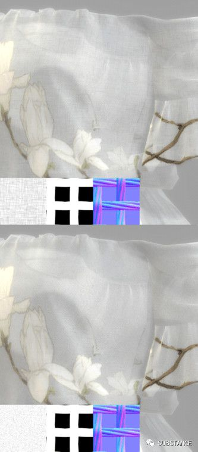

Substance不仅能制作出高品质的纹理，它庞大的材质库Substance Source还可以提供很多类型的材质纹理以供下载使用。根据项目的规格，当然还是有些纹理需要花点时间进行优化和处理。

程序纹理易于管理，制作效率极高，高效率自然导致大家就更愿意去创造更复杂更完美的资源。

但这个办法也有大挑战，比如中国风的刺绣，刺绣的排线太考究，几乎只能使用传统的方式来制作，对于 Substance Designer 还没有特别好的思路。

 

 

------

 

 

------

（待续）

