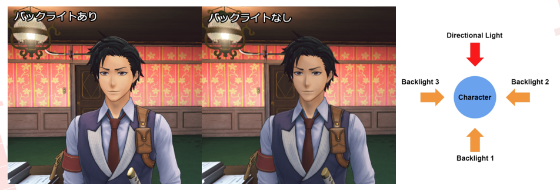
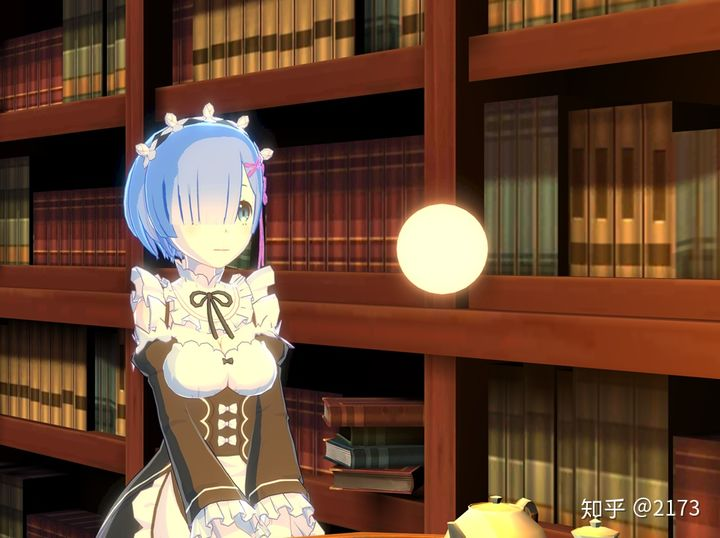
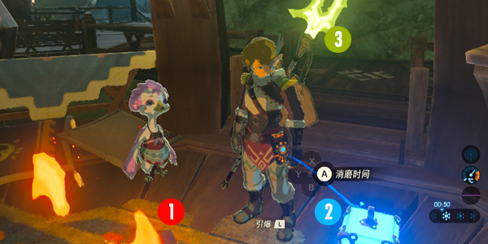
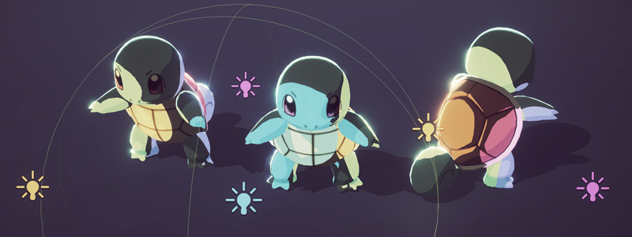
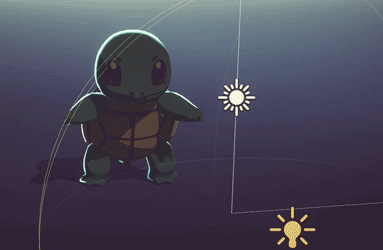
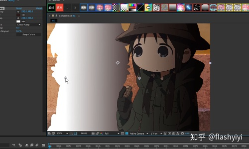
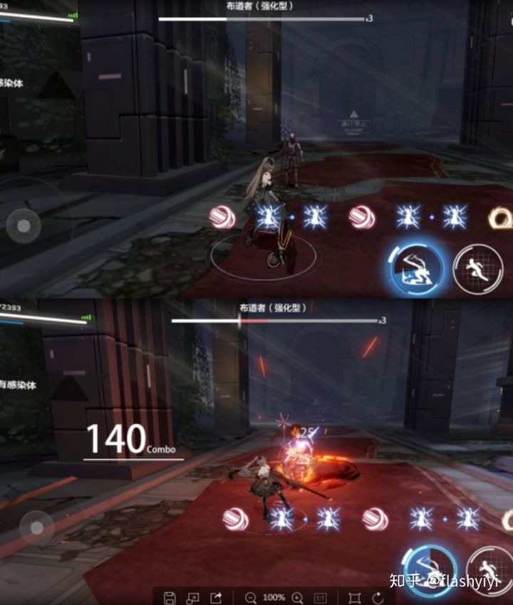
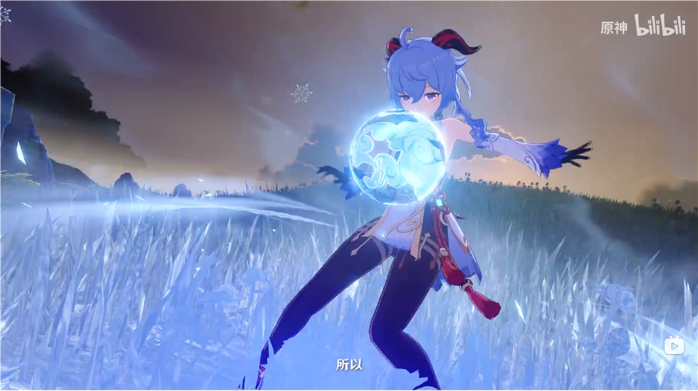
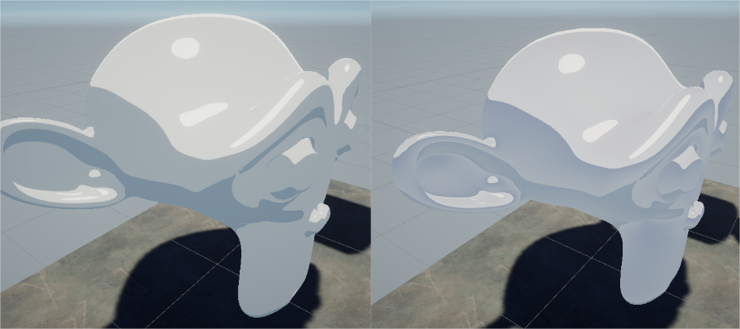
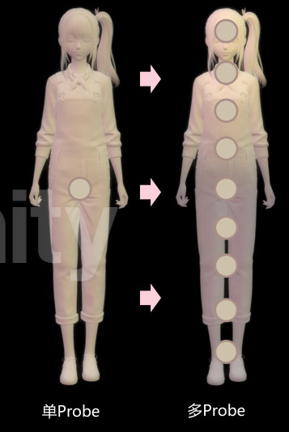

# Toon Shading Collection 

## CH12 - Lighting 打光（多光源）

 

 

------

### 角色打光方案

#### 全独立打光

传统横板游戏的常见做法是给每个角色专门配一个独立光照方向，这个灯光方向可以和场景灯光或其他角色的灯光方向不一致，只要能获得最佳画面表现力。罪恶装备甚至在过场动画中为了达到最好的效果，会逐帧改变角色的光照方向。

整个方案是：场景打主光，每个角色单独打光。

 

#### 半独立打光

面部漫反射章节还提到了永远从视线方向给角色打光的弃疗办法，算是一种把角色打光跟场景打光拆分的半独立方案，只是所有角色基本上会共享打光方案。

漫反射章节还提到了一种把角色打光以场景主光源角度为基础压低50%的办法，也是一种半独立方案。

 

#### 分区打光

总的说来，角色打光方向（尤其是高低）靠近视线方向的话，身体的明暗细节就不够丰富；而打光方向靠近正午垂直头顶的话，脸部明暗细节就会过于丰富。所以说，脸部适合偏平视方向的打光，身体适合偏顶光的打光。

在面部漫反射章节中，水平mask法已经做到了独立光照方向，而强度mask法也可以做到专门把脸部提亮一些，但后者独立性还是差点，光照角度越高越容易崩脸，毕竟不能把脸提亮到永久处于亮部。

所以还是可以在光源方向上分区处理，思路和上一小节里的压低法一样（上面直接全身压低光照角度其实也太粗糙了），只是要用mask控制需要压平光照的区域。

选人界面非常适合应用这套思路：身体的打光偏高角度，脸的打光偏低角度。

 

#### 角色补光

也有专门给角色打多个光的，有点像电影打光或人像摄影的补光。一些写实渲染的游戏也会给角色打补光。

新樱花大战会在主光照的180度相反位置和左右90度的位置添加用于角色亮度修正的背光灯，主要用于防止角色站在逆光的位置导致变暗的问题，以及背光灯的光照也可以强调出材质的质感。

（但感觉逆光暗部不该这么处理，今天Unity的官方技术指导过来教俺们，说暗部提亮就该靠正确的间接光设置，我想对这个也适用吧。而且新樱花大战这渲染咋看都丑啊，反正放这随便看看吧。）

 

#### 统一打光

当年罪恶装备开发人员甚至认为动画强调的2D风格不需要搞多光源。

不过现在都开放世界时代了，以后肯定绕不开场景与角色统一光源+多光源了。

在这个基础上，可能会同时应用分区打光方案。

 

 

------

### 综合打光决策示例

事实上，光照修正问题的源头是“背面死暗”和“阴阳脸”，而这两个东西其实在PBR也一直存在。

光照只有在正面才有亮度变化，转到背面当然只有固有色的“平面”。现在因为有了全局光照，背面也有了粗略的光照效果，但依然缺少一些特性（比如说自阴影，SSS），依然会导致背面不如正面好看。所以即使是2020年的现在，在过场剧情和人物的聚焦画面时，依然会给人物打补光。

如果没有全局光照就更不用说了，只能长期打着补光才能让人物有一个稍微好看的结果。

而卡通渲染的二值化光照下是不能随便打补光的，并且二值化还会放大光照的不美观之处。

为了人物好看，只能限制光照角度，尽量使用正面光。但同样是正面光，仰角也有很大的区别，一般情况是45度比较好看，但45度就会在脸上打出上下的阴阳脸。并且，强制使用正面光，也会在镜头旋转时让玩家发现人物缺乏光照变化，好好的动态光照变成了死光照，正反面相同反而是小事。

我的方案，首先是可以定制每个部分的光照仰角。一般用户并不会太在意光照的仰角是否合理地，是否和日照方向同步。

其次，给予光照一个水平偏转角度，扩展它处于视觉正面的角度比例。即使光照处于正背面，依然可以看到足够比例被照亮的部分，并在某个角度快速转向到另一侧。

还有个常用方案是让光照偏向头顶，这样至少头上那块是一直照亮的。但是这样做很容易导致一些有角度的物体（比如说裙子）一直都是亮的，所以需要手动调整。但既然你固定了仰角，那旋转一周就能看到所有可能的光照结果，还算比较容易处理。

上面说的都是决定人物基本光照的主光源方向。比较强调方向性的辅光源在仰角的限制可能就需要去掉（出现在头顶的光总不成还是水平的），但水平的调整依然可以保留。总之这一切都需要通过设置光源的参数来进行区分。

另外，上面也说了，玩家不能接受的并非“正反面光照一直相同”，而是“视角和光照变化时人物光影没有变化”，所以像战双那样，始终保证光照从摄像机射出，但是变化时给予一定延迟，让玩家看到一个光照变化的过程，虽然完全“物理错误”，却也是可以接受的设计。但我暂时还没用这个方案，现方案实在不行的时候再说吧，毕竟乱晃镜头的时候破绽太明显了。要加也是加个脚本的事。

 

 

------

### 多光源

#### 光源分散

在场景中添加多个光源，同时作用于场景和角色。场景和角色有共同受光，能够提高两者的融合感。

不管是用默认光照系统还是自定义一套光照，总之是用代码将多个点光源信息传递到shader里运算相对于物体表面的角度、距离和颜色。

 

多（点）光源照亮卡通角色可能要考虑的问题：

- 点光的方向和衰减对ramp边界位置的影响如何处理（可能简化点光源方向为对每个角色整体的平行光方向）
- 多光源照亮部分叠加时谁在最上层（是否按重要性或距离、强度排序，据说暖光覆盖冷光会比较舒服）
- 叠加受光可能会过曝（或者处理成不叠加而是纯lerp覆盖？）
- 二分光影效果互相叠加会不会难看

 

多点光源的复杂视觉效果，对于Q版角色来说可能影响不大，但对正常比例人物来说，就很容易造成丑化。

如果点光源的摆放不会互相叠加还好，但如果必须叠加就麻烦多了。

 

#### 舍弃副光照方向

因为上面二分光源互相叠加的复杂情况，有个简化的办法是，放弃副光源的光照方向，仅使用副光源的颜色和衰减信息，而漫反射二分保持按主光源决定。通常这里的主光都改成永久正面光照了。

也就是说，不再让非主光的直接光照方向和法线方向点乘，而是直接根据距离衰减减弱光照，并除Pi获得一个各方向光照的均值。

而光照探针提供的间接光照，可以直接使用第一层SH的值（Unity的做法是在获取SH9的时候传入(0,0,0)这个参数），它实际上就是各方向光的均值。

还可以在场景上布置一些碰撞体，进入碰撞的时候调整材质的亮度，因为探针布置起来挺麻烦的精度也不高，也不好处理进出时的突变。

这些光相加后，直接乘在颜色上，对暗部和亮部同时造成影响。虽然光照的方向特性完全没了，起码不会让人物在场景里显得违和。

这样产生的光照和法线无关，只按光照距离衰减，是一个类似氛围光的东西，可以让人物融入到四周的环境中。在接近一个光源时人物会渐渐染上光源的颜色，而在进入阴影时整个人物会变黑。

战双就是这样搞的。

 

##### ——无方向光视觉优化

无方向副光源有个可能的优化方法：根据预定的光照方向将模型分为明暗两个角度，两部分分别计算半球均值获得颜色，这样光源在物体周围旋转的时候起码不会毫无变化，在光照较多的场景里多多少少能多一些动态变化，也能反应出背光和正光颜色的不同（边缘光也是一种背光）。

动画中，方向光过渡大多利用分层调色实现，放在即时渲染里，就是在模型上虚构一个圆柱体，来生成上面的黑白渐变区域。脸和身体分别处理。

这个在剧情过场中必然是可行的，毕竟动画就这样做的。但是在自由视角的游戏里根据光源生成这个……就不知道会变成什么样了。

此外，这种过渡其实是类似BlendNormal的思路，由于原始法线过于高频，而卡通渲染需要简化的光照效果，所以或许可以通过在屏幕空间，以depth为界限大幅模糊Normal纹理来实现？普通的模糊滤镜是不行的，就算可以，也得用特殊的做法。

线性调光的这种做法还是值得一试的，至少可以提高实时过场和动画的相似性。

 

 

------

### 多光源系统管理

多光源一般涉及光照裁剪，但如果保持一两个光源的数量，也可以不裁剪，现在这个计算量不算大。

如果用unity默认管线不接受多pass性能的，就自己重新实现单PASS光照系统，可以退回到LightMode Vertex，用unity_LightColor，unity_LightPosition获取最近的8个光源处理光照。也可以转URP，并帮URP实现尚未实现的功能。

自己写多光源系统的话，可以给光源增加更多细节特性，比如用抖动系数配合sin和cos给光源方向做点动态偏移，模拟火焰跳动效果。

 

 

------

### 特效打光

在攻击时产生光特效的时候，为特效位置添加专用光源照亮场景，让人物与特效有一致的表现，能显著提高画面观感。场景正常根据法线着色即可，人物可能用无方向光方法，要不就额外附加一个二值化方向光，或者两者混合。

随着手机性能发展，多跑一个光源也慢慢能被主流机型接受了，在战双中能看见不少特效都有点光源。

*↑注意观察七大罪的特效用光源*

*↑战双有无特效照亮场景对比*

*↑原神这个似乎没有给特效加光源，还是背光……*

 

 

------

### 间接光

之前漫反射章节末尾提过角色漫反射如何融入环境，这里再探讨下更丰富的间接光效果。

 

#### 变动采样方向

前面章节对漫反射的乘法处理算是一种伪环境光的算法，我们还可以另外考虑贴近写实一点的思路。

可以选择引擎内置的环境光光源，天空盒或者GI等，然后按表面法线方向采样，计算的光照颜色直接加到最终颜色上，会形成让模型更加立体的渐变色彩。

可能的缺点是，加法的计算比较难让美术人员控制最终呈现的亮暗面颜色，而且有时候会显得太有立体感。

如果想削弱立体感，采样环境光可以不使用表面法线，比如改成球形法线等自定义方向。

*↑左：纯色作为环境色，非常平面化；右：按法线采样环境色，有立体感，细节更加丰富。*

 

#### 丰富采样点

闪暖早期使用5.6引擎版本的时候只有两盏灯可以使用，当时在丰富灯光的问题上卡了很久，之前也考虑过用天空盒的方式来丰富渲染的效果，但是这样做可控性很低，如果想让2D人员辅助来调整效果就很难，他们无法理解天空盒的方式。

后面的解决思路是沿着球的纵向进行摆放LightProbe的采样点，点的密度可以进行调整，如果希望面部光照更丰富的话，就可以在面部摆放得密集点。后来我们会把所有的信息都烘焙到这些LightProbe球上，这样就可以得到一个光照很丰富的效果了，而且成本也不会很高。

 

 

------

