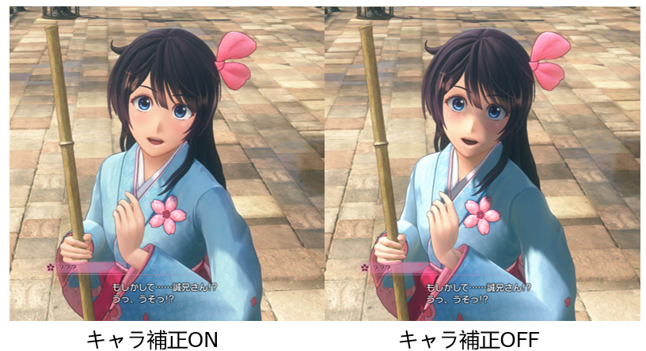
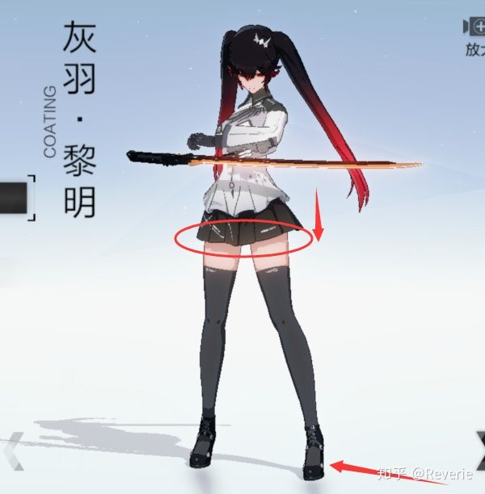

# Toon Shading Collection 

## CH13 - Shadow 投影

 

卡通渲染的阴影不同于一般意义上的阴影，而是拆分成了两个更精细的定义：

- 阴：很难被光照射到的暗面，即背对光源的区域。本文之前一直称之为“暗面”。
- 影：由其他物体遮挡生成的暗面。本文称之为“投影”“阴影”。

卡通渲染的阴影一般不能用引擎默认的那套。

 

------

### 高质量角色阴影

#### 自定义ShadowMap

如果直接使用Unity内置的CSM阴影，在镜头靠近角色的特写情况下，阴影品质并不能满足需求。

想要局部特写也能表现非常细腻的高品质角色软阴影效果，就要为角色单独渲染一张shadowmap（此处米哈游所用分辨率2K），以确保恒定的阴影品质。

ShadowMap基于视锥，根据角色的bounding box和视锥求交集部分，以此作为渲染区域，就可以最大化阴影贴图的使用率，保证相机拉很近的时候仍有较高的阴影品质。

此外还可使用Variance shadow map以及PCSS来减少阴影瑕疵以及获得自然的软阴影效果。

如果要实现正确的透明材质阴影，还需要额外的通道根据材质的透明度来存储阴影强度。

*↑从实例图片中看到半透明的裙子可以投射出自然的阴影*

 

#### Bias修正

上图左右采用的是同样的光照环境，虽然右图的光照是物理正确的，但是并不是所想要达到的风格。

对Shader进行修改，在ShadowMap上添加一个Bias来对光照进行修正。由于是直接在被投影表面进行的调整，导致有的时候会将想要保留的阴影也抹除的情况，例如头发等在脸部的投影也会消失。

新樱花大战由于没有采用将头发的阴影另外绘制的方法，所以并没有完全解决这个问题，只是通过调整参数来尽可能的达到一个好的效果。

阴影Bias可调在其它游戏里也很常见，一般会对身体不同部分单独设置不同的bias，尤其是脸上的额发投影和自投影。

 

 

------

### 光源阴影配合

看下米哈游基于光源对自定义阴影的优化：

为了实现高质量的角色阴影，需要为角色指定某个光源，并在渲染时判断当前光源是否为角色主光源，是则使用高质量阴影贴图，否则使用内置的默认阴影贴图。

Unity的默认管线无法方便地遍历整个光源列表，并且无法在Shader中得知光源与场景中实际光源的对应关系，这使得无法在多光源下灵活地兼顾角色自阴影和默认阴影。

在新的HDRP高清晰渲染管线中，所有的光源列表可以在一个Pass中遍历完成，同时可以依靠光源ID判定是否为角色主光源，从根本上解决了问题。

 

 

------

### 额发投影

额发投影可能需要专门处理。

 

#### 固定正面光照法

大家应该发现很多游戏明明角色各种地方都有投影，偏偏隐藏了额发投影。它们就是为了避免出现图1的结果（也可能是批量调整bias的副产物）。

当然，上图丑还跟鼻子，脸产生了多余的自投影有关，这些需要单独设置bias来消除。但即使消除了，其实还是丑。

但只要使用正面光照，即使不调bias这些问题也都不存在了。

正面光照的问题就是会让投影很难出现，所以在适当范围内做一点偏移，效果才比较好。这就是上面让光照方向也和角色朝向有关的原因。

 

#### AO法

但额发直接投影效果其实是不对的。从物理角度讲，额发投影除了投影还有ao的贡献。美观角度讲，投影是为了表达物体的空间关系，不管该不该有，需要的时候都该有。

*↑如果是投影，两边的光照方向是不同的*

不动的头发，我们可以绘制ao图让侧面的额外投影出现。如果两边都是活动的就不行了。

虽然也可以用法线扩展投影物体大小的方式来扩大范围，但这样还不如再创建一个专门用于投影的模型。这样也能一并解决长头发隐藏投影以及齐刘海拉平投影的问题。

实时ao的话则在于精度，没有dxr恐怕困难，很容易出现扭曲和抖动。再说这玩意好多时候表现也一点都不ao。

 

 

------

### 投影方案组合

#### 理想很丰满

虽然之前说人物光照要固定到视角正面，自投影也需要固定在视角正面，但人物对地面的投影自然不可能这样变来变去，只能固定在世界空间里。

因此，我们必须使用两个shadowmap，分别处理自投影和对外投影，或者每个人物（乃至每个部位）使用独立shadowmap（用图集shadowmap的方式实现）。

由于自投影的投影区域大小可以控制得很精确，后者方案效率上会更好一些。

其实说不定以后的投影方案可以靠光追，软阴影、半透明投影、多光源投影之类的都搞定了。

 

#### 现实很骨感

投影的性能问题是绕不过去的坎，实际采用的投影方案都精简很多。

原神直接给刘海画了死阴影在脸的固有色贴图上，其它身体部位用了mask压出阴影，而且角色根本就不受自投影，环境物件对角色的投影可能是脚本控制，非常生硬。让我们回忆一下原神角色树下阴影跳变之名场景。

角色对地面的投影倒是有做软阴影。

*↑是你吗，吴克？*

 

选人界面的投影处理算是战双里最高精度的了。

人物身上的影子包含两部分，一个是基于nl点积的光影（例如腿部两侧），另一个是来自方向光的投影（图中两个红色箭头）。这两边使用的光源方向是不一样的，目的主要还是为了让小裙子有投影。

投影明显分了两个方向，能看到地上投影的光是从右边打过来，裙子、刀和额发投影是从上方打下来。针对这种有一个兼顾性能与表现的做法，就是裙子、刀这种自投影使用ShadowMap，地上的投影使用平面阴影，毕竟地上大多数情况都是平坦表面，不需要考虑穿模，完美适合高性能的平面阴影。

总之最后用了一个分辨率不超过屏幕分辨率的ShadowMap，另外在各部位的bias可调整。这里没用软阴影。

 

暂时没有看到对透明物体的投影做特殊处理的，虽然为了性能考虑是可以做dither抖动，但实际上抖动方案的闪烁比较辣眼睛。

屏幕AO在后处理章节有提到，但游戏项目比较少见，可能一因为性能二因为还是脏。

多光源的话，基本上只有主光会投影。

 

 

------

### 风格化阴影

阴影也可以风格化，下面摘抄下思路。当然这种风格化对性能要求不低，尚未见过实装，实机游戏还是先争取物理正确的软阴影再说吧。

 

类似于风格化的高光，风格化的阴影也是在标准的阴影计算流程之后，定义了一系列针对标准阴影的操作，通过这些操作，配合用户自定义的参数，便可以达到风格化阴影的效果，总的来说，共有四类操作：

1. 膨胀/腐蚀（Inflation）：扩大或者缩小阴影范围，用参数i来控制
2. 亮度（Brightness）：阴影区域的亮度，可以用于模拟半影区的效果，用参数b控制
3. 柔度（Softness）：阴影边界处的柔和程度，用参数s控制
4. 抽象度（Abstraction）：阴影形状的抽象程度，用参数alpha控制

*↑几种操作和相应的效果*

整个风格化阴影的生成是基于图像空间的，从一个已经生成的精确阴影图开始。可以分成五个阶段：

1. 精确阴影的生成，由于是基于图像空间的，因此对精确阴影图的生成方法没有特别要求，可以是shadow volume，shadow map，ray tracing或者其他阴影生成技术，但必须要注意的是这里的阴影值一定是二值化的
2. 有向距离场的生成，基于图像空间的精确阴影，计算每个像素距离最近阴影边界的有向距离，这是文中算法的核心，也是后面风格化的基础，在文中给出了一种有向距离场的计算方法，当然也可以采用其他方案
3. 有向距离场的高斯模糊，这一步是抽象阴影生成的关键
4. 过滤，通过一个转移函数，将模糊后的有向距离场重新映射为阴影图
5. 使用过滤后的阴影进行光照计算

*↑整个算法的流程，图3,4中红色部分表示阴影内部，蓝色表示阴影外部*

可以清楚地看出整个算法流程的核心是（2）（3）（4），其中（2）是在整个图像空间计算有向距离场。

中略，具体请看[文章](https://zhuanlan.zhihu.com/p/26409746)。

 

上述算法中计算量最大的部分是有向距离场的生成，因为最终效果和采样数量关系密切，因此很难做到完全实时，这大概也是《军团要塞2》最终没有集成这个算法的原因。

 

 

------

