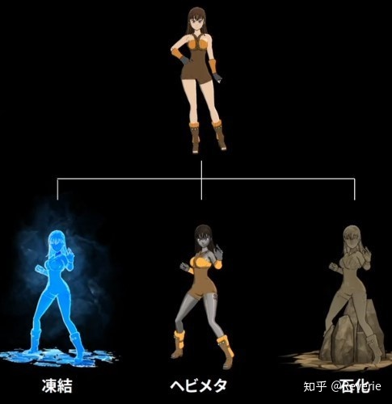
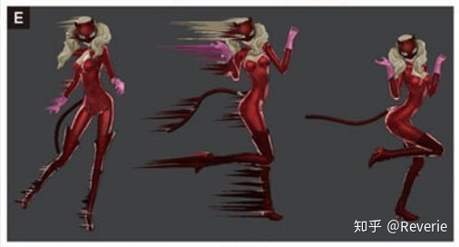

# Toon Shading Collection 

## CH14 - Special Effects 特效表现

 

记录一些特效相关的零碎点。

 

------

### 技能变色

七大罪中使用basemap和MatCap来控制人物颜色，缺点是得到的是一个比较固定的光照表现（相机不旋转的话），但好处是可以通过更换MatCap贴图来轻松实现不同buffer下的人物特效。

由于是手游，牺牲一些光照效果来使用MatCap确实是比较实惠的选择，前提是美术能接受的话。

 

 

------

### 运动模糊

PBR的速度动态必然通过模糊来呈现，但卡通渲染其实和模糊并不怎么兼容。当然模糊也可以用，就是没那么兼容而已。

一般会将高速运动的模型临时换成一张透明图，特效化。但其实也可以考虑用运动方向的顶点扰动来模拟。

实现它如果能取到顶点的速度信息会方便很多，但在skinMesh里，因为缺乏公开API，想要获得这个信息必须用BakeMesh，效率太低。

为了不影响别的区域，最好有一个Mask，限制这个效果只出现在指定的运动物体上，诸如运动的手臂，武器等等。

反正也取不到速度图，直接从骨骼节点获得整个物体大概的速度和角速度，然后利用顶点上储存的mask信息，实现它也不失为一个方法，还可以通过角速度制作出拖影的弧线。

 

 

------

### 深度调整

横版对战游戏并线站位时角色的前后遮挡关系要注意下。

在3D图像上， 角色是立体的大小，两个人距离接近，一个角色的突出的手腕就会插入到另一个角色里。回避这种情况的策略的讨论是有必要的。

最终的是，绘制攻击方的角色时，会在3D空间上把深度Z值向视点方向做越1米的Offset，这样就不会有重叠发生了。总之，攻击方的角色，会无视被攻击方的角色的3D的前后关系，用深度Z-Test一直合格的进行绘制。

使用双臂抓投对手的技能的时候，被投掷的一方会插入到投掷放的手腕中，要把这个Offset去掉进行调整。有时也有用火焰特效遮掩来做欺骗的地方。

通过这些处理系统的实现，大多数不自然的状况都没有了。深度方向上很大，会有和其他角色紧贴在一起的情况，确认陷进角色里的情况也有，只是，做了“不妨碍游戏”的判断，就这样照原样保留了。

*↑深度调整前（左）后（右）的角色绘制（上）和它的ZBuffer（下）*

*↑对峙的状态（上）摄像机移动后所看到的是下面的截图，看出角色一起在同一个轴上*

 

 

------

 

 

------

 

 

------

