# Toon Shading Collection 

## CH14 - Special Effects 特效表现

 

记录一些特效相关的零碎点。

 

------

### 技能变色

七大罪中使用basemap和MatCap来控制人物颜色，缺点是得到的是一个比较固定的光照表现（相机不旋转的话），但好处是可以通过更换MatCap贴图来轻松实现不同buffer下的人物特效。

由于是手游，牺牲一些光照效果来使用MatCap确实是比较实惠的选择，前提是美术能接受的话。

 

 

------

### 运动模糊

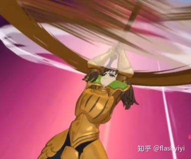

为了表现物体高速运动的速度感，物体表面的轮廓会发生类似于速度线的变形。

PBR的速度动态必然通过**模糊**来呈现，但卡通渲染其实和模糊并不怎么兼容。当然模糊也可以用，就是没那么兼容而已。

一般会将高速运动的模型临时换成一张**透明图**，特效化。但其实也可以考虑用运动方向的**顶点扰动**来模拟。

实现它如果能取到顶点的速度信息会方便很多，但在skinMesh里，因为缺乏公开API，想要获得这个信息必须用BakeMesh，效率太低。

为了不影响别的区域，最好有一个Mask，限制这个效果只出现在指定的运动物体上，诸如运动的手臂，武器等等。

反正也取不到速度图，直接从骨骼节点获得整个物体大概的速度和角速度，然后利用顶点上储存的mask信息，实现它也不失为一个方法，还可以通过角速度制作出拖影的弧线。

不过，使用着色器来对物体的顶点进行修改来实现类似的效果，对模型精度的要求比较高。如果表现大范围的扭曲，并且动得非常快的话表现力还可以。

《罪恶装备》和《火影忍者》中使用的是**插入模型**的方式进行制作的。这种制作方式可以使用TA开发的DCC工具来进一步实现。

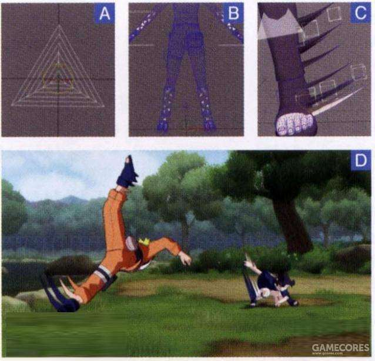

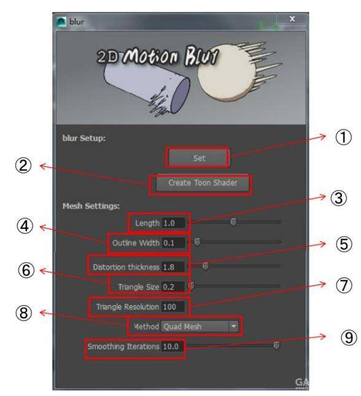

 

 

------

### 深度调整

横版对战游戏并线站位时角色的前后遮挡关系要注意下。

在3D图像上， 角色是立体的大小，两个人距离接近，一个角色的突出的手腕就会插入到另一个角色里。回避这种情况的策略的讨论是有必要的。

最终的是，绘制攻击方的角色时，会在3D空间上把深度Z值向视点方向做越1米的Offset，这样就不会有重叠发生了。总之，攻击方的角色，会无视被攻击方的角色的3D的前后关系，用深度Z-Test一直合格的进行绘制。

使用双臂抓投对手的技能的时候，被投掷的一方会插入到投掷放的手腕中，要把这个Offset去掉进行调整。有时也有用火焰特效遮掩来做欺骗的地方。

通过这些处理系统的实现，大多数不自然的状况都没有了。深度方向上很大，会有和其他角色紧贴在一起的情况，确认陷进角色里的情况也有，只是，做了“不妨碍游戏”的判断，就这样照原样保留了。

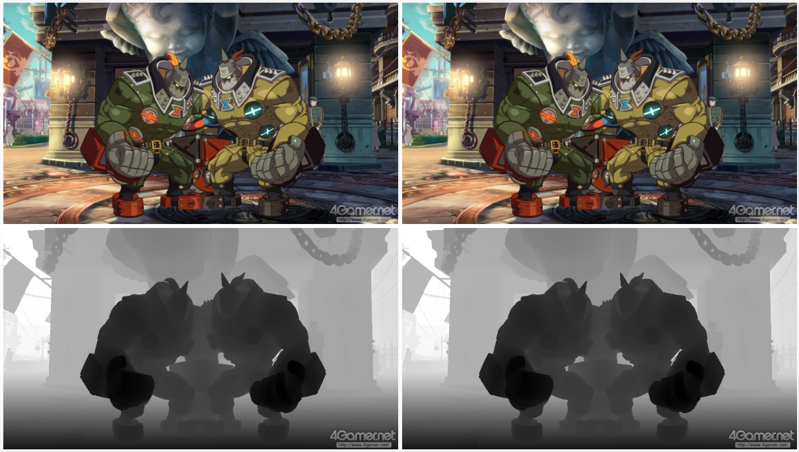

*↑深度调整前（左）后（右）的角色绘制（上）和它的ZBuffer（下）*

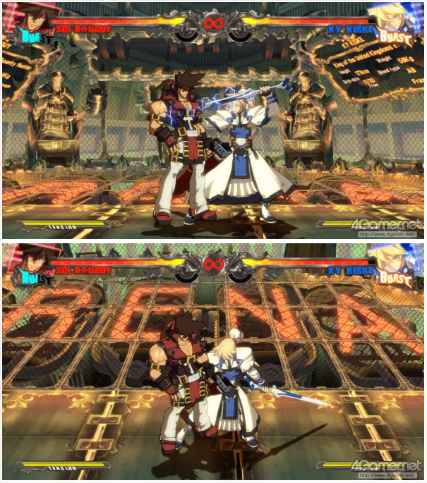

*↑对峙的状态（上）摄像机移动后所看到的是下面的截图，看出角色一起在同一个轴上*

 

 

------

### 不透明特效

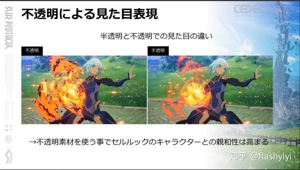

角色技能也在这硬扯一下吧。

常规做的半透明特效放在卡通渲染中，看上去很容易有廉价页游感。做成不透明的，反而和卡通渲染风格更统一了。

而且，不透明的特效，可以更多使用体积模型来作为载体，完全不会有排序问题，对性能也更友好。

通过体积模型载体的顶点移动，特效可以更有体积感，而非平面片状的感觉。

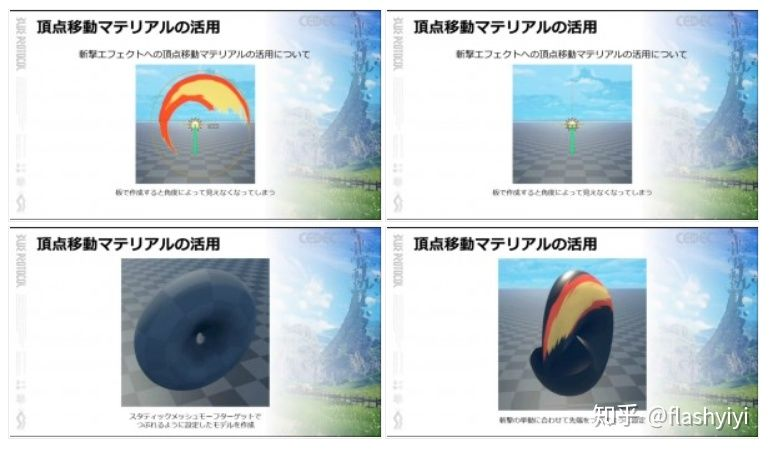

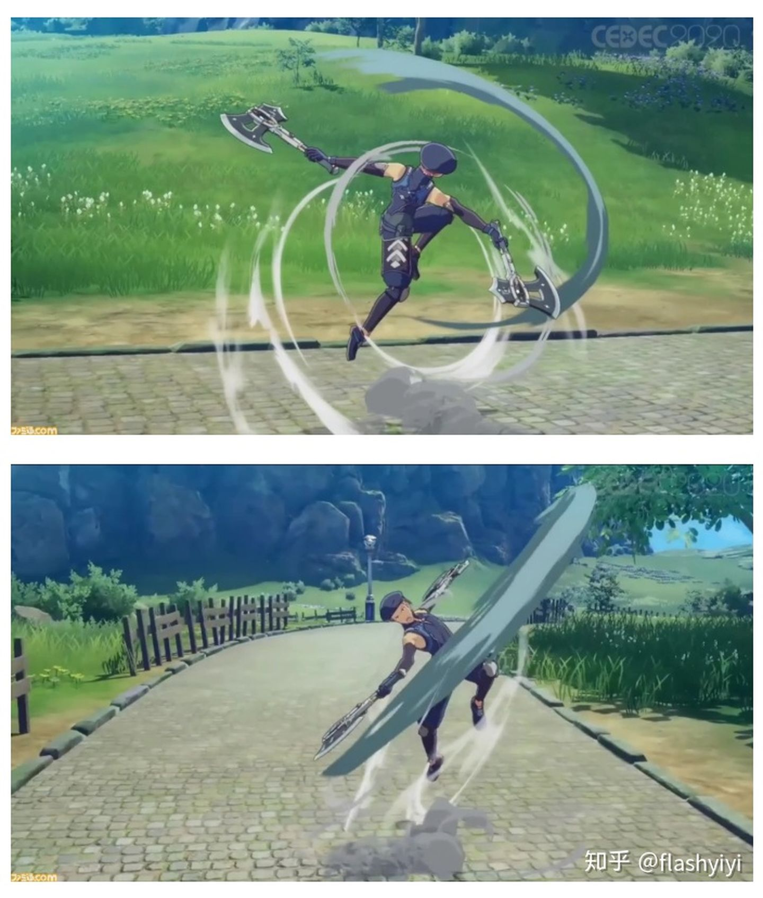

一个使用不透明特效遇到的问题：多个特效叠加的时候特效遮挡太严重了。他们的方案是让特效移到远处有一个消隐的效果，应该是增加Cutout的值。

但效果也不算好吧，而网点抖动也可以做到让特效一定程度重叠。

估计他们就是要坚持这种不透明特效的感觉。

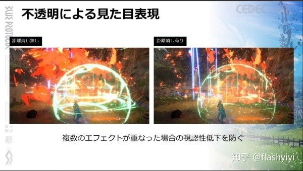

此外有一点，不透明特效还有个好处是对TAA更友好。TAA的帧间混合是基于深度的，处理透明物体很容易瞎，表现出来是移动镜头透明度变低。为了避免这个问题需要让透明物体也写速度buffer，但透明物体覆盖住的物体就不行了，而它这种AlphaTest为主的方式就没这问题。

否则估计只能放弃TAA，那么高光边界就很难这么锐利而且没锯齿。那么就只能考虑模糊边界，或者想办法把MSAA开起来，延迟部分就不好办。方案选择会有不少变化。

*↑罪恶装备的技能bloom效果*

不透明特效配合bloom，在边缘处就会有透明感了。

 

 

------

### 模型特效动画

烟雾特效可以用流体动画做，但为了卡通表现力，也可以做骨骼动画，或在动画中每帧替换模型，当然工作量是递增的。

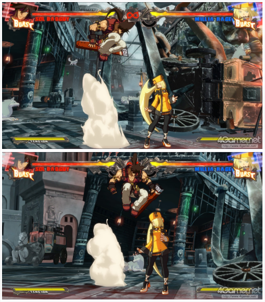

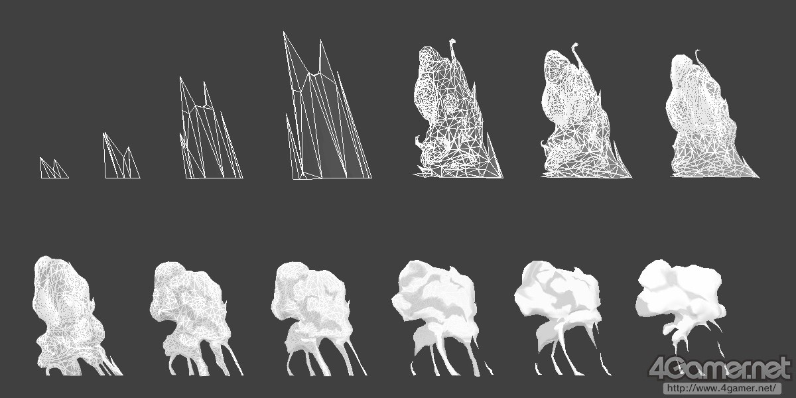

*↑烟的效果是一帧一帧K的模型*

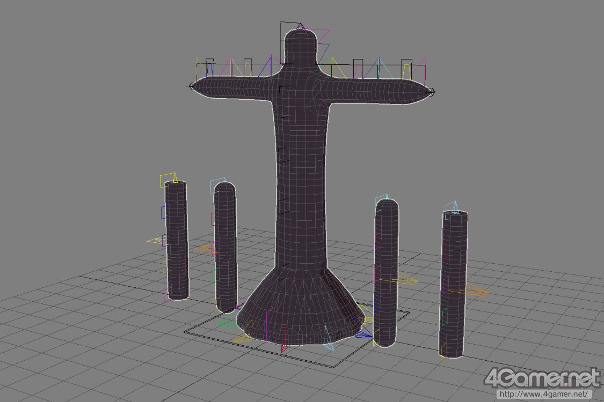

*↑影子融化的特效模型，附加动作前的素体*

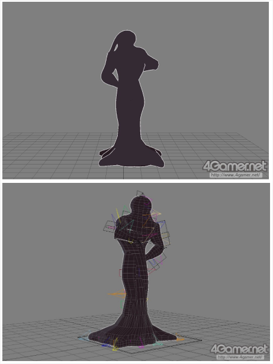

*↑附加了动作完成版的影子溶解模型*

 

 

------

