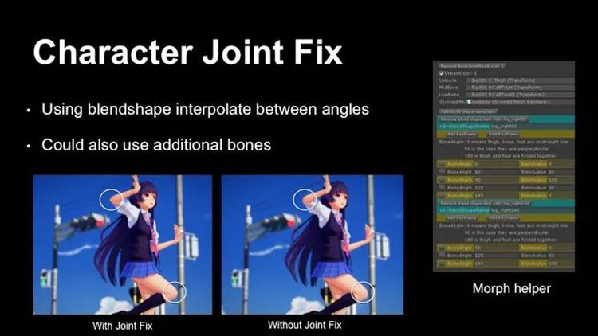
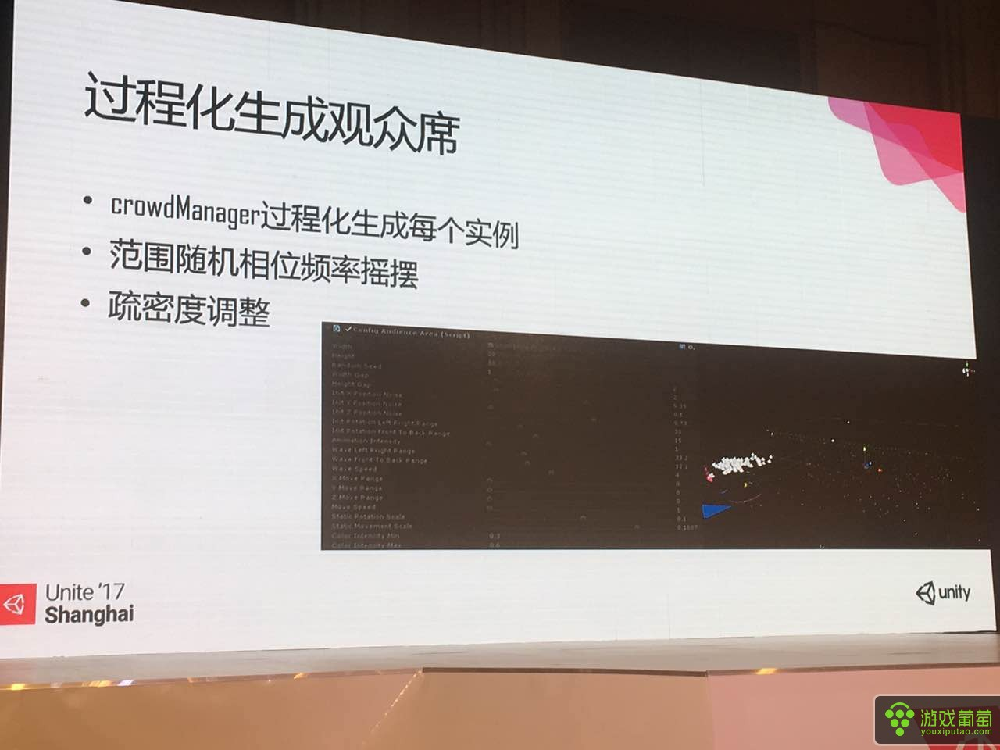

# Toon Shading Collection 

## CH15 - Animation 角色动画

 关于角色动画，有一些值得注意的优化点。

 

------

### 高品质角色动画

#### 关节修正

在Unity中使用Humanoid作为动画导入方式的时候，如果关节处旋转角度较大，按照动画品质的要求关节处的形状就不能令人满意。

为此可以在建模软件中，建立了每关节修正的Blendshape导入到Unity当中来防止关节变形。使用一个自动控制脚本根据关节旋转角度来差值混合形状。 为了确保更好的结果，可为每个关节分别制作两个Blendshape，一个用于90度，另一个用于140度以补正关节变形。

另外一种方法还可以使用额外的骨骼进行关节修正。这种方法更容易制作，但是对于结构细节的表现不如使用Blendshape。

 

 

------

### 高性能人群动画

#### Imposter Animation

对大量的npc使用面片播放帧动画代替实际人物模型，而这些图片是由多个相机对3D模型预计算生成图集所得，实际游戏中根据视线角度和关键帧来显示子图。

又是一个能省下来计算量的做法，况且这些面片还可以合批。

不过用它做动画的问题在于每一帧就需要一张图，要保证精度，一张图至少得要512分辨率，一段动画少说都有5、6帧，这么多贴图放shader里难免对带宽有点吃力。

Imposter这种还是只做静物就行，大批量的房屋比较合适，比如远景LOD，在高视距大世界场景里可能很有用。

 

#### AnimMap

利用GPU视线大规模角色动画渲染，本质上是一种顶点动画，通过贴图记录下每个关键帧的顶点位置，比方说6*1024的贴图，6表示6个关键帧，1024记录1024个顶点的位置，结合GPUInstance，达到高性能且不错的表现，非常适合大批量路人、观众这种，可以弥补imposter的不足。

 

#### 过程化生成

为了表现大量随机群体动作，过程化生成是最高效的方式。

米哈游的实现方式是写一个crowdmanager过程化生成每个实例，观众席每个独立个体表现，由振幅、频率、颜色、位置偏移等随机参数来控制。

实际测试，数量从100到400到800，对于帧率并没有明显的变化。

*↑米哈游这段MMD视频展示了有500个观众挥舞荧光棒的场面，效率有比较大的提升。*

 

 

------

