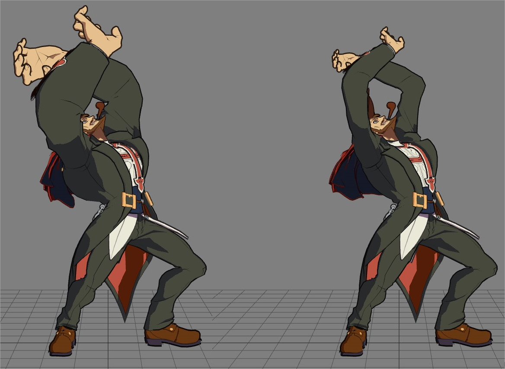
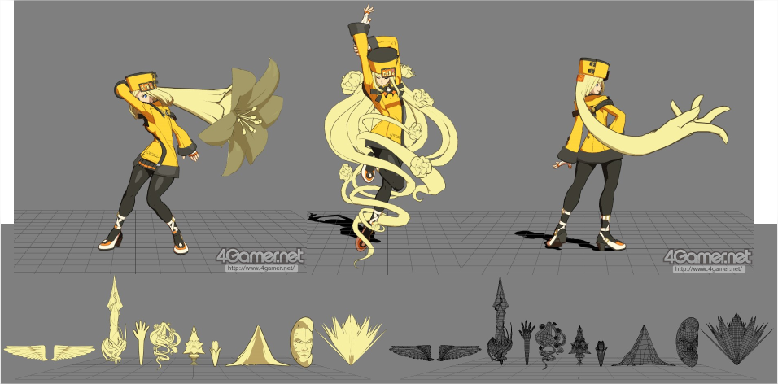
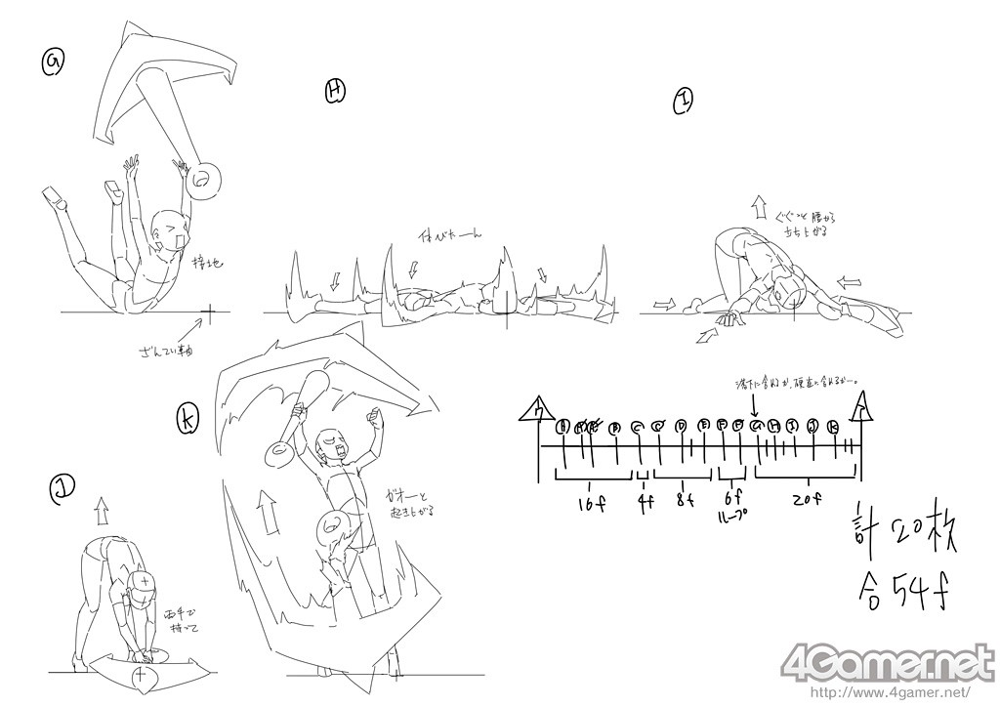
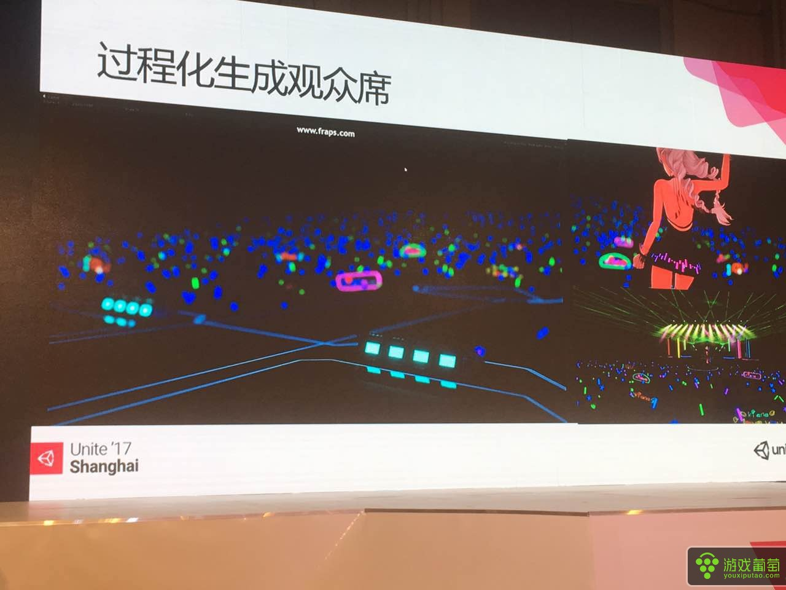

# Toon Shading Collection 

## CH15 - Animation 角色动画

 关于角色动画，有一些值得注意的优化点。

 

------

### 高品质角色动画

#### 关节修正

在Unity中使用Humanoid作为动画导入方式的时候，如果关节处旋转角度较大，按照动画品质的要求关节处的形状就不能令人满意。

为此可以在建模软件中，建立了每关节修正的Blendshape导入到Unity当中来防止关节变形。使用一个自动控制脚本根据关节旋转角度来差值混合形状。 为了确保更好的结果，可为每个关节分别制作两个Blendshape，一个用于90度，另一个用于140度以补正关节变形。

另外一种方法还可以使用额外的骨骼进行关节修正。这种方法更容易制作，但是对于结构细节的表现不如使用Blendshape。

 

#### 模型变形

罪恶装备的理念：漂亮的画面就是正义。

为增加表现力，会非常规地调整模型骨骼。其中对设计好镜头的过场动画，还会进行不科学的调整。

*↑为了加强纵深感，需要放大手部，因此拉伸手腕模型靠近镜头*

*↑通过骨骼放大缩小，可以变出Q版2头身*

*↑单独部位分轴进行骨骼缩放*

 

#### 模型替换

对于毛发的形状变形，一般的骨骼系统实现不了，所以要准备替换部件。

*↑头发变形的情况，准备了追加部件，来进行替换的样子*

 

#### 动画帧数

一般都以为高质量动画必须高帧数，但其实还能有意地选择低帧数。

为了营造表现力和打击感，罪恶装备故意采用了强硬的粗糙帧分布的动画。

在Anime业界，把像迪士尼那样每秒24帧作画的动画称作[Full Animation]，同样是连续帧显示的，每秒8~12帧程度运动的通常称作[Limited Animation]。Limited Animation，和普通的3D图形的动画在制作风格有一些差异。

一般的3D游戏图形的角色动画，是有对角色模型内部配置的骨头的轨道进行修正的印象。轨道的制作是使用高次曲线函数（F Curve），或者是基于动作捕捉取得的数据。

与之对应的，罪恶装备是让角色一点点的运动，1帧1帧的姿势修正的做成。像粘土动画（clay animation）一样的流程。

为此，要由动画师制作故事板，设计第几帧出拳、产生碰撞判断等。

另外一方面，角色跳跃时产生的放射性轨迹的活动和运动的飞行道具等等的运动都是60fps来更新的。

*↑必杀技相关的故事板，20帧记录了54帧的信息*

 

 

------

### 高性能人群动画

#### Imposter Animation

对大量的npc使用面片播放帧动画代替实际人物模型，而这些图片是由多个相机对3D模型预计算生成图集所得，实际游戏中根据视线角度和关键帧来显示子图。

又是一个能省下来计算量的做法，况且这些面片还可以合批。

不过用它做动画的问题在于每一帧就需要一张图，要保证精度，一张图至少得要512分辨率，一段动画少说都有5、6帧，这么多贴图放shader里难免对带宽有点吃力。

Imposter这种还是只做静物就行，大批量的房屋比较合适，比如远景LOD，在高视距大世界场景里可能很有用。

 

#### AnimMap

利用GPU视线大规模角色动画渲染，本质上是一种顶点动画，通过贴图记录下每个关键帧的顶点位置，比方说6*1024的贴图，6表示6个关键帧，1024记录1024个顶点的位置，结合GPUInstance，达到高性能且不错的表现，非常适合大批量路人、观众这种，可以弥补imposter的不足。

 

#### 过程化生成

为了表现大量随机群体动作，过程化生成是最高效的方式。

米哈游的实现方式是写一个crowdmanager过程化生成每个实例，观众席每个独立个体表现，由振幅、频率、颜色、位置偏移等随机参数来控制。

实际测试，数量从100到400到800，对于帧率并没有明显的变化。

*↑米哈游这段MMD视频展示了有500个观众挥舞荧光棒的场面，效率有比较大的提升。*

 

 

------

