# Toon Shading Collection 

## CH14 - Special Effects 特效表现

 

表情的制作要么就是改模型，要么就是改贴图。改模型的做法又可以分为blend shape（morph）和改骨骼。

 

------

### 表情方案分类

#### 骨骼表情

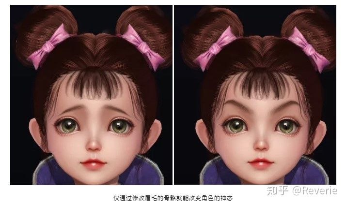

骨骼动画表情在非二次元游戏中常用，而二次元比较少见。可能是因为写实人物的五官差异比较小吧。

修改骨骼的变换信息，通过蒙皮来修改脸部模型，就性能上来说这种会好一点。

- 通用性较高，还适应捏脸
- 脸部主体顶点序列不变
- 方便做连续的表情动画
- 重要角色可能要单独处理表情
- 资源量比较少
- 可能需要过多的骨骼才能实现漫画式的夸张表情

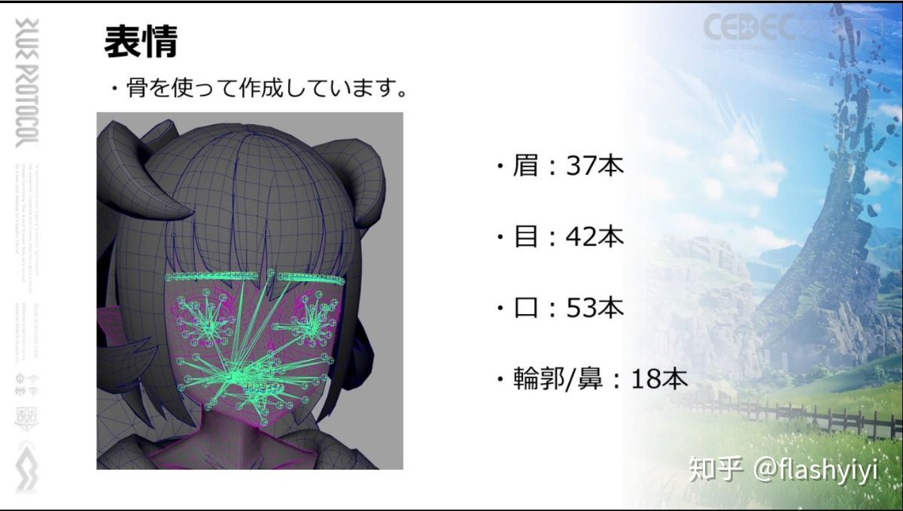

蓝色协议的骨骼表情，骨骼特别多，应该是没有BlendShape做的快的，性能也很抱歉。估计只有在特写时才会开启，那样还行。

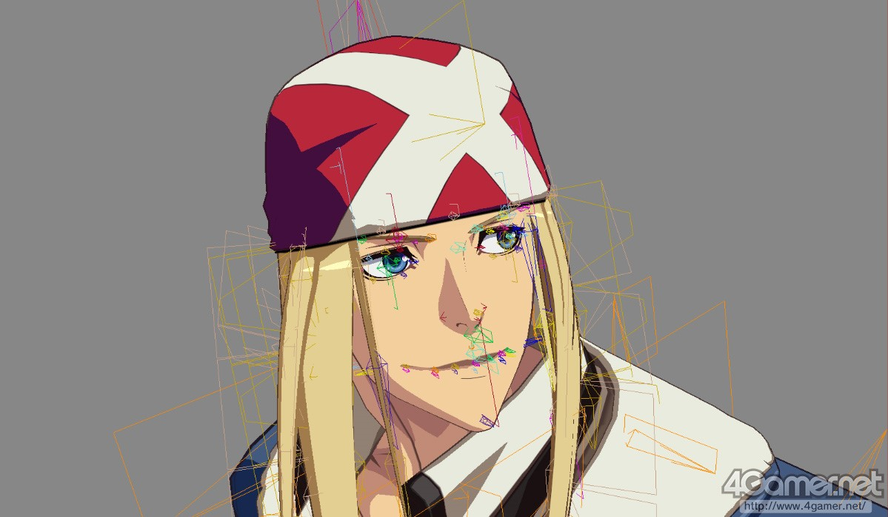

还有罪恶装备也采用了骨骼动画方案做表情。

 

#### Morph表情

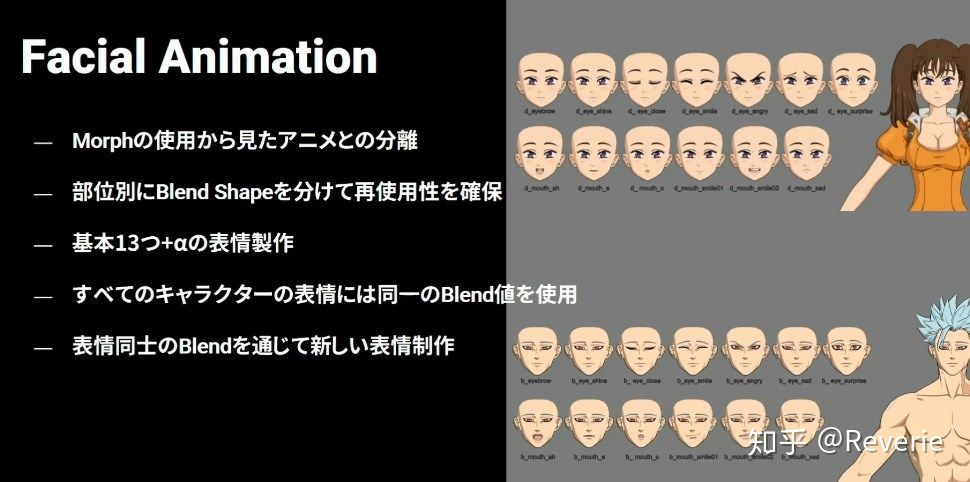

Blend shape在CG制作动漫中非常常见，本质是修改网格顶点进行形变预先制作好一套表情组合，像是眨眼之间的表情切换可以通过顶点动画插值来实现。

目前可见的二次元游戏人物表情和口型都是用的blend shape而非骨骼，原因不明，毕竟blendshape几乎无复用的可能，而脸部还是存在不少需要建模的部分。可能是为了即使同一表情也要每个人订制不同细节？

又有大佬言，BlendShape其实也可以复用的，用SkinWarp一类可以让眉毛睫毛模型跟随脸部一起运动，而脸大家都一样的，组合也可以通过Mask。

有个叫vroid的软件，可以比较方便地生成和绘制二次元人物模型，生成后自带表情blendshape。如果能做个工具把表情这个过程参数化，最后输出blendshape作为结果，将能大大提升铺量的效率。

- 效果可控
- 数量较少
- 模型前期要求高，后续修改较难
- 只能做成多个关键帧，做连续表情动画比较麻烦

 

#### 贴图表情

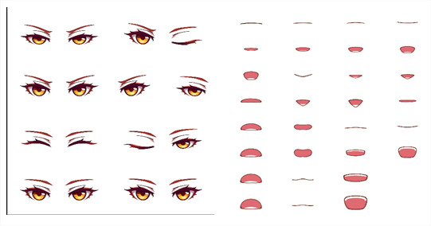

*↑崩坏3贴图表情*

如果对精度没有较高要求、数量也很有限的话，其实直接用贴图就是一种非常实惠的做法，例如>.<这些表情换张图就能很好搞定。贴图的局限性在于动态得通过帧动画的形式来做，数量较多的话还不如改模型。

贴图表情可以放在脸上附加的面片上，也可以直接在面部材质上采样第二层贴图混合。

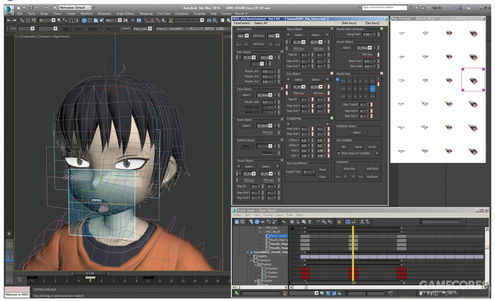

*↑使用贴片的方法制作嘴巴和眼睛*

贴图表情算是业界老黄历了，现存的可能就是Q版角色或特殊简化表情会用这种方案。这年头为了质量还是要老老实实和写实渲染一样去搞，不要想着用切换图片精灵的方法来做表情。

 

 

------

### 特殊表情处理

#### 特定建模方案

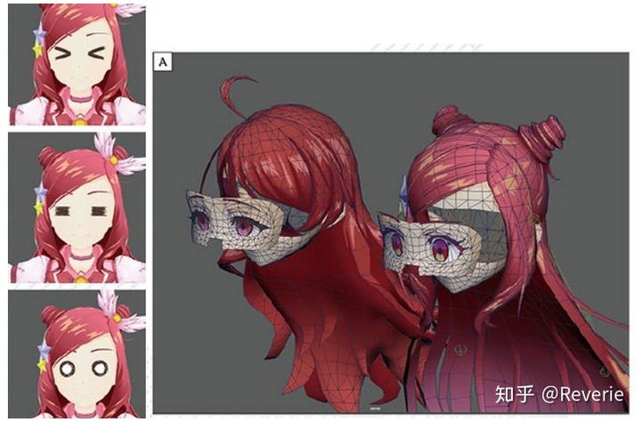

如果需要表现出一些特殊的漫画中表情，就得考虑为眼睛和眉毛单独建模。

崩坏将眼睛部分的脸部做了单独建模，估计是为了方便在特殊表情（比如 X.X）的时候更换眼睛模型。但也可以试试，与其这样将blendshape撕裂开两部分，倒不如在特殊表情的时候直接把一个单独模型盖在原来的眼睛上面（原模型这部分下陷避免穿帮），这样不影响默认表情，想换哪就换哪也更加自由。

还特殊一点的：颜艺。丰富表情导致的形状扭曲，如果用3D模型来表现这种效果，这需要非常细致的骨骼绑定才会还原得比较好。而且光影计算已经救不了了，需要另外用贴图或模型块面来制作。像是褶皱和嘴巴三角阴影，将一些常用小物件（汗、#）放在贴图中，在动画每帧中间插进去。国内基本不会做到这么细致。

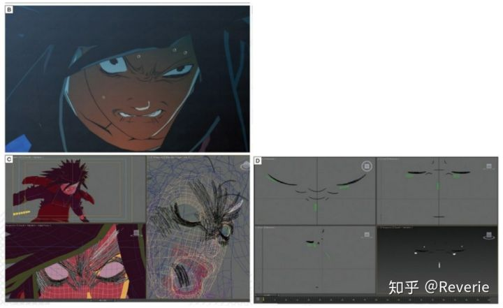

 

#### 相机视角专门变形

三维的脸换一个角度就很容易跟理想的画面设定不一致，为了某个相机角度的视觉美观，甚至可以专门调整五官到物理错误的位置。不过这个办法需要镜头角度的配合，一般用在过场动画上。

下图是罪恶装备角色一击必杀的剧情场景。一开始，制作的是从哪个方向看都说得过去的外表一样的表情，初期印象的设定图不同表现的地方很多。因此，驱动Rig，调整目鼻口的位置和角度。因为追求从摄像机里看的印象是要一样的，实现了角色有效果的演出。

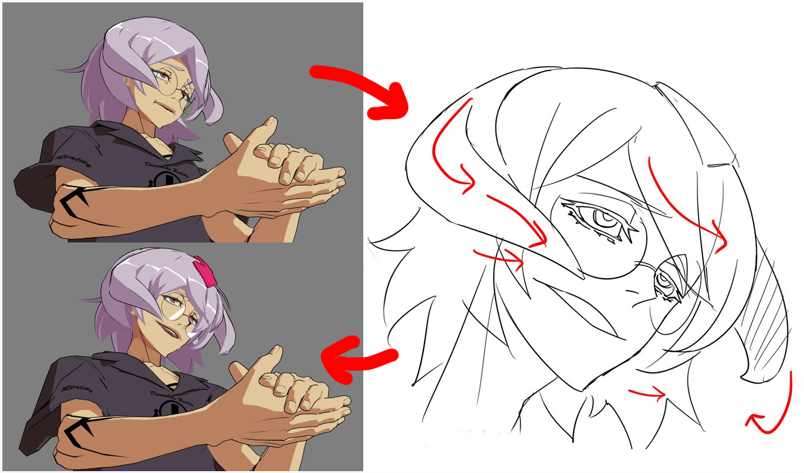

如果是自由的摄像机角度，还可以考虑使用Blend Shape或其他方法事先把模型在各个摄像机角度的变形调节好，然后再通过实时运算来对齐效果。

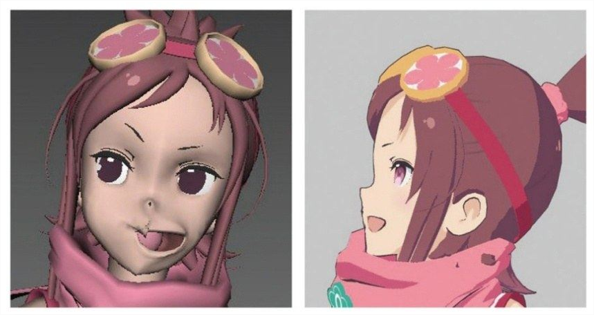

*↑扭曲修正前后对比*

 

贴片制作的五官会导致侧面会穿帮。许多游戏是使用贴片的方式来绘制五官的，这也需要对不同角度的五官面片进行换图和扭曲操作。

*↑同一个状态下的正面图和侧面图对比*

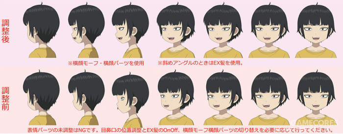

*↑通过位移扭曲和换图来修正效果*

 

#### 非对称性变形

如果要表现一个角色丰富的情感，强调面部表情的非对称性是非常重要的，不然看起来会非常的不自然，这也是许多国内游戏或动画制作者的通病。这种调节，在日本动画中一般是作画监督来把控的。

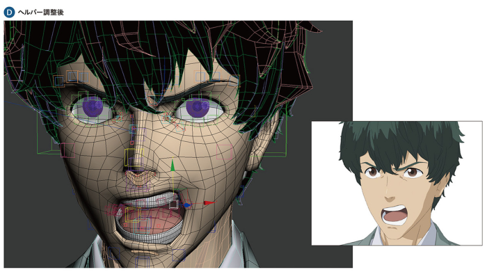

*↑非对称性调整后，表情更加自然、生动*

 

 

------

### 综合规划示例

米哈游MMD动画使用Blendshape来制作面部表情。 眼睛、嘴巴和眉毛的表情独立为不同的部件单独制作，然后通过自定义面部表情插件，来实现表情动画的及语音嘴型的自动映射。此外，还会通过预定义不同的表情集合来在交互应用中驱动面部表情。

 

 

------

 

 

------

 

 

------

