# Toon Shading Collection 

## CH15b- Fit FOV 视角适应

 

关于角色动画，有一些值得注意的优化点。

 

------

### 视场(Field of View)

先来解释一下视场，视场即FOV，在摄影中指相机可以接收影像的角度范围，也可以称为视野。

（由于显示比例的原因，FOV在水平与垂直方向上的数值不同，以下未作说明的情况下默认为水平FOV。）

FOV越大视野越宽，透视的变形就越大，下图可以很好的展示这种特征。

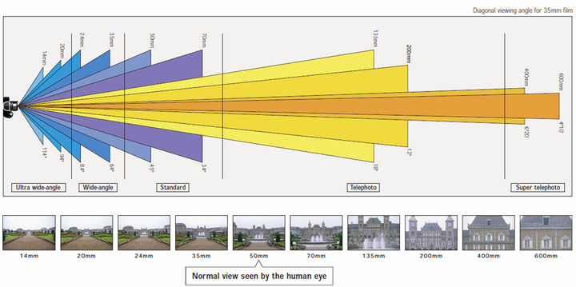

人眼的水平视场的范围，±30°是中央视野区域，±60°是双眼水平视场。所以游戏中的FOV也遵循这个规则，能够修改的范围通常都在60 - 120之间。

而FOV的高低会很大程度上的会影响角色表现，特别是特写时的面部区域。卡通角色更适用于在较低的FOV中表现效果，而第三人称视角中通常使用到的FOV数值要远大于适合卡通表现的FOV。

很多卡通角色的模型在制作时面部正面会选择做扁，一部分原因就是为了抵消高FOV带来的面部轮廓变形。

 

 

------

### 卡通脸部制作特征

 

卡通角色为了画面表现的常常会有夸张的形变，同时也有上述FOV的问题，所以在卡通角色头部时会有不同于写实角色头部的制作技巧。

说到底动画人物的脸在三维上是不成立的。“夸张”和“省略”提升了角色的表现力，不如说，很多情况下不成立的部分正是魅力所在。

动漫风格的脸 = 极端和“超现实”的变形。因此，很难将其完全还原为立体形象。应当认清无法还原是不可避免的，使用变形器或骨骼修正是比较现实的方式。不过在模型层面上尽可能的接近理想的外观，能做的事情有很多。

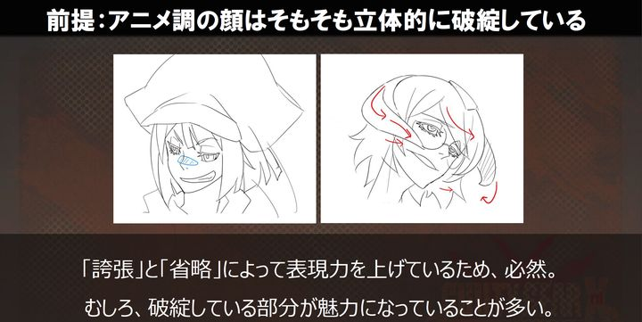

这种方式的逻辑是，在正面与侧面上还原外观都是可行的，但是如果想要各个方向的外观都成立，难度就瞬间飙升。所以就不能继续使用三视图的制作方式了，这里非常考验模型师的能力。而斜面是展示频率最高的角度，真正使用到正面与侧面的构图反而是很少的。另外也有很多从正面与侧面看不出来的表现点。并且作为中间角度的斜面脸型成立的话，正面与侧面之间的其他角度也很容易成立。

「让斜脸造型成立 = 打造有立体感的脸，兼顾动画变形与立体感的脸才能最大程度的减少违和感」

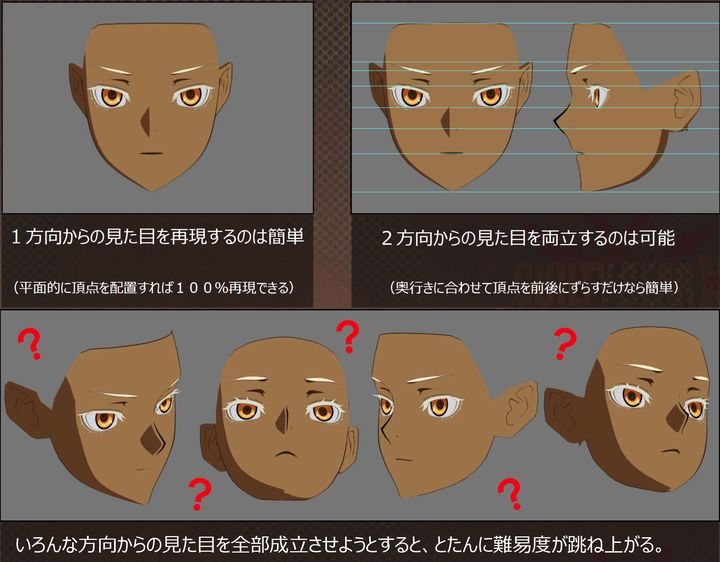

 

#### 斜脸时制作的注意点

1. 脸颊的线条（粉紫线）
2. 嘴部的收缩（蓝线）
3. 眉眼的立体感（黄线）
4. 下巴的线条（绿线）

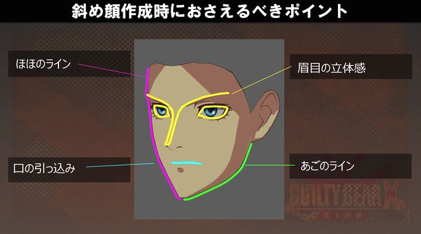

 

- ##### 脸颊的线条

正面和侧面看不到的线条，很大程度上决定了角色尖锐、柔软、粗略的印象，可以看作制作美型、美少女角色时候的生命线。

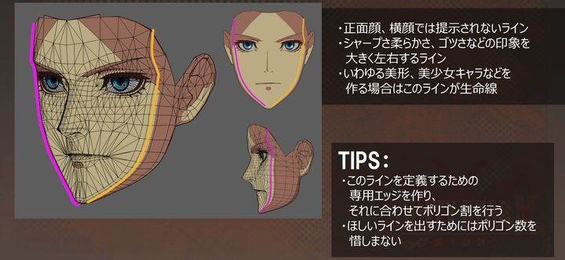

 

- ##### 嘴部的收缩

动画中常见的情况，在斜脸的时候把嘴部画的偏后，可以使用变形或骨骼修正，不过在模型阶段也能做一些努力。将嘴角向后收缩，可以一定程度表现出这种纵深感。（这几年二次元画风更加丰富了，有些更加贴近写实，并不倾向于在半侧面时把嘴靠后画，所以看情况而定。）

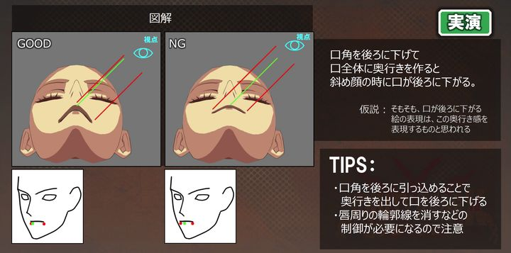

 

- ##### 眉眼的立体感

人们常说的眉清目秀的重要要素，特别是眼睛周围容易吸引视线，即使有一点错误也容易产生违和感。

眼角到眉间的高度落差就是所谓的周边深度，虽然容易被”额头是平的“先入为主的观念影响，但只有中间的部分才是平坦的。越靠近脸中间，额头与眼睛的落差是越深的。（这里的意思应该是，眼角区域与眉间的落差是很大的）

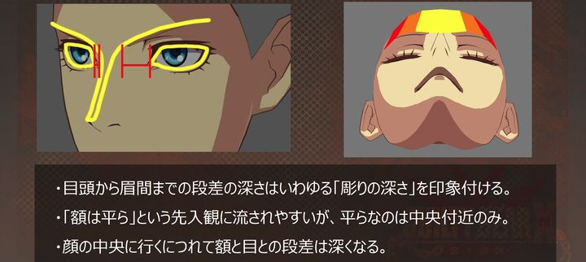

动画中，通常会夸张两个眼睛之间的宽度差距，以此来营造立体感。把眼睛整部分倾斜，会在侧面获得一个还不错的效果，但是在其他方向上会导致各种问题。所以只让眼角向后倾斜，既可以获得立体感，得到侧面两个眼睛之间具有比较大宽度差距的效果，也能不影响其他角度的面部形态。

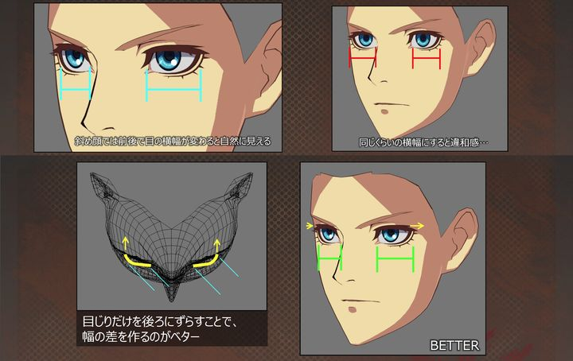

 

- ##### 下巴的线条

和脸颊的线条一起形成了面部的轮廓，和脸颊的线条一样很大程度上也左右着尖锐、生硬等形象。

在制作中的一个常见问题，模型的正面与侧面是符合三视图特征的，但是在斜面就会显得脸横向拉长。

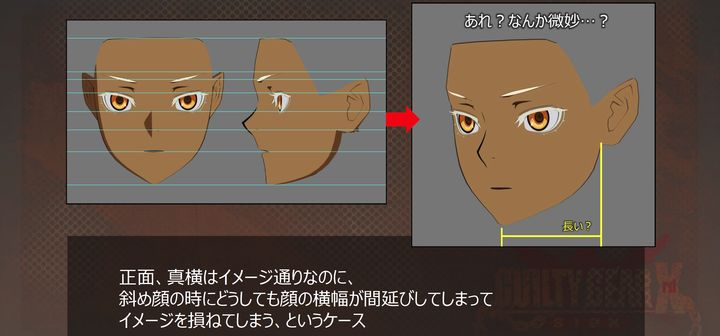

解决这个问题的方式不是压平面部减少横向宽度，而是要向内收窄下巴轮廓，这样就可以在不改变正面脸和侧脸的外观的情况下，调整斜脸的面部轮廓。

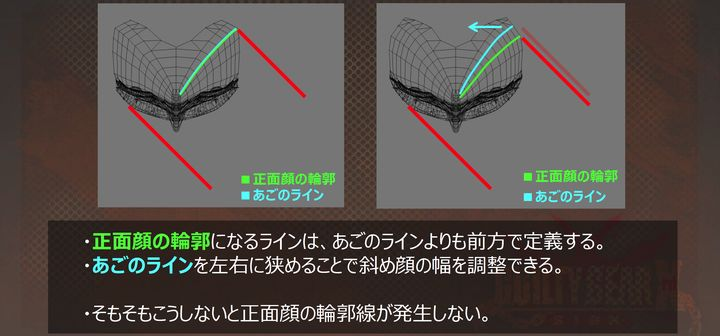

 

#### 总结

既然以“超越现实的表现”为目标，一定程度的违和就不可避免。通过变形器或骨骼变形的目前最好的方式。但是通过模型制作时的努力可以在一定程度上缓解。重点在于变形与立体感的兼容性，在不影响变形效果的范围内，在立体感上下功夫。

 

 

------

### 基于视角的面部形态修正

只靠模型制作是很难达到理想效果的，这个时候就需要辅助手段，根据视角去修正面部形态，保证面部在镜头中的形态是好看的。为了某个相机角度的视觉美观，甚至可以专门调整五官到物理错误的位置。可以使用BS或骨骼根据摄像机位置混合对应的变形。变形方式也可以有多种。

也算是赛璐璐方面的一些优势。它的Mesh已经夸张到非常奇怪了，但是它的2D表现还是非常好的。这就说明赛璐璐风格虽然抹掉了色阶，但是其实它也忽略了Mesh的物理结构。我们可以通过一些非常夸张的Mesh在一些镜头下做出好看的2D效果，它会更接近于我们2D手绘的效果。

#### 局部变形微调

下图是罪恶装备角色一击必杀的剧情场景。一开始，制作的是从哪个方向看都说得过去的外表一样的表情，初期印象的设定图不同表现的地方很多。因此，驱动Rig，调整目鼻口的位置和角度。因为追求从摄像机里看的印象是要一样的，实现了角色有效果的演出。

如果是自由的摄像机角度，还可以考虑使用Blend Shape或其他方法事先把模型在各个摄像机角度的变形调节好，然后再通过实时运算来对齐效果。

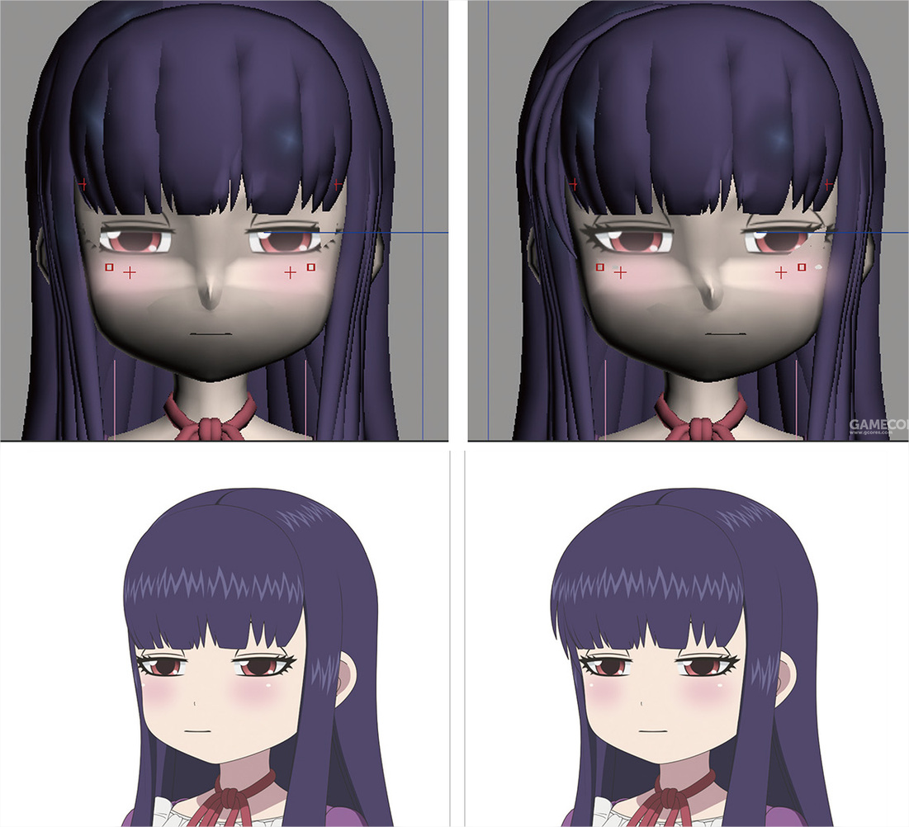

*↑扭曲修正前后对比*

*↑动态效果展示*

 

贴片制作的五官会导致侧面会穿帮。许多游戏是使用贴片的方式来绘制五官的，这也需要对不同角度的五官面片进行换图和扭曲操作。

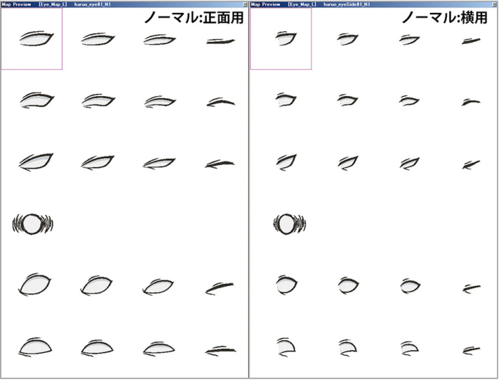

*↑同一个状态下的正面图和侧面图对比*

*↑通过位移扭曲和换图来修正效果*

 

#### 头部整体压扁

由于建模时经常处于平行视角，切换到引擎内透视视角时容易有明显的脸部凸出问题，前后差异感在卡通风格角色上会特别明显。对此，也有根据视角动态压扁头部的做法，本质上是对低FOV的模拟。

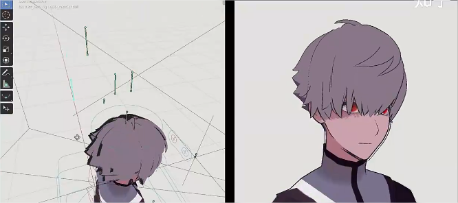

*↑无任何处理，脸部中心凸出*

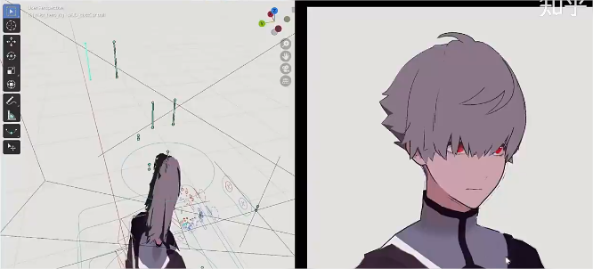

*↑压扁头部处理，不过似乎鼻子的深度勾边损失了*

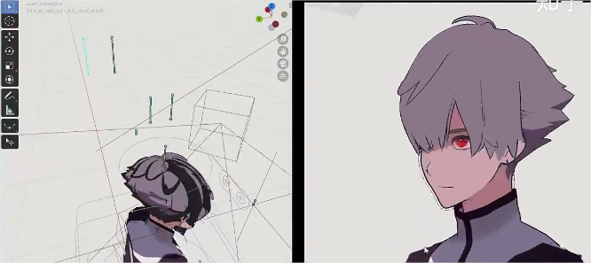

*↑压扁头部处理，另一个角度*

 

#### 纯2D思路

已经超出3D建模范畴的[Live2D的做法](https://www.bilibili.com/video/BV17x411m79t?from=search&seid=16718950334246774402)参考，360°都照顾到了，只是不清楚做起来有多麻烦，另外可能不兼容动态光影：

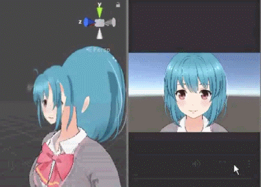

 

 

------

### FOV最佳角色表现参考区间

 

早期闪暖在开发镜头的时候也遇到过瓶颈，就是在选择镜头蓝本的时候。大家知道《闪耀暖暖》是个竖屏游戏，而且也是一个决定版的选人界面，所以找了很多游戏的选人界面来参考，但是大部分游戏没有借鉴价值，因为很多游戏都是横屏的。

调整了下思路，换个领域，并带着全身、半身、面部、好看这四个问题去寻求方案。很快就分析出了方向——发现杂志和人物海报都可以满足上面这四个要求。所以找了摄影的朋友，了解拍摄这些素材时会用到的技巧，很快就从这些经验中提取到了很多有价值的东西。

镜头比较关注两个点，一个是对焦点，一个是FOV。

全身的镜头，FOV在25°到30°之间。半身的镜头，FOV大概是22°到25°之间。面部的效果，FOV大概是18°到20°之间。

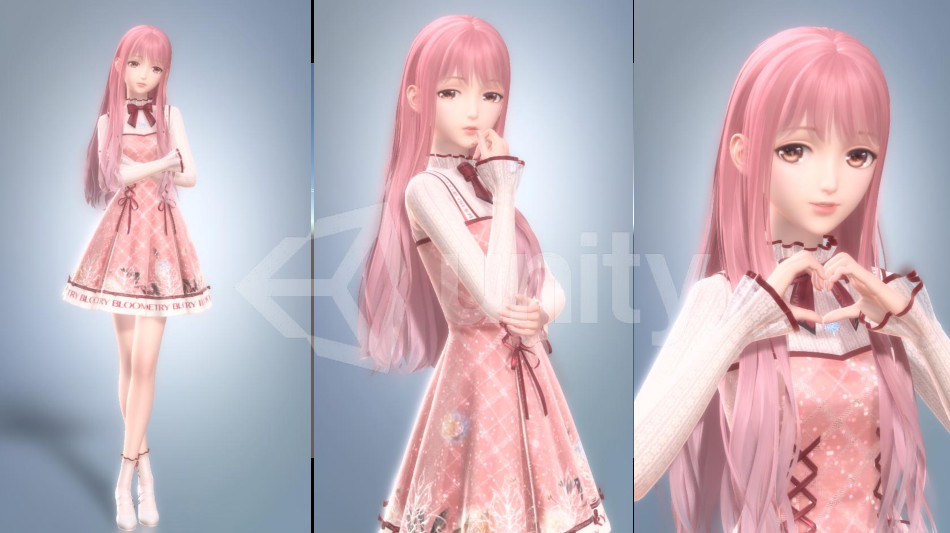

 

 

 

 

------

