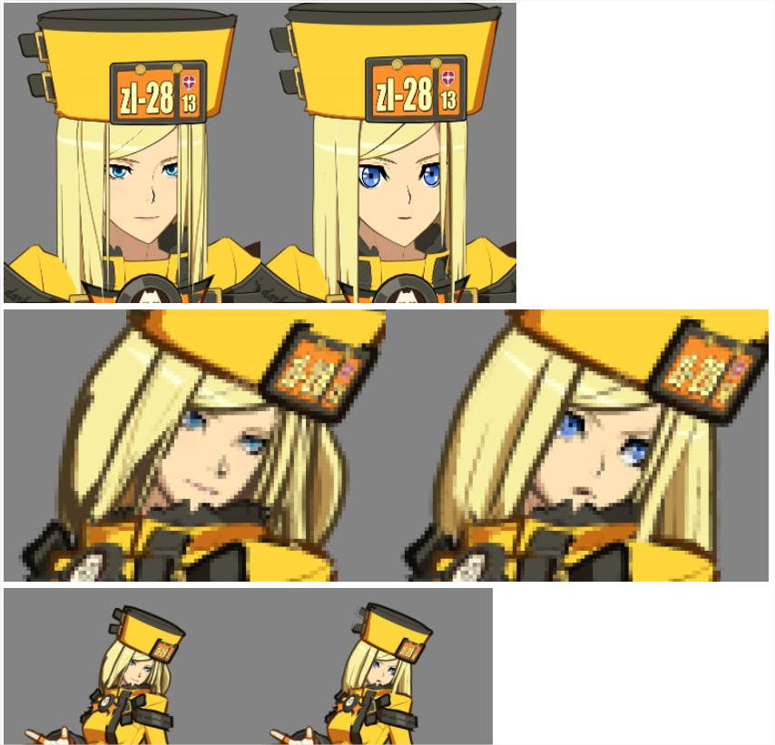
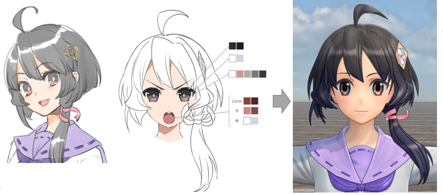

# Toon Shading Collection 

## CH16 - Character Modeling 建模要点

 

暂时随手记一些建模要注意的地方。

 

------

### 远近不同模

*↑有意图的把眼睛变的很大的情况*

卡通角色占屏幕面积很小时，五官变得过于的细小，角色的个性和表情变得很难表现的好。

战斗远景用的3D模型，要强调角色的表情、角色的服装和饰品这种有象征性部分的细节，建议把近景用的3D模型和造型进行改变。算是卡通渲染专用LOD方案。

这是横板战斗游戏常用的手段，开放视角的3D游戏倒没咋听说过这种处理，不过其实也因为大部分二次元游戏都是大眼睛画风吧。

 

 

------

### 头型发型相关

二次元头顶普遍尖一点，整体轮廓是鸡蛋型。不知道为啥俺们厂美术同事就喜欢把头做成灯泡型，显得头顶头发过于膨胀。

头发比较建议映射成球形法线，试了下自动计算法线，果然比较难看。

*↑左自动平滑法线，右球面法线*

 

 

------

### 原画和建模的一致性

新樱花大战为什么可以把这么萌的妹纸设计稿改得那么丑那么土？！

这个原画明显接近原神风格，如果直接按原神标准来建模，最终效果的萌度绝对可以吹爆。

为了3D画风统一（为久保带人画风）而抛弃美感，这合理吗？！

 

 

------

 

 

------

 

 

------

